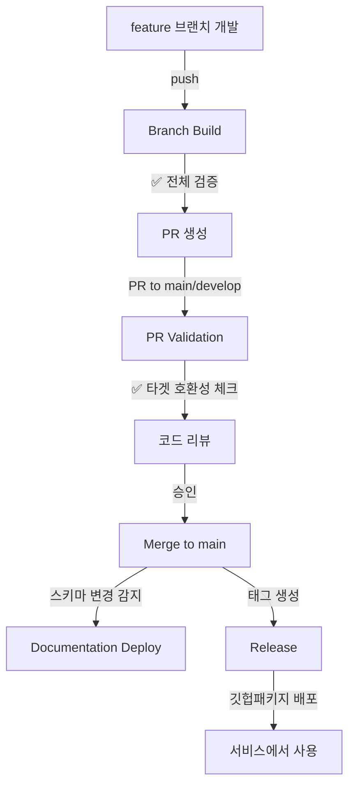

# GitHub Actions 워크플로우 가이드

이 디렉토리에는 C4ang Contract Hub의 CI/CD 파이프라인을 구성하는 4개의 워크플로우가 있습니다.

## 워크플로우 비교표

| 워크플로우 | 트리거 | 주요 목적 | 실행 시간 |
|-----------|--------|----------|----------|
| **Branch Build** | Push → develop, feature/** | 개발 중 전체 검증 및 피드백 | 3-5분 |
| **PR Validation** | PR → main, develop | PR 최종 검증 (빠른 체크) | 1-2분 |
| **Release** | Tag → v*.*.* | 정식 릴리스 배포 | 3-4분 |
| **Documentation Deploy** | Push → main (스키마 변경 시) | 문서 자동 생성 및 커밋 | 1-2분 |

---

## 1. Branch Build (개발 피드백)

**파일**: `branch-build.yml`
**목적**: 개발 브랜치에서 전체 검증을 수행하고 빠른 피드백 제공

### 트리거
```yaml
on:
  push:
    branches:
      - develop
      - 'feature/**'
```

### 주요 책임
- ✅ **Avro 스키마 문법 검증**: JSON 유효성 체크
- ✅ **Breaking Change 감지**: Base 브랜치와 비교하여 호환성 체크
- ✅ **Java 클래스 생성 검증**: 생성 가능 여부 확인
- ✅ **프로젝트 빌드**: 전체 빌드 테스트
- ✅ **문서 생성**: Avro 문서 자동 생성
- 📦 **아티팩트 확인**: 빌드 아티팩트 생성 및 확인

### 검증 내용
1. **스키마 문법 검증**: 각 `.avsc` 파일이 유효한 JSON인지 체크
2. **호환성 체크**:
   - Base 브랜치(develop 또는 main)와 비교
   - 필드 삭제 또는 타입 변경 감지
   - Breaking Change 경고 표시
3. **빌드 검증**: 생성된 Java 클래스로 정상 빌드 가능한지 확인

### 아티팩트
- **보관 기간**: 7일
- **내용**: JAR, 생성된 Java 클래스, 문서
- **이름**: `build-artifacts-{branch-name}`

---

## 2. PR Validation (머지 게이트)

**파일**: `pr-validation.yml`
**목적**: PR의 최종 방어선으로 타겟 브랜치와의 호환성 빠르게 체크

### 트리거
```yaml
on:
  pull_request:
    branches:
      - main
      - develop
    types: [opened, synchronize, reopened]
```

### 주요 책임
- 🎯 **타겟 브랜치 호환성**: PR 타겟 브랜치 최신 상태와 비교
- ⚡ **빠른 빌드 테스트**: 병렬 빌드로 시간 단축
- 💬 **PR 코멘트**: 검증 결과를 PR에 자동 코멘트
- ⚠️ **Breaking Change 경고**: 호환성 문제 하이라이트

### Branch Build와의 차이점

| 항목 | Branch Build | PR Validation |
|------|--------------|---------------|
| **호환성 기준** | 브랜치 분기 시점 | **타겟 브랜치 최신 상태** ⭐ |
| **검증 범위** | 전체 (문법 + 호환성 + 빌드) | 핵심만 (호환성 + 빌드) |
| **실행 시간** | 3-5분 | 1-2분 (병렬 처리) |
| **피드백** | 콘솔 로그 | **PR 코멘트** ⭐ |

### PR 코멘트 예시
```markdown
## ✅ PR 검증 - Avro 스키마

**상태**: 성공
**타겟 브랜치**: `main`

### 📊 요약
- **전체 Avro 스키마**: 15개
- **생성된 Java 클래스**: 45개

### 📝 스키마 변경사항
- **변경된 파일**: 2개
- ✅ Breaking change가 감지되지 않았습니다

### ✅ 검증 항목
- ✅ 스키마 호환성 체크
- ✅ Java 클래스 생성
- ✅ 프로젝트 빌드
```

---

## 3. Release (정식 배포)

**파일**: `release.yml`
**목적**: 버전 태그 생성 시 자동으로 릴리스 및 GitHub Packages 배포

### 트리거
```yaml
on:
  push:
    tags:
      - 'v*.*.*'
```

### 주요 책임
- 📋 **버전 정보 추출**: 태그에서 버전 파싱
- 📝 **스키마 변경 내역**: 이전 릴리스와 diff 생성
- ⚠️ **Breaking Change 하이라이트**: 호환성 문제 강조
- 🚀 **GitHub Release 생성**: 릴리스 노트 자동 생성
- 🔨 **GitHub Packages 배포**: 중앙 패키지 허브로 자동 배포
- 📦 **아티팩트 배포**: JAR 및 문서 첨부

### 릴리스 생성 방법
```bash
# 1. 버전 태그 생성
git tag v1.0.0

# 2. 태그 푸시
git push origin v1.0.0

# 3. 워크플로우 자동 실행
#    - GitHub Release 생성
#    - GitHub Packages 배포
#    - 릴리스 노트 자동 생성
```

### 릴리스 노트 구조
```markdown
## 📦 C4ang Contract Hub v1.0.0

### 📝 이번 릴리스의 변경사항

#### ✨ 새로운 스키마
- `src/main/avro/order/OrderCreated.avsc`

#### 🔄 수정된 스키마
- `src/main/avro/payment/PaymentCompleted.avsc`

#### ⚠️ Breaking Changes
- `src/main/avro/product/StockReserved.avsc` (필드 삭제 또는 타입 변경)

**주의**: 이 릴리스는 호환성이 깨지는 변경을 포함합니다.
Consumer 서비스 업데이트가 필요할 수 있습니다.

---

### 📊 포함된 내용
- **Avro Schemas**: 15 schemas
- **Generated Java Classes**: 45 classes
...
```

### 아티팩트
- **보관 기간**: 90일
- **내용**: JAR, 생성된 문서
- **첨부**: GitHub Release에 자동 첨부

---

## 4. Documentation Deploy (문서 자동화)

**파일**: `docs-deploy.yml`
**목적**: 스키마 변경 시 문서를 자동 생성하고 main 브랜치에 커밋

### 트리거
```yaml
on:
  push:
    branches:
      - main
    paths:
      - 'src/main/avro/**/*.avsc'
      - 'docs/interface/**'
      - 'buildSrc/**'

  workflow_dispatch:  # 수동 실행 가능
```

### 주요 책임
- 📝 **문서 자동 생성**: `generateAvroEventDocs` Gradle 태스크 실행
- 🔍 **변경사항 감지**: docs/generated/ 디렉토리 diff 체크
- 💾 **자동 커밋**: 변경된 문서를 main 브랜치에 커밋
- 🤖 **Bot 커밋**: GitHub Actions bot 계정으로 커밋

### 문서 생성 위치
```
docs/generated/
├── avro-schemas.md
├── event-specifications.md
└── ...
```

### 수동 실행
GitHub Actions 탭에서 "Documentation Deploy" 워크플로우를 선택하고 "Run workflow" 버튼 클릭

---

## 전체 워크플로우 시나리오

### 일반적인 개발 흐름



### 상세 시나리오

```
1. feature/add-payment-event 브랜치 생성
   ↓
2. 스키마 파일 추가: PaymentCompleted.avsc
   ↓ push
3. [Branch Build] 실행
   - ✅ 스키마 문법 검증
   - ✅ Breaking Change 체크 (develop 기준)
   - ✅ Java 클래스 생성
   - ✅ 빌드 테스트
   - 📦 SNAPSHOT 아티팩트 생성
   ↓
4. PR 생성 (feature/add-payment-event → develop)
   ↓
5. [PR Validation] 실행
   - 🎯 최신 develop과 호환성 체크
   - ⚡ 빠른 빌드 (1-2분)
   - 💬 PR에 검증 결과 코멘트
   ↓
6. 코드 리뷰 및 승인
   ↓
7. Merge to develop
   ↓
8. (나중에) Merge develop → main
   ↓
9. [Documentation Deploy] 자동 실행
   - 📝 docs/generated/ 업데이트
   - 💾 main 브랜치에 자동 커밋
   ↓
10. 릴리스 준비되면 태그 생성
    git tag v1.1.0
    git push origin v1.1.0
   ↓
11. [Release] 자동 실행
    - 📝 스키마 변경 diff 생성
    - 🚀 GitHub Release 생성
    - 🔨 GitHub Packages 배포
   ↓
12. 각 서비스에서 사용
    implementation("io.github.groomc4:c4ang-contract-hub:1.1.0")
```

---

## 하이브리드 접근법의 장점

### 왜 Branch Build와 PR Validation을 분리했는가?

#### 1. 동시 개발 충돌 방지
```
feature/A: OrderCreated에 "status" 필드 추가
feature/B: OrderCreated에 "priority" 필드 추가

- Branch Build: 각각 develop 기준으로 검증 ✅
- PR Validation: 최신 타겟과 비교하여 충돌 감지 ⚠️
```

#### 2. Base 브랜치 변경 감지
```
1. feature/A를 develop에서 분기 (2025-01-01)
2. feature/A: Branch Build ✅
3. 다른 PR이 develop에 머지 (2025-01-05)
4. feature/A: PR 생성 → PR Validation 실행
   → 최신 develop과 호환성 재검증 ⚠️
```

#### 3. 빠른 피드백 + 안전성
- **Branch Build**: 개발 중 빠른 피드백 (3-5분)
- **PR Validation**: 머지 전 최종 확인 (1-2분)

---

## 아티팩트 보관 정책

| 워크플로우 | 보관 기간 | 포함 내용 |
|-----------|----------|----------|
| Branch Build | 7일 | JAR, 생성된 Java 클래스, 문서 |
| PR Validation | 7일 | JAR, 생성된 문서 |
| Release | 90일 | JAR, 생성된 문서 (GitHub Release 첨부) |
| Documentation Deploy | - | main 브랜치에 직접 커밋 |

---

## 권한 요구사항

| 워크플로우 | 필요 권한 |
|-----------|----------|
| Branch Build | 기본 권한 (`contents: read`) |
| PR Validation | `contents: read`, `pull-requests: write` (PR 코멘트 작성) |
| Release | `contents: write` (Release 생성) |
| Documentation Deploy | `contents: write` (문서 커밋) |

---

## Breaking Change 감지 로직

모든 워크플로우는 동일한 Breaking Change 감지 로직을 사용합니다:

```bash
# 필드 삭제 또는 타입 변경 패턴
grep -E '^\-.*"name".*:|^\-.*"type".*:'
```

### 감지되는 패턴
- ❌ 필드 삭제: `"name": "oldField"` 라인 삭제
- ❌ 타입 변경: `"type": "string"` → `"type": "int"` 변경
- ✅ 필드 추가: Breaking Change 아님 (Avro backward compatibility)
- ✅ 문서 수정: Breaking Change 아님

### 제한사항
현재 로직은 간단한 패턴 매칭을 사용합니다. 고급 검증이 필요한 경우:
- [Avro Schema Validator](https://github.com/confluentinc/schema-registry) 도입 고려
- Confluent Schema Registry 사용 고려

---

## 문제 해결

### 워크플로우가 실행되지 않는 경우

#### Branch Build
- ✅ `develop` 또는 `feature/**` 브랜치에 푸시했는지 확인
- ✅ `.github/workflows/branch-build.yml` 파일이 브랜치에 존재하는지 확인

#### PR Validation
- ✅ `main` 또는 `develop` 브랜치로의 PR인지 확인
- ✅ PR이 `opened`, `synchronize`, `reopened` 상태인지 확인

#### Release
- ✅ 태그 형식이 `v*.*.*` (예: `v1.0.0`)인지 확인
- ✅ 태그가 원격 저장소에 푸시되었는지 확인

#### Documentation Deploy
- ✅ `main` 브랜치에 푸시했는지 확인
- ✅ `src/main/avro/` 디렉토리의 파일이 변경되었는지 확인

### GitHub Packages 배포 실패

**일반적인 원인**:
- `GITHUB_TOKEN` 권한 부족
- `build.gradle.kts`의 `group` 또는 `version` 설정 오류
- 네트워크 문제

**해결 방법**:
1. 로컬에서 `./gradlew clean build publishToMavenLocal` 테스트
2. GitHub Actions의 `permissions` 설정 확인 (`packages: write`)
3. Organization 토큰 (`GROOM_GITHUB_ACTION_TOKEN`) 권한 확인

### Breaking Change 오탐지

현재 로직은 간단한 패턴 매칭을 사용하므로 오탐이 발생할 수 있습니다:

```json
// 오탐 예시: 필드 순서만 변경 (실제로는 Breaking Change 아님)
- "name": "fieldA"
- "type": "string"
+ "type": "string"
+ "name": "fieldA"
```

**해결 방법**:
- 수동으로 diff 확인
- 향후 Avro Schema Validator 도입 고려

### PR 코멘트 권한 에러

**에러 메시지**:
```
RequestError [HttpError]: Resource not accessible by integration
status: 403
```

**원인**: PR에 코멘트를 작성할 권한이 없음

**해결 방법**:
- ✅ 이미 `pr-validation.yml`에 `pull-requests: write` 권한 추가됨
- ⚠️ Fork된 저장소에서 PR 생성 시에는 보안상 제한될 수 있음
- 외부 기여자 PR의 경우 수동으로 워크플로우 승인 필요

---

## 모범 사례

### 1. 스키마 변경 시
```bash
# 1. feature 브랜치 생성
git checkout -b feature/add-new-event

# 2. 스키마 추가/수정
vi src/main/avro/order/NewEvent.avsc

# 3. 로컬 테스트
./gradlew generateAvroJava
./gradlew build

# 4. 커밋 및 푸시
git add .
git commit -m "feat: Add NewEvent schema"
git push origin feature/add-new-event

# 5. Branch Build 확인 (자동 실행)

# 6. PR 생성
# 7. PR Validation 확인 (자동 실행)
# 8. 코드 리뷰 후 머지
```

### 2. Breaking Change 릴리스
```bash
# Major 버전 증가
git tag v2.0.0  # v1.x.x → v2.0.0
git push origin v2.0.0

# Release 워크플로우가 Breaking Change를 하이라이트
# 영향받는 서비스에 공지
```

### 3. 문서 수동 업데이트
```bash
# GitHub Actions 탭에서 "Documentation Deploy" 워크플로우 선택
# "Run workflow" 버튼 클릭
```

---

## 참고 문서

- [README.md](../../README.md) - 프로젝트 전체 가이드
- [GitHub Packages 배포 가이드](../../docs/publishing/github-packages-guide.md)
- [Avro Artifact Publishing](../../docs/publishing/avro-artifact-publishing.md)
- [GitHub Actions Documentation](https://docs.github.com/en/actions)

---

## 버전 관리

이 워크플로우 구성은 **하이브리드 접근법**을 사용합니다:
- **개발 단계**: Branch Build로 전체 검증
- **머지 전**: PR Validation으로 최종 호환성 체크
- **릴리스**: Release로 자동 배포
- **문서화**: Documentation Deploy로 자동 업데이트

운영하면서 개선이 필요한 부분이 발견되면 이 문서를 업데이트하세요.
