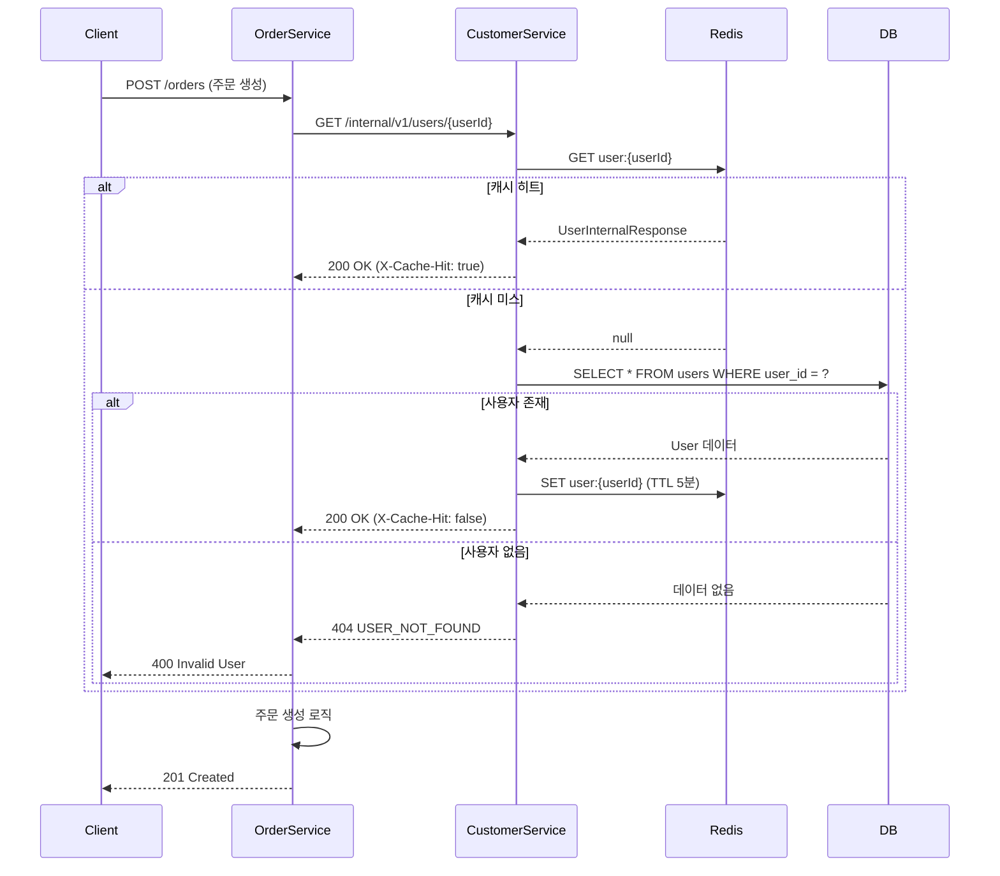
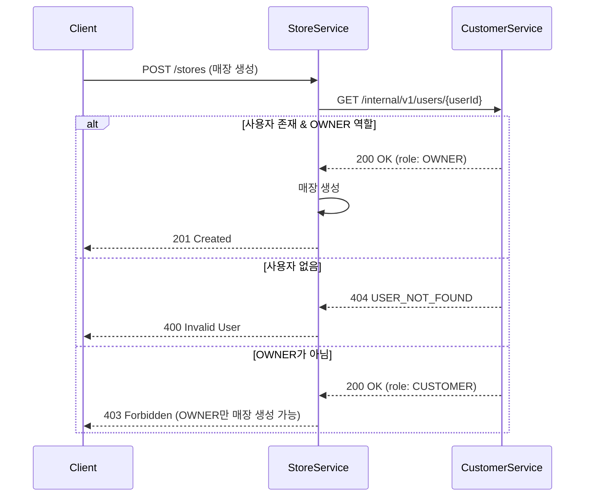

# Internal User API

## 개요

K8s 클러스터 내부에서 사용자 정보를 조회하는 API입니다.

**용도:**
- 다른 서비스에서 사용자 검증 및 정보 조회
- 사용자 역할(Role) 기반 권한 체크
- 주문/매장 생성 시 사용자 유효성 검증

**특징:**
- 클러스터 내부 전용 (Istio mTLS)
- 민감 정보 제외 (비밀번호, 리프레시 토큰)
- Redis 캐싱 지원 (TTL 5분)

---

## 엔드포인트

### 사용자 조회

```http
GET /internal/v1/users/{userId}
```

**Path Parameters:**
- `userId` (string, required): 사용자 고유 ID (UUID 형식)

**Query Parameters:** 없음

**Request Headers:**
```http
Accept: application/json
X-Request-ID: {UUID}  # 선택, 요청 추적용
```

**Response Headers:**
```http
Content-Type: application/json
X-Cache-Hit: true|false  # 캐시 히트 여부
```

---

## 요청/응답 스키마

### 성공 응답 (200 OK)

**Avro Schema:** [`UserInternalResponse.avsc`](../../src/main/api/avro/customer/UserInternalResponse.avsc)

**응답 예시:**
```json
{
  "userId": "123e4567-e89b-12d3-a456-426614174000",
  "username": "john_doe",
  "email": "john@example.com",
  "role": "CUSTOMER",
  "isActive": true,
  "profile": {
    "fullName": "홍길동",
    "phoneNumber": "+82-10-1234-5678",
    "address": "서울시 강남구 테헤란로 123"
  },
  "createdAt": 1699000000000,
  "updatedAt": 1699999999999,
  "lastLoginAt": 1699999999999
}
```

**Nested Schema:** [`UserProfileInternal.avsc`](../../src/main/api/avro/customer/UserProfileInternal.avsc)

### 에러 응답

**Avro Schema:** [`ErrorResponse.avsc`](../../src/main/api/avro/common/ErrorResponse.avsc)

#### 400 Bad Request - 잘못된 UUID 형식
```json
{
  "errorCode": "INVALID_UUID_FORMAT",
  "message": "userId는 UUID 형식이어야 합니다",
  "timestamp": 1699999999999,
  "path": "/internal/v1/users/invalid-id",
  "details": {
    "userId": "invalid-id"
  }
}
```

#### 404 Not Found - 사용자 없음
```json
{
  "errorCode": "USER_NOT_FOUND",
  "message": "사용자를 찾을 수 없습니다",
  "timestamp": 1699999999999,
  "path": "/internal/v1/users/123e4567-e89b-12d3-a456-426614174000",
  "details": {
    "userId": "123e4567-e89b-12d3-a456-426614174000"
  }
}
```

#### 403 Forbidden - 비활성 사용자
```json
{
  "errorCode": "USER_INACTIVE",
  "message": "탈퇴한 사용자입니다",
  "timestamp": 1699999999999,
  "path": "/internal/v1/users/123e4567-e89b-12d3-a456-426614174000"
}
```

---

## 시퀀스 다이어그램

### 주문 생성 시 사용자 검증


### 매장 생성 시 OWNER 역할 확인


---

## 사용 예시

### Kotlin (Spring Boot)

```kotlin
import com.groom.ecommerce.customer.api.avro.UserInternalResponse
import com.groom.ecommerce.customer.api.avro.UserRole
import org.springframework.stereotype.Service
import org.springframework.web.client.RestTemplate
import org.springframework.web.client.HttpClientErrorException

@Service
class UserValidator(
    private val restTemplate: RestTemplate
) {
    private val baseUrl = "http://customer-service"

    fun validateUser(userId: String): UserInternalResponse {
        val url = "$baseUrl/internal/v1/users/$userId"

        return try {
            restTemplate.getForObject(url, UserInternalResponse::class.java)
                ?: throw UserNotFoundException("User not found: $userId")
        } catch (e: HttpClientErrorException.NotFound) {
            throw UserNotFoundException("User not found: $userId")
        } catch (e: HttpClientErrorException.BadRequest) {
            throw InvalidUserIdException("Invalid userId format: $userId")
        }
    }

    fun validateOwner(userId: String): UserInternalResponse {
        val user = validateUser(userId)

        if (user.role != UserRole.OWNER) {
            throw ForbiddenException("User is not an OWNER: $userId")
        }

        if (!user.isActive) {
            throw ForbiddenException("User is inactive: $userId")
        }

        return user
    }
}
```

### RestTemplate 설정
```kotlin
import org.springframework.boot.web.client.RestTemplateBuilder
import org.springframework.context.annotation.Bean
import org.springframework.context.annotation.Configuration
import java.time.Duration

@Configuration
class RestTemplateConfig {

    @Bean
    fun restTemplate(builder: RestTemplateBuilder): RestTemplate {
        return builder
            .setConnectTimeout(Duration.ofSeconds(3))
            .setReadTimeout(Duration.ofSeconds(5))
            .build()
    }
}
```

### 에러 처리
```kotlin
class UserNotFoundException(message: String) : RuntimeException(message)
class InvalidUserIdException(message: String) : RuntimeException(message)
class ForbiddenException(message: String) : RuntimeException(message)
```

---

## 성능 고려사항

### 캐싱 전략

**Redis 캐시:**
- **Key**: `user:{userId}`
- **TTL**: 5분
- **Eviction**: 사용자 정보 업데이트 시 즉시 무효화

**캐시 무효화 이벤트:**
- 사용자 정보 수정 (`user.updated`)
- 사용자 탈퇴 (`user.deleted`)

### DB 인덱싱
```sql
-- 필수 인덱스
CREATE INDEX idx_user_id ON users(user_id);

-- 선택 인덱스 (이메일/사용자명 조회 시)
CREATE INDEX idx_user_email ON users(email);
CREATE INDEX idx_user_username ON users(username);
```

### 타임아웃 설정
- **Connection Timeout**: 3초
- **Read Timeout**: 5초
- **Retry**: 최대 2회 (멱등성 보장)

---

## 주요 포인트

### 1. 보안
- ✅ 클러스터 내부 전용 (Istio mTLS)
- ✅ 민감 정보 제외 (password_hash, refresh_token)
- ✅ Network Policy로 외부 접근 차단

### 2. 성능
- ✅ Redis 캐싱 (TTL 5분)
- ✅ DB 인덱스 최적화
- ✅ 응답 시간 모니터링 (SLA: 95% < 100ms)

### 3. 안정성
- ✅ Circuit Breaker 적용 (Resilience4j)
- ✅ Retry 정책 (최대 2회)
- ✅ Fallback 전략 (캐시 실패 시 DB 조회)

---

## 관련 문서

- [Avro 스키마](../../src/main/api/avro/customer/) - Customer Service API 스키마
- [Customer Service README](./README.md) - 전체 API 목록
- [API 전체 명세](../../docs/interface/internal-api-specifications.md) - 모든 Internal API

---

## 변경 이력

| 버전 | 날짜 | 변경 내용 |
|-----|------|----------|
| v1.0 | 2024-11-17 | 초기 버전 작성 |
