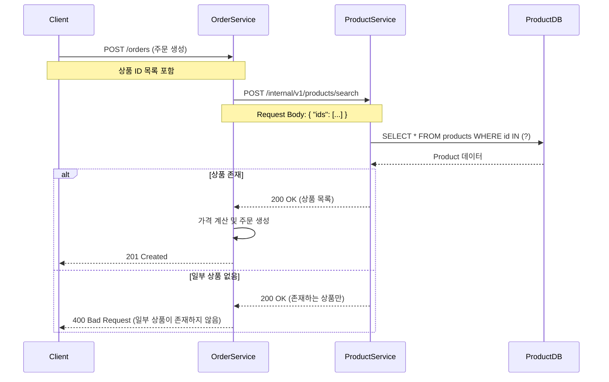
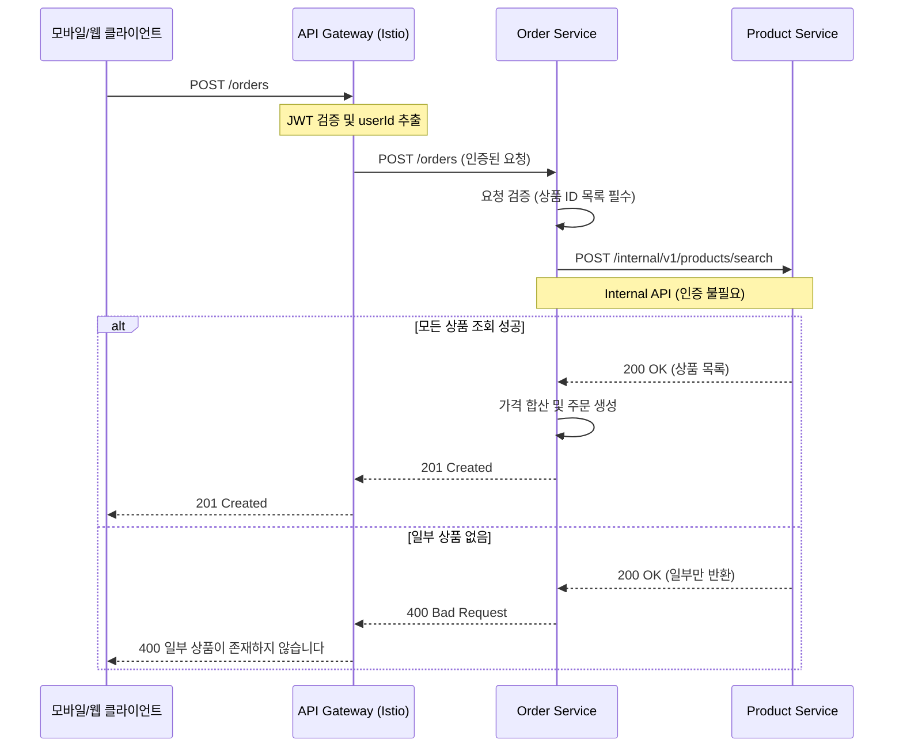

# Internal Product API

## 개요

K8s 클러스터 내부에서 상품(Product) 정보를 조회하는 API입니다.

**용도:**
- 주문 생성 시 상품 정보 조회 (가격, 스토어 정보)
- 결제 시 상품 유효성 검증
- 여러 상품 일괄 조회

**특징:**
- 클러스터 내부 전용 (Istio mTLS)
- 별도 인증 불필요 (API Gateway에서 이미 인증 완료)
- Consumer Contract Test 적용

---

## 엔드포인트

### 1. 상품 ID로 단건 조회

```http
GET /internal/v1/products/{id}
```

**Path Parameters:**
- `id` (string, required): 상품 고유 ID (UUID 형식)

**Request Headers:**
```http
Accept: application/json
X-Request-ID: {UUID}  # 선택, 요청 추적용
```

### 2. 상품 ID 목록으로 다건 조회

```http
POST /internal/v1/products/search
```

**Request Headers:**
```http
Content-Type: application/json
Accept: application/json
X-Request-ID: {UUID}  # 선택, 요청 추적용
```

**Request Body:**
```json
{
  "ids": [
    "550e8400-e29b-41d4-a716-446655440000",
    "550e8400-e29b-41d4-a716-446655440002"
  ]
}
```

---

## 요청/응답 스키마

### 요청 (다건 조회)

| 필드 | 타입 | 필수 | 설명 |
|-----|------|-----|------|
| `ids` | array[string] | O | 상품 ID 목록 (UUID 형식) |

**요청 예시:**
```json
{
  "ids": [
    "550e8400-e29b-41d4-a716-446655440000",
    "550e8400-e29b-41d4-a716-446655440002"
  ]
}
```

### 성공 응답 (200 OK)

**필드 정의:**

| 필드 | 타입 | 필수 | 설명 |
|-----|------|-----|------|
| `id` | string | O | 상품 고유 ID (UUID) |
| `storeId` | string | O | 스토어 ID (UUID) |
| `name` | string | O | 상품명 |
| `storeName` | string | O | 스토어명 |
| `price` | number | O | 상품 가격 |

**단건 조회 응답 예시:**
```json
{
  "id": "550e8400-e29b-41d4-a716-446655440000",
  "storeId": "660e8400-e29b-41d4-a716-446655440001",
  "name": "아메리카노",
  "storeName": "스타벅스 강남점",
  "price": 4500.00
}
```

**다건 조회 응답 예시:**
```json
[
  {
    "id": "550e8400-e29b-41d4-a716-446655440000",
    "storeId": "660e8400-e29b-41d4-a716-446655440001",
    "name": "아메리카노",
    "storeName": "스타벅스 강남점",
    "price": 4500.00
  },
  {
    "id": "550e8400-e29b-41d4-a716-446655440002",
    "storeId": "660e8400-e29b-41d4-a716-446655440001",
    "name": "카페라떼",
    "storeName": "스타벅스 강남점",
    "price": 5000.00
  }
]
```

### 에러 응답

#### 404 Not Found - 상품 없음 (단건 조회)
```json
{
  "error": "PRODUCT_NOT_FOUND",
  "message": "상품을 찾을 수 없습니다: 550e8400-e29b-41d4-a716-446655440000"
}
```

#### 다건 조회 시 존재하지 않는 ID
- 존재하지 않는 상품 ID는 **무시**되며, 존재하는 상품만 반환됩니다.
- 모든 ID가 존재하지 않으면 빈 배열 `[]`을 반환합니다.

---

## 시퀀스 다이어그램

### 주문 생성 시 상품 조회

Order Service에서 주문을 생성할 때 Product Service를 호출하여 상품 정보를 조회합니다.



### 전체 주문 플로우



---

## 사용 예시

### Order Service 구현

#### Port 인터페이스 (Domain Layer)
```kotlin
// domain/port/LoadProductPort.kt
interface LoadProductPort {
    /**
     * 상품 ID로 상품 조회
     * @return 상품 정보 또는 null (미존재)
     */
    fun loadById(productId: UUID): ProductInfo?

    /**
     * 상품 ID 목록으로 다건 조회
     * @return 존재하는 상품 목록 (없으면 빈 리스트)
     */
    fun loadByIds(productIds: List<UUID>): List<ProductInfo>
}

data class ProductInfo(
    val id: UUID,
    val storeId: UUID,
    val name: String,
    val storeName: String,
    val price: BigDecimal
)
```

#### Adapter 구현 (Feign Client)
```kotlin
// adapter/outbound/client/ProductServiceFeignClient.kt
@FeignClient(
    name = "product-service",
    url = "\${external.product-service.url}"
)
interface ProductServiceFeignClient {

    @GetMapping("/internal/v1/products/{id}")
    fun getProductById(@PathVariable id: UUID): ProductInternalDto?

    @PostMapping("/internal/v1/products/search")
    fun getProductsByIds(@RequestBody request: ProductSearchRequest): List<ProductInternalDto>
}

data class ProductSearchRequest(
    val ids: List<UUID>
)

data class ProductInternalDto(
    val id: String,
    val storeId: String,
    val name: String,
    val storeName: String,
    val price: BigDecimal
)
```

#### Port 구현체
```kotlin
// adapter/outbound/client/ProductClientAdapter.kt
@Component
class ProductClientAdapter(
    private val productServiceFeignClient: ProductServiceFeignClient
) : LoadProductPort {

    private val logger = LoggerFactory.getLogger(this::class.java)

    override fun loadById(productId: UUID): ProductInfo? {
        return try {
            productServiceFeignClient.getProductById(productId)?.toProductInfo()
        } catch (e: FeignException.NotFound) {
            logger.warn("Product not found: productId=$productId")
            null
        } catch (e: Exception) {
            logger.error("Failed to load product: productId=$productId", e)
            null
        }
    }

    override fun loadByIds(productIds: List<UUID>): List<ProductInfo> {
        return try {
            val request = ProductSearchRequest(ids = productIds)
            productServiceFeignClient.getProductsByIds(request)
                .map { it.toProductInfo() }
        } catch (e: Exception) {
            logger.error("Failed to load products: productIds=$productIds", e)
            emptyList()
        }
    }

    private fun ProductInternalDto.toProductInfo() = ProductInfo(
        id = UUID.fromString(id),
        storeId = UUID.fromString(storeId),
        name = name,
        storeName = storeName,
        price = price
    )
}
```

---

## 환경별 설정

| 환경 | Product Service URL | 비고 |
|------|---------------------|------|
| 로컬 (default) | `http://localhost:8081` | 로컬 개발 환경 |
| k3d (dev) | `http://product-service:8081` | K8s 서비스 디스커버리 |
| 운영 (prod) | `${PRODUCT_SERVICE_URL}` | 환경 변수로 주입 |
| 테스트 (test) | Mock 사용 | WireMock 또는 Stub |

### application.yml 예시
```yaml
external:
  product-service:
    url: ${PRODUCT_SERVICE_URL:http://localhost:8081}
```

---

## Consumer Contract Test

Order Service에서 Product Service API의 계약을 검증하는 테스트입니다.

### Contract 정의 (Product Service)

**위치**: `product-service/product-api/src/test/resources/contracts.internal/order-service/`

```yaml
# getProductById_success.yml
name: order_service_get_product_by_id_success
description: |
  Consumer: order-service
  Purpose: 주문 시 상품 정보 단건 조회

request:
  method: GET
  url: /internal/v1/products/550e8400-e29b-41d4-a716-446655440000
  headers:
    Content-Type: application/json

response:
  status: 200
  headers:
    Content-Type: application/json
  body:
    id: "550e8400-e29b-41d4-a716-446655440000"
    storeId: "660e8400-e29b-41d4-a716-446655440001"
    name: "아메리카노"
    storeName: "스타벅스 강남점"
    price: 4500.00
```

```yaml
# getProductsByIds_success.yml
name: order_service_get_products_by_ids_success
description: |
  Consumer: order-service
  Purpose: 주문 시 여러 상품 정보 일괄 조회

request:
  method: POST
  url: /internal/v1/products/search
  headers:
    Content-Type: application/json
  body:
    ids:
      - "550e8400-e29b-41d4-a716-446655440000"
      - "550e8400-e29b-41d4-a716-446655440002"

response:
  status: 200
  headers:
    Content-Type: application/json
  body:
    - id: "550e8400-e29b-41d4-a716-446655440000"
      storeId: "660e8400-e29b-41d4-a716-446655440001"
      name: "아메리카노"
      storeName: "스타벅스 강남점"
      price: 4500.00
    - id: "550e8400-e29b-41d4-a716-446655440002"
      storeId: "660e8400-e29b-41d4-a716-446655440001"
      name: "카페라떼"
      storeName: "스타벅스 강남점"
      price: 5000.00
```

### 테스트 실행

```bash
# Provider Contract Test 실행 (Product Service)
./gradlew :product-api:contractTest

# Consumer Contract Test 실행 (Order Service)
./gradlew :order-api:contractTest
```

---

## 에러 처리

### Order Service 에러 매핑

| Product Service 응답 | Order Service 처리 | 클라이언트 응답 |
|---------------------|-------------------|----------------|
| 200 OK (모든 상품 존재) | 주문 생성 진행 | 201 Created |
| 200 OK (일부 상품만 반환) | 누락된 상품 확인 | 400 Bad Request |
| 200 OK (빈 배열) | 상품 없음 처리 | 400 Bad Request |
| 404 Not Found (단건) | 상품 없음 처리 | 400 Bad Request |
| 5xx Server Error | 로그 후 에러 반환 | 503 Service Unavailable |

---

## 성능 고려사항

### 타임아웃 설정

```yaml
feign:
  client:
    config:
      product-service:
        connectTimeout: 3000   # 3초
        readTimeout: 5000      # 5초
```

### Circuit Breaker (Resilience4j)

```yaml
resilience4j:
  circuitbreaker:
    instances:
      productService:
        failureRateThreshold: 50
        waitDurationInOpenState: 60s
        slidingWindowSize: 10
```

---

## 주요 포인트

### 1. POST 방식 다건 조회
- **이유**: URL 길이 제한 없이 많은 상품 ID 전달 가능
- **장점**: Request Body로 `List<UUID>` 직접 전달
- **확장성**: 나중에 필터 조건 추가 용이

### 2. 존재하지 않는 상품 처리
- 다건 조회 시 존재하지 않는 ID는 무시
- Consumer(Order Service)에서 요청한 ID와 응답 비교하여 누락 확인

### 3. Consumer Contract Test
- Product Service API 변경 시 Order Service 테스트 실패
- Breaking Change 사전 감지

---

## 관련 문서

- [Product Service README](./README.md) - 전체 API 목록
- [API Flows 메인](../README.md) - 전체 서비스 API
- [Store Service Internal API](../store-service/internal-store-api.md) - Store 조회 API

---

## 변경 이력

| 버전 | 날짜 | 변경 내용 |
|-----|------|----------|
| v1.0 | 2024-12-04 | 초기 버전 작성 |
| v1.1 | 2024-12-04 | 다건 조회 GET → POST 변경, Request Body 방식으로 전환 |
