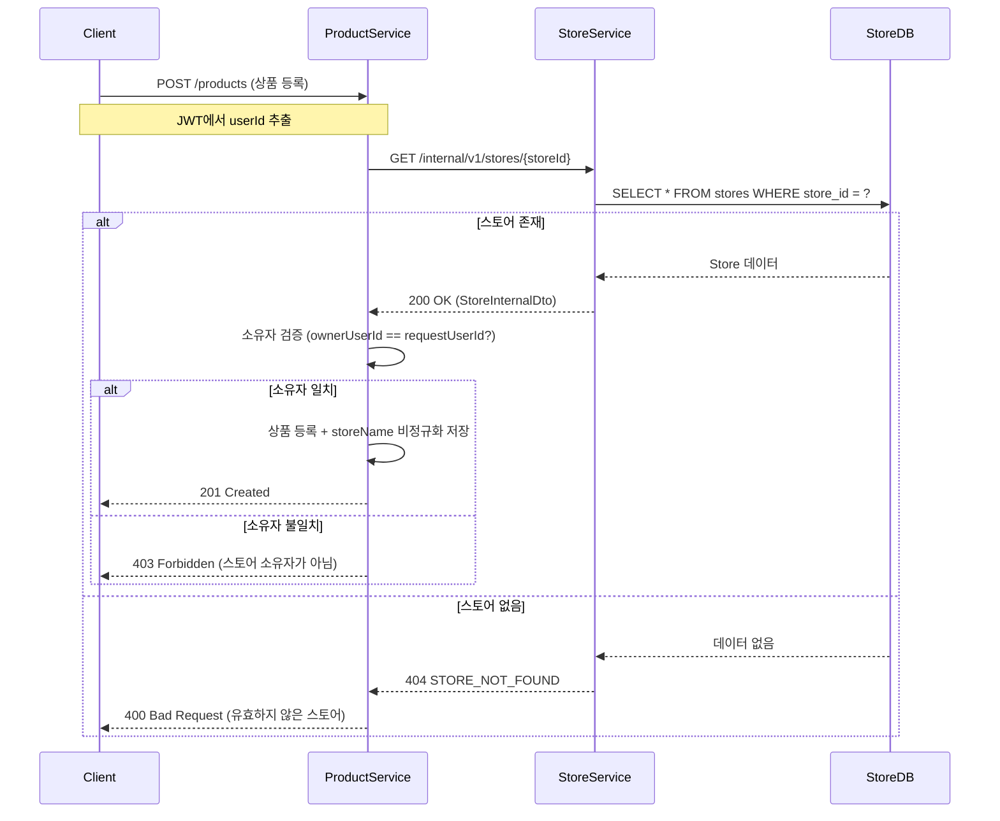
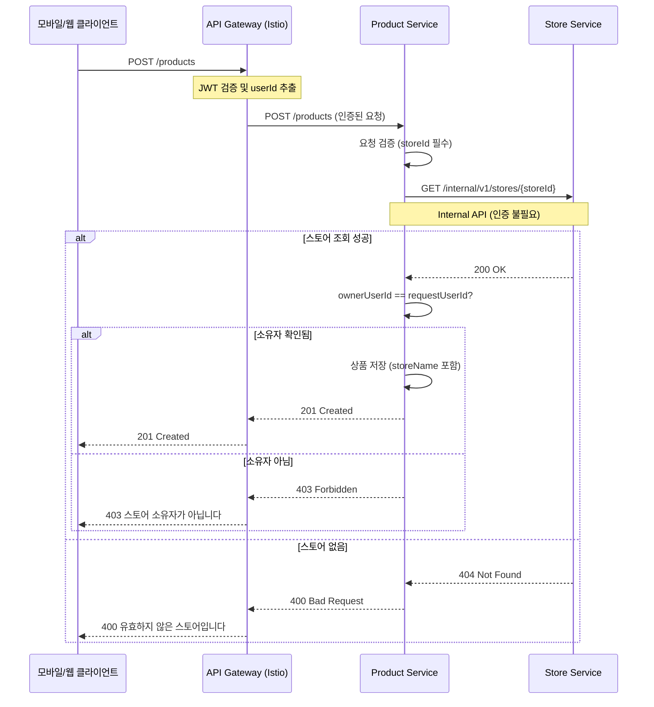

# Internal Store API

## 개요

K8s 클러스터 내부에서 매장(Store) 정보를 조회하는 API입니다.

**용도:**
- 상품 등록 시 스토어 소유자 검증
- 스토어 이름 조회 (상품에 비정규화 저장)
- 스토어 상태 확인 (REGISTERED, SUSPENDED 등)

**특징:**
- 클러스터 내부 전용 (Istio mTLS)
- 별도 인증 불필요 (API Gateway에서 이미 인증 완료)
- Consumer Contract Test 적용

---

## 엔드포인트

### 1. 스토어 ID로 조회

```http
GET /internal/v1/stores/{storeId}
```

**Path Parameters:**
- `storeId` (string, required): 스토어 고유 ID (UUID 형식)

**Request Headers:**
```http
Accept: application/json
X-Request-ID: {UUID}  # 선택, 요청 추적용
```

### 2. 소유자 ID로 조회

```http
GET /internal/v1/stores/owner/{ownerId}
```

**Path Parameters:**
- `ownerId` (string, required): 스토어 소유자 ID (UUID 형식)

**Request Headers:**
```http
Accept: application/json
X-Request-ID: {UUID}  # 선택, 요청 추적용
```

---

## 요청/응답 스키마

### 성공 응답 (200 OK)

**응답 DTO:**
```
StoreInternalDto
├── storeId: String           # 스토어 고유 ID
├── ownerUserId: String       # 소유자 사용자 ID
├── name: String              # 스토어 이름
├── description: String?      # 스토어 설명
├── status: String            # 상태 (REGISTERED, SUSPENDED, HIDDEN, DELETED)
├── averageRating: Double?    # 평균 평점
├── reviewCount: Int?         # 리뷰 수
├── launchedAt: LocalDateTime?# 오픈 일시
├── createdAt: LocalDateTime  # 생성 일시
└── updatedAt: LocalDateTime  # 수정 일시
```

**응답 예시:**
```json
{
  "storeId": "550e8400-e29b-41d4-a716-446655440000",
  "ownerUserId": "123e4567-e89b-12d3-a456-426614174000",
  "name": "맛있는 분식집",
  "description": "30년 전통의 분식 전문점입니다",
  "status": "REGISTERED",
  "averageRating": 4.5,
  "reviewCount": 128,
  "launchedAt": "2024-01-15T09:00:00",
  "createdAt": "2024-01-01T10:30:00",
  "updatedAt": "2024-11-20T14:22:00"
}
```

### 에러 응답

#### 404 Not Found - 스토어 없음
```json
{
  "errorCode": "STORE_NOT_FOUND",
  "message": "스토어를 찾을 수 없습니다",
  "timestamp": 1699999999999,
  "path": "/internal/v1/stores/550e8400-e29b-41d4-a716-446655440000"
}
```

#### 404 Not Found - 소유자의 스토어 없음
```json
{
  "errorCode": "OWNER_STORE_NOT_FOUND",
  "message": "해당 소유자의 스토어를 찾을 수 없습니다",
  "timestamp": 1699999999999,
  "path": "/internal/v1/stores/owner/123e4567-e89b-12d3-a456-426614174000"
}
```

---

## 시퀀스 다이어그램

### 상품 등록 시 스토어 소유자 검증

Product Service에서 상품을 등록할 때 Store Service를 호출하여 스토어 소유자를 검증합니다.



### 상품 등록 전체 플로우



---

## 사용 예시

### Product Service 구현

#### Port 인터페이스 (Domain Layer)
```kotlin
// domain/port/LoadStorePort.kt
interface LoadStorePort {
    /**
     * 스토어 ID와 소유자 ID로 스토어 조회
     * @return 스토어 정보 또는 null (미존재 또는 소유자 불일치)
     */
    fun loadByIdAndOwnerId(storeId: String, ownerId: String): StoreInfo?
}

data class StoreInfo(
    val id: String,
    val name: String
)
```

#### Application Service
```kotlin
// application/service/RegisterProductService.kt
@Service
class RegisterProductService(
    private val loadStorePort: LoadStorePort,
    private val saveProductPort: SaveProductPort
) {
    fun register(command: RegisterProductCommand): Product {
        // 1. 스토어 소유자 검증
        val storeInfo = loadStorePort.loadByIdAndOwnerId(
            storeId = command.storeId,
            ownerId = command.requestUserId
        ) ?: throw StoreException.StoreRegistrationRequired()

        // 2. 상품 생성 (storeName 비정규화)
        val product = Product.create(
            storeId = command.storeId,
            storeName = storeInfo.name,  // 비정규화
            name = command.name,
            price = command.price
        )

        // 3. 저장 및 반환
        return saveProductPort.save(product)
    }
}
```

#### Adapter 구현 (Feign Client)
```kotlin
// adapter/outbound/client/StoreServiceFeignClient.kt
@FeignClient(
    name = "store-service",
    url = "\${external.store-service.url}"
)
interface StoreServiceFeignClient {

    @GetMapping("/internal/v1/stores/{storeId}")
    fun getStoreById(@PathVariable storeId: String): StoreInternalDto?

    @GetMapping("/internal/v1/stores/owner/{ownerId}")
    fun getStoreByOwnerId(@PathVariable ownerId: String): StoreInternalDto?
}
```

#### Port 구현체
```kotlin
// adapter/outbound/client/StoreClientAdapter.kt
@Component
class StoreClientAdapter(
    private val storeServiceFeignClient: StoreServiceFeignClient
) : LoadStorePort {

    private val logger = LoggerFactory.getLogger(this::class.java)

    override fun loadByIdAndOwnerId(storeId: String, ownerId: String): StoreInfo? {
        return try {
            val store = storeServiceFeignClient.getStoreById(storeId)

            if (store == null) {
                logger.warn("Store not found: storeId=$storeId")
                return null
            }

            if (store.ownerUserId != ownerId) {
                logger.warn("Owner mismatch: storeId=$storeId, expected=$ownerId, actual=${store.ownerUserId}")
                return null
            }

            StoreInfo(id = store.storeId, name = store.name)
        } catch (e: FeignException.NotFound) {
            logger.warn("Store not found: storeId=$storeId")
            null
        } catch (e: Exception) {
            logger.error("Failed to load store: storeId=$storeId", e)
            null
        }
    }
}
```

---

## 환경별 설정

| 환경 | Store Service URL | 비고 |
|------|-------------------|------|
| 로컬 (default) | `http://localhost:8082` | 로컬 개발 환경 |
| k3d (dev) | `http://store-service:8082` | K8s 서비스 디스커버리 |
| 운영 (prod) | `${STORE_SERVICE_URL}` | 환경 변수로 주입 |
| 테스트 (test) | Mock 사용 | `MockStoreServiceClient` |

### application.yml 예시
```yaml
external:
  store-service:
    url: ${STORE_SERVICE_URL:http://localhost:8082}
```

---

## Consumer Contract Test

Product Service에서 Store Service API의 계약을 검증하는 테스트가 구현되어 있습니다.

### Contract 정의 (Store Service)

**위치**: `store-service/store-api/src/test/resources/contracts/internal/`

```yaml
# get/should_get_store_by_id.yml
request:
  method: GET
  urlPath: /internal/v1/stores/550e8400-e29b-41d4-a716-446655440000
response:
  status: 200
  headers:
    Content-Type: application/json
  body:
    storeId: "550e8400-e29b-41d4-a716-446655440000"
    ownerUserId: "123e4567-e89b-12d3-a456-426614174000"
    name: "테스트 스토어"
    status: "REGISTERED"
```

```yaml
# get/should_return_404_when_store_not_found.yml
request:
  method: GET
  urlPath: /internal/v1/stores/non-existent-store-id
response:
  status: 404
  headers:
    Content-Type: application/json
  body:
    errorCode: "STORE_NOT_FOUND"
    message: "스토어를 찾을 수 없습니다"
```

### Consumer Test (Product Service)

**위치**: `product-service/product-api/src/test/kotlin/.../StoreInternalApiConsumerContractTest.kt`

```kotlin
@SpringBootTest
@AutoConfigureStubRunner(
    ids = ["com.groom:store-service-contract-stubs:+:stubs:8082"],
    stubsMode = StubRunnerProperties.StubsMode.REMOTE
)
class StoreInternalApiConsumerContractTest {

    @Autowired
    lateinit var storeServiceFeignClient: StoreServiceFeignClient

    @Test
    fun `스토어 ID로 조회 - 성공`() {
        val storeId = "550e8400-e29b-41d4-a716-446655440000"

        val result = storeServiceFeignClient.getStoreById(storeId)

        assertThat(result).isNotNull
        assertThat(result!!.storeId).isEqualTo(storeId)
        assertThat(result.name).isEqualTo("테스트 스토어")
    }

    @Test
    fun `스토어 미존재 - 404 반환`() {
        assertThrows<FeignException.NotFound> {
            storeServiceFeignClient.getStoreById("non-existent-store-id")
        }
    }
}
```

### 테스트 실행

```bash
# Consumer Contract Test 실행
./gradlew :product-api:contractTest

# 필요 환경 변수
export GITHUB_ACTOR=your-username
export GITHUB_TOKEN=ghp_xxxxx

# 또는 ~/.gradle/gradle.properties
gpr.user=your-username
gpr.key=ghp_xxxxx
```

---

## 에러 처리

### Product Service 에러 매핑

| Store Service 응답 | Product Service 처리 | 클라이언트 응답 |
|-------------------|---------------------|----------------|
| 200 OK (소유자 일치) | 상품 등록 진행 | 201 Created |
| 200 OK (소유자 불일치) | `null` 반환 | 403 Forbidden |
| 404 Not Found | `null` 반환 | 400 Bad Request |
| 5xx Server Error | 로그 후 `null` 반환 | 500 Internal Error |
| Timeout | 로그 후 `null` 반환 | 503 Service Unavailable |

### 에러 예외 클래스
```kotlin
sealed class StoreException(message: String) : RuntimeException(message) {
    class StoreRegistrationRequired : StoreException("스토어 등록이 필요합니다")
    class StoreNotFound(storeId: String) : StoreException("스토어를 찾을 수 없습니다: $storeId")
    class NotStoreOwner : StoreException("스토어 소유자가 아닙니다")
}
```

---

## 성능 고려사항

### 타임아웃 설정

```yaml
feign:
  client:
    config:
      store-service:
        connectTimeout: 3000   # 3초
        readTimeout: 5000      # 5초
```

### Retry 정책

```kotlin
@Bean
fun retryer(): Retryer {
    return Retryer.Default(
        100,   // period (ms)
        1000,  // maxPeriod (ms)
        2      // maxAttempts
    )
}
```

### Circuit Breaker (Resilience4j)

```yaml
resilience4j:
  circuitbreaker:
    instances:
      storeService:
        failureRateThreshold: 50
        waitDurationInOpenState: 60s
        slidingWindowSize: 10
```

---

## 주요 포인트

### 1. 보안
- Istio mTLS로 서비스 간 통신 암호화
- 클러스터 내부 전용 (외부 접근 차단)
- 별도 인증 불필요 (API Gateway에서 이미 인증)

### 2. 데이터 비정규화
- 상품 등록 시 `storeName`을 상품에 저장
- 이유: 상품 조회 시 Store Service 호출 최소화
- 주의: 스토어 이름 변경 시 이벤트로 동기화 필요

### 3. Consumer Contract Test
- Store Service API 변경 시 Product Service 테스트 실패
- Breaking Change 사전 감지
- Stub은 GitHub Packages에서 관리

---

## 관련 문서

- [Store Service README](./README.md) - 전체 API 목록
- [API Flows 메인](../README.md) - 전체 서비스 API
- [Product Service 외부 의존성](https://github.com/GroomC4/c4ang-product-service/blob/main/docs/EXTERNAL_SERVICE_DEPENDENCIES.md)

---

## 변경 이력

| 버전 | 날짜 | 변경 내용 |
|-----|------|----------|
| v1.0 | 2024-12-02 | 초기 버전 작성 |
