# MSA 시퀀스 다이어그램

## 문서 개요

**작성일**: 2025-11-10
**목적**: MSA 전환 후 API별 서비스 간 통신 흐름 시각화
**대상 독자**: 백엔드 개발자, QA, 아키텍트

---

## 📋 목차

1. [Store 생성 (역할 검증)](#1-store-생성-역할-검증)
2. [Store 삭제 (Cascade Operation)](#2-store-삭제-cascade-operation)
3. [Order 생성 (완전 비동기 Saga)](#3-order-생성-완전-비동기-saga)
4. [Payment-Order Saga (결제 완료)](#4-payment-order-saga-결제-완료)
5. [Payment Saga (결제 실패)](#5-payment-saga-결제-실패)
6. [Payment-Order Saga (재고 부족 실패)](#6-payment-order-saga-재고-부족-실패)
7. [스케줄 작업 시나리오](#7-스케줄-작업-시나리오)
8. [통신 방식 비교표](#8-통신-방식-비교표)
9. [에러 처리 시나리오](#9-에러-처리-시나리오)
10. [부록: 주요 이벤트 목록](#10-부록-주요-이벤트-목록)
11. [FAQ](#11-faq)

---

## 1. Store 생성 (역할 검증)

### 시나리오
기존 User(OWNER)가 추가 Store를 생성하려고 시도합니다.

### 동기 HTTP API 흐름

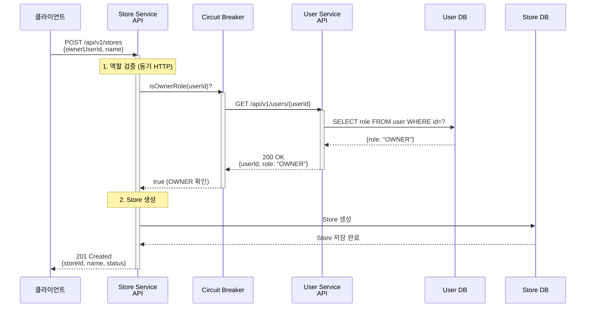
```mermaid
sequenceDiagram
    participant Client as 클라이언트
    participant StoreAPI as Store Service<br/>API
    participant CircuitBreaker as Circuit Breaker
    participant UserAPI as User Service<br/>API
    participant UserDB as User DB
    participant StoreDB as Store DB

    Client->>StoreAPI: POST /api/v1/stores<br/>{ownerUserId, name}

    activate StoreAPI
    Note over StoreAPI: 1. 역할 검증 (동기 HTTP)
    StoreAPI->>CircuitBreaker: isOwnerRole(userId)?

    activate CircuitBreaker
    CircuitBreaker->>UserAPI: GET /api/v1/users/{userId}

    activate UserAPI
    UserAPI->>UserDB: SELECT role FROM user WHERE id=?
    UserDB-->>UserAPI: {role: "OWNER"}
    UserAPI-->>CircuitBreaker: 200 OK<br/>{userId, role: "OWNER"}
    deactivate UserAPI

    CircuitBreaker-->>StoreAPI: true (OWNER 확인)
    deactivate CircuitBreaker

    Note over StoreAPI: 2. Store 생성
    StoreAPI->>StoreDB: Store 생성
    StoreDB-->>StoreAPI: Store 저장 완료

    StoreAPI-->>Client: 201 Created<br/>{storeId, name, status}
    deactivate StoreAPI
```

**주요 포인트**:
- ✅ **동기 HTTP**: 역할 검증은 실시간 필수
- ✅ **Circuit Breaker**: User Service 장애 격리
- ✅ **보안 강화**: Eventual Consistency 위험 제거

**응답 시간**: ~150ms (User API 50ms + Store 생성 100ms)

---

### Circuit Breaker Open (장애 시)

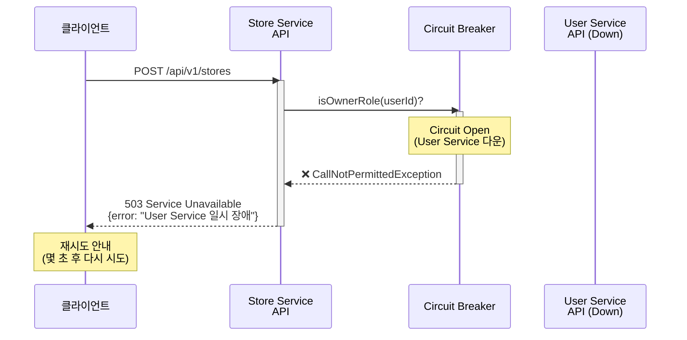
```mermaid
sequenceDiagram
    participant Client as 클라이언트
    participant StoreAPI as Store Service<br/>API
    participant CircuitBreaker as Circuit Breaker
    participant UserAPI as User Service<br/>API (Down)

    Client->>StoreAPI: POST /api/v1/stores

    activate StoreAPI
    StoreAPI->>CircuitBreaker: isOwnerRole(userId)?

    activate CircuitBreaker
    Note over CircuitBreaker: Circuit Open<br/>(User Service 다운)
    CircuitBreaker-->>StoreAPI: ❌ CallNotPermittedException
    deactivate CircuitBreaker

    StoreAPI-->>Client: 503 Service Unavailable<br/>{error: "User Service 일시 장애"}
    deactivate StoreAPI

    Note over Client: 재시도 안내<br/>(몇 초 후 다시 시도)
```

**Circuit Breaker 설정**:
- Failure Rate: 50%
- Wait Duration: 10초
- Fallback: 기본적으로 Store 생성 거부 (보안 우선)

---

## 2. Store 삭제 (Cascade Operation)

### 시나리오
스토어 소유자가 스토어를 삭제하면, 해당 스토어의 모든 상품이 자동으로 비활성화(DISCONTINUED) 처리됩니다.

### 비동기 이벤트 흐름

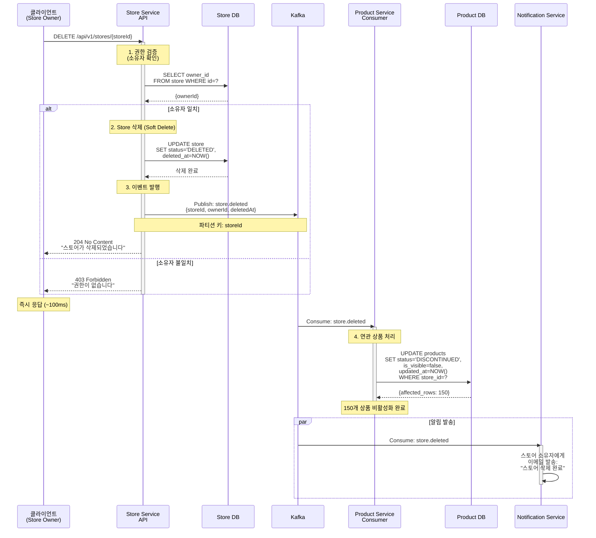
```mermaid
sequenceDiagram
    participant Client as 클라이언트<br/>(Store Owner)
    participant StoreAPI as Store Service<br/>API
    participant StoreDB as Store DB
    participant Kafka as Kafka
    participant ProductConsumer as Product Service<br/>Consumer
    participant ProductDB as Product DB
    participant NotificationConsumer as Notification Service

    Client->>StoreAPI: DELETE /api/v1/stores/{storeId}

    activate StoreAPI
    Note over StoreAPI: 1. 권한 검증<br/>(소유자 확인)
    StoreAPI->>StoreDB: SELECT owner_id<br/>FROM store WHERE id=?
    StoreDB-->>StoreAPI: {ownerId}

    alt 소유자 일치
        Note over StoreAPI: 2. Store 삭제 (Soft Delete)
        StoreAPI->>StoreDB: UPDATE store<br/>SET status='DELETED',<br/>deleted_at=NOW()
        StoreDB-->>StoreAPI: 삭제 완료

        Note over StoreAPI: 3. 이벤트 발행
        StoreAPI->>Kafka: Publish: store.deleted<br/>{storeId, ownerId, deletedAt}
        Note over StoreAPI,Kafka: 파티션 키: storeId

        StoreAPI-->>Client: 204 No Content<br/>"스토어가 삭제되었습니다"
    else 소유자 불일치
        StoreAPI-->>Client: 403 Forbidden<br/>"권한이 없습니다"
    end
    deactivate StoreAPI

    Note over Client: 즉시 응답 (~100ms)

    Kafka->>ProductConsumer: Consume: store.deleted

    activate ProductConsumer
    Note over ProductConsumer: 4. 연관 상품 처리
    ProductConsumer->>ProductDB: UPDATE products<br/>SET status='DISCONTINUED',<br/>is_visible=false,<br/>updated_at=NOW()<br/>WHERE store_id=?
    ProductDB-->>ProductConsumer: {affected_rows: 150}

    Note over ProductConsumer: 150개 상품 비활성화 완료
    deactivate ProductConsumer

    par 알림 발송
        Kafka->>NotificationConsumer: Consume: store.deleted
        activate NotificationConsumer
        NotificationConsumer->>NotificationConsumer: 스토어 소유자에게<br/>이메일 발송:<br/>"스토어 삭제 완료"
        deactivate NotificationConsumer
    end
```

**주요 포인트**:
- ✅ **Soft Delete**: 실제 삭제 대신 status='DELETED' 처리 (데이터 복구 가능)
- ✅ **Cascade Operation**: Product Service가 자율적으로 연관 상품 처리
- ✅ **빠른 응답**: Store 삭제 API는 즉시 응답 (~100ms)
- ✅ **비동기 처리**: 상품 비활성화는 백그라운드에서 처리 (1~3초)
- ✅ **권한 검증**: 스토어 소유자만 삭제 가능

**응답 시간**:
- Store 삭제: ~100ms (동기)
- 연관 상품 처리: 1~5초 (비동기, 상품 수에 따라 변동)

**비즈니스 규칙**:
- 진행 중인 주문이 있는 경우: Store 삭제 불가 (409 Conflict)
- 삭제 후 복구: 관리자 API를 통해 30일 이내 복구 가능
- 30일 경과 후: Hard Delete (Scheduled Job)

---

## 3. Order 생성 (완전 비동기 Saga)

### 시나리오
고객이 주문을 생성하면 즉시 접수되고, 비동기로 재고 예약 → 주문 확정 → 결제 대기 흐름이 진행됩니다.

### 정상 흐름

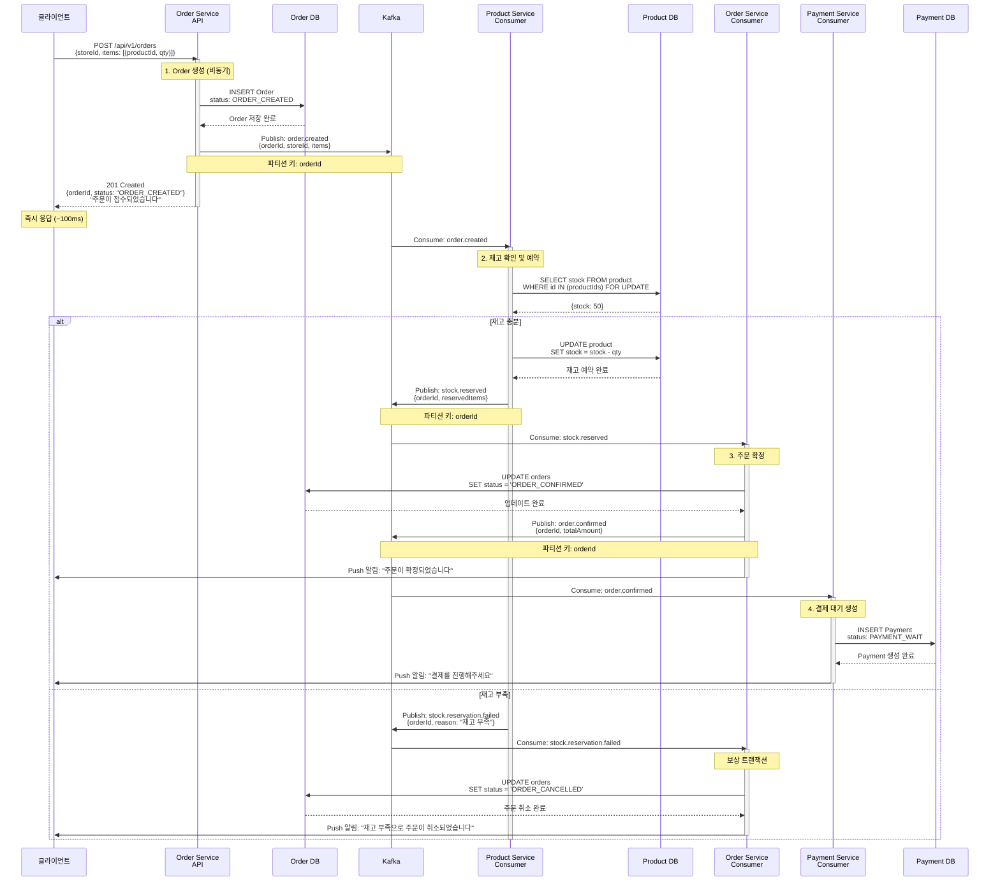
```mermaid
sequenceDiagram
    participant Client as 클라이언트
    participant OrderAPI as Order Service<br/>API
    participant OrderDB as Order DB
    participant Kafka as Kafka
    participant ProductConsumer as Product Service<br/>Consumer
    participant ProductDB as Product DB
    participant OrderConsumer as Order Service<br/>Consumer
    participant PaymentConsumer as Payment Service<br/>Consumer
    participant PaymentDB as Payment DB

    Client->>OrderAPI: POST /api/v1/orders<br/>{storeId, items: [{productId, qty}]}

    activate OrderAPI
    Note over OrderAPI: 1. Order 생성 (비동기)
    OrderAPI->>OrderDB: INSERT Order<br/>status: ORDER_CREATED
    OrderDB-->>OrderAPI: Order 저장 완료

    OrderAPI->>Kafka: Publish: order.created<br/>{orderId, storeId, items}
    Note over OrderAPI,Kafka: 파티션 키: orderId

    OrderAPI-->>Client: 201 Created<br/>{orderId, status: "ORDER_CREATED"}<br/>"주문이 접수되었습니다"
    deactivate OrderAPI

    Note over Client: 즉시 응답 (~100ms)

    Kafka->>ProductConsumer: Consume: order.created

    activate ProductConsumer
    Note over ProductConsumer: 2. 재고 확인 및 예약
    ProductConsumer->>ProductDB: SELECT stock FROM product<br/>WHERE id IN (productIds) FOR UPDATE
    ProductDB-->>ProductConsumer: {stock: 50}

    alt 재고 충분
        ProductConsumer->>ProductDB: UPDATE product<br/>SET stock = stock - qty
        ProductDB-->>ProductConsumer: 재고 예약 완료

        ProductConsumer->>Kafka: Publish: stock.reserved<br/>{orderId, reservedItems}
        Note over ProductConsumer,Kafka: 파티션 키: orderId

        Kafka->>OrderConsumer: Consume: stock.reserved

        activate OrderConsumer
        Note over OrderConsumer: 3. 주문 확정
        OrderConsumer->>OrderDB: UPDATE orders<br/>SET status = 'ORDER_CONFIRMED'
        OrderDB-->>OrderConsumer: 업데이트 완료

        OrderConsumer->>Kafka: Publish: order.confirmed<br/>{orderId, totalAmount}
        Note over OrderConsumer,Kafka: 파티션 키: orderId

        OrderConsumer->>Client: Push 알림: "주문이 확정되었습니다"
        deactivate OrderConsumer

        Kafka->>PaymentConsumer: Consume: order.confirmed

        activate PaymentConsumer
        Note over PaymentConsumer: 4. 결제 대기 생성
        PaymentConsumer->>PaymentDB: INSERT Payment<br/>status: PAYMENT_WAIT
        PaymentDB-->>PaymentConsumer: Payment 생성 완료

        PaymentConsumer->>Client: Push 알림: "결제를 진행해주세요"
        deactivate PaymentConsumer

    else 재고 부족
        ProductConsumer->>Kafka: Publish: stock.reservation.failed<br/>{orderId, reason: "재고 부족"}

        Kafka->>OrderConsumer: Consume: stock.reservation.failed

        activate OrderConsumer
        Note over OrderConsumer: 보상 트랜잭션
        OrderConsumer->>OrderDB: UPDATE orders<br/>SET status = 'ORDER_CANCELLED'
        OrderDB-->>OrderConsumer: 주문 취소 완료

        OrderConsumer->>Client: Push 알림: "재고 부족으로 주문이 취소되었습니다"
        deactivate OrderConsumer
    end

    deactivate ProductConsumer
```

**주요 포인트**:
- ✅ **빠른 응답**: 재고 확인 전에 주문 접수 완료 (~100ms)
- ✅ **약결합**: Product Service 장애와 무관하게 주문 접수
- ✅ **Choreography**: 각 서비스가 자율적으로 이벤트 처리
- ✅ **보상 트랜잭션**: 재고 부족 시 자동 주문 취소 + Push 알림
- ✅ **순서 보장**: 파티션 키 = orderId

**응답 시간**:
- 주문 접수: ~100ms (동기)
- 재고 예약 → 주문 확정 → 결제 생성: 1~3초 (비동기)

---

## 4. Payment-Order Saga (결제 완료)

### 시나리오
고객이 결제를 완료하면 Order Service가 재고를 확정합니다.

### 정상 흐름

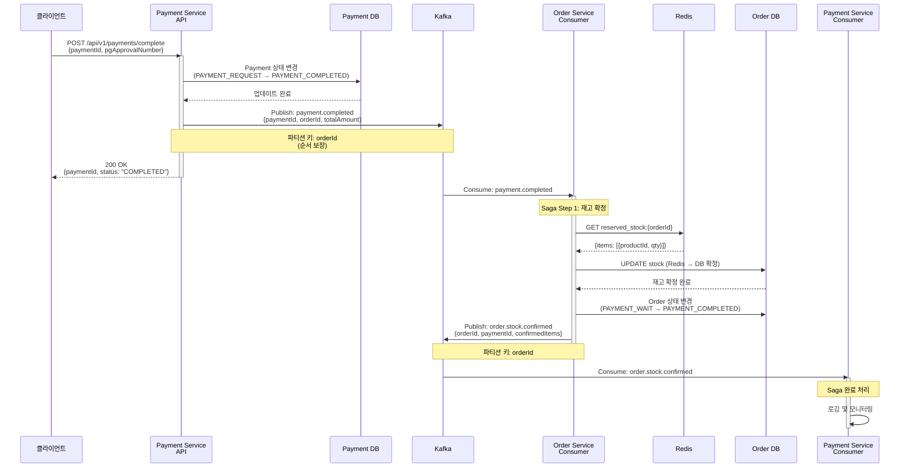
```mermaid
sequenceDiagram
    participant Client as 클라이언트
    participant PaymentAPI as Payment Service<br/>API
    participant PaymentDB as Payment DB
    participant Kafka as Kafka
    participant OrderConsumer as Order Service<br/>Consumer
    participant Redis as Redis
    participant OrderDB as Order DB
    participant PaymentConsumer as Payment Service<br/>Consumer

    Client->>PaymentAPI: POST /api/v1/payments/complete<br/>{paymentId, pgApprovalNumber}

    activate PaymentAPI
    PaymentAPI->>PaymentDB: Payment 상태 변경<br/>(PAYMENT_REQUEST → PAYMENT_COMPLETED)
    PaymentDB-->>PaymentAPI: 업데이트 완료

    PaymentAPI->>Kafka: Publish: payment.completed<br/>{paymentId, orderId, totalAmount}
    Note over PaymentAPI,Kafka: 파티션 키: orderId<br/>(순서 보장)

    PaymentAPI-->>Client: 200 OK<br/>{paymentId, status: "COMPLETED"}
    deactivate PaymentAPI

    Kafka->>OrderConsumer: Consume: payment.completed

    activate OrderConsumer
    Note over OrderConsumer: Saga Step 1: 재고 확정
    OrderConsumer->>Redis: GET reserved_stock:{orderId}
    Redis-->>OrderConsumer: {items: [{productId, qty}]}

    OrderConsumer->>OrderDB: UPDATE stock (Redis → DB 확정)
    OrderDB-->>OrderConsumer: 재고 확정 완료

    OrderConsumer->>OrderDB: Order 상태 변경<br/>(PAYMENT_WAIT → PAYMENT_COMPLETED)

    OrderConsumer->>Kafka: Publish: order.stock.confirmed<br/>{orderId, paymentId, confirmedItems}
    Note over OrderConsumer,Kafka: 파티션 키: orderId
    deactivate OrderConsumer

    Kafka->>PaymentConsumer: Consume: order.stock.confirmed

    activate PaymentConsumer
    Note over PaymentConsumer: Saga 완료 처리
    PaymentConsumer->>PaymentConsumer: 로깅 및 모니터링
    deactivate PaymentConsumer
```

**주요 포인트**:
- ✅ Saga 시작: `payment.completed`
- ✅ 재고 확정: Redis → DB (영구 저장)
- ✅ Saga 완료: `order.stock.confirmed`
- ✅ 순서 보장: 파티션 키 = `orderId`

**응답 시간**:
- Payment 완료: ~100ms (동기)
- 재고 확정: 1~3초 (비동기)

---

## 5. Payment Saga (결제 실패)

### 시나리오
고객이 결제를 시도했으나 PG사에서 결제 승인이 거부되는 경우 보상 트랜잭션이 실행됩니다.

### 실패 흐름

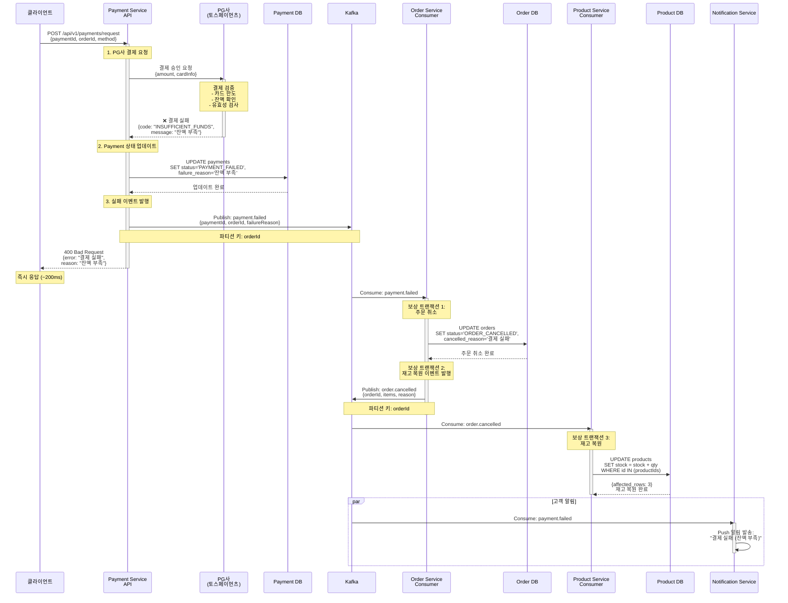
```mermaid
sequenceDiagram
    participant Client as 클라이언트
    participant PaymentAPI as Payment Service<br/>API
    participant PG as PG사<br/>(토스페이먼츠)
    participant PaymentDB as Payment DB
    participant Kafka as Kafka
    participant OrderConsumer as Order Service<br/>Consumer
    participant OrderDB as Order DB
    participant ProductConsumer as Product Service<br/>Consumer
    participant ProductDB as Product DB
    participant NotificationConsumer as Notification Service

    Client->>PaymentAPI: POST /api/v1/payments/request<br/>{paymentId, orderId, method}

    activate PaymentAPI
    Note over PaymentAPI: 1. PG사 결제 요청
    PaymentAPI->>PG: 결제 승인 요청<br/>{amount, cardInfo}

    activate PG
    Note over PG: 결제 검증<br/>- 카드 한도<br/>- 잔액 확인<br/>- 유효성 검사

    PG-->>PaymentAPI: ❌ 결제 실패<br/>{code: "INSUFFICIENT_FUNDS",<br/>message: "잔액 부족"}
    deactivate PG

    Note over PaymentAPI: 2. Payment 상태 업데이트
    PaymentAPI->>PaymentDB: UPDATE payments<br/>SET status='PAYMENT_FAILED',<br/>failure_reason='잔액 부족'
    PaymentDB-->>PaymentAPI: 업데이트 완료

    Note over PaymentAPI: 3. 실패 이벤트 발행
    PaymentAPI->>Kafka: Publish: payment.failed<br/>{paymentId, orderId, failureReason}
    Note over PaymentAPI,Kafka: 파티션 키: orderId

    PaymentAPI-->>Client: 400 Bad Request<br/>{error: "결제 실패",<br/>reason: "잔액 부족"}
    deactivate PaymentAPI

    Note over Client: 즉시 응답 (~200ms)

    Kafka->>OrderConsumer: Consume: payment.failed

    activate OrderConsumer
    Note over OrderConsumer: 보상 트랜잭션 1:<br/>주문 취소
    OrderConsumer->>OrderDB: UPDATE orders<br/>SET status='ORDER_CANCELLED',<br/>cancelled_reason='결제 실패'
    OrderDB-->>OrderConsumer: 주문 취소 완료

    Note over OrderConsumer: 보상 트랜잭션 2:<br/>재고 복원 이벤트 발행
    OrderConsumer->>Kafka: Publish: order.cancelled<br/>{orderId, items, reason}
    Note over OrderConsumer,Kafka: 파티션 키: orderId
    deactivate OrderConsumer

    Kafka->>ProductConsumer: Consume: order.cancelled

    activate ProductConsumer
    Note over ProductConsumer: 보상 트랜잭션 3:<br/>재고 복원
    ProductConsumer->>ProductDB: UPDATE products<br/>SET stock = stock + qty<br/>WHERE id IN (productIds)
    ProductDB-->>ProductConsumer: {affected_rows: 3}<br/>재고 복원 완료
    deactivate ProductConsumer

    par 고객 알림
        Kafka->>NotificationConsumer: Consume: payment.failed
        activate NotificationConsumer
        NotificationConsumer->>NotificationConsumer: Push 알림 발송:<br/>"결제 실패 (잔액 부족)"
        deactivate NotificationConsumer
    end
```

**주요 포인트**:
- ✅ **즉시 실패 응답**: PG사 응답 즉시 클라이언트에게 전달 (~200ms)
- ✅ **자동 보상 트랜잭션**: Order 취소 → 재고 복원 자동 실행
- ✅ **데이터 정합성**: 주문/재고/결제 상태 일관성 유지
- ✅ **고객 알림**: 실패 사유와 함께 알림 발송

**응답 시간**:
- 결제 실패 응답: ~200ms (동기, PG사 응답 포함)
- 보상 트랜잭션: 1~3초 (비동기)

**결제 실패 사유**:
- `INSUFFICIENT_FUNDS`: 잔액 부족
- `CARD_LIMIT_EXCEEDED`: 카드 한도 초과
- `INVALID_CARD`: 유효하지 않은 카드
- `EXPIRED_CARD`: 카드 유효기간 만료
- `PG_TIMEOUT`: PG사 타임아웃

**비즈니스 규칙**:
- 결제 실패 시 주문은 ORDER_CANCELLED 상태로 변경
- 재고는 즉시 복원 (다른 고객이 구매 가능)
- 고객은 동일한 주문으로 재결제 불가 (새 주문 생성 필요)

---

## 6. Payment-Order Saga (재고 부족 실패)

### 시나리오
결제 완료 후 재고 확정 시 재고가 부족한 경우 보상 트랜잭션이 실행됩니다.

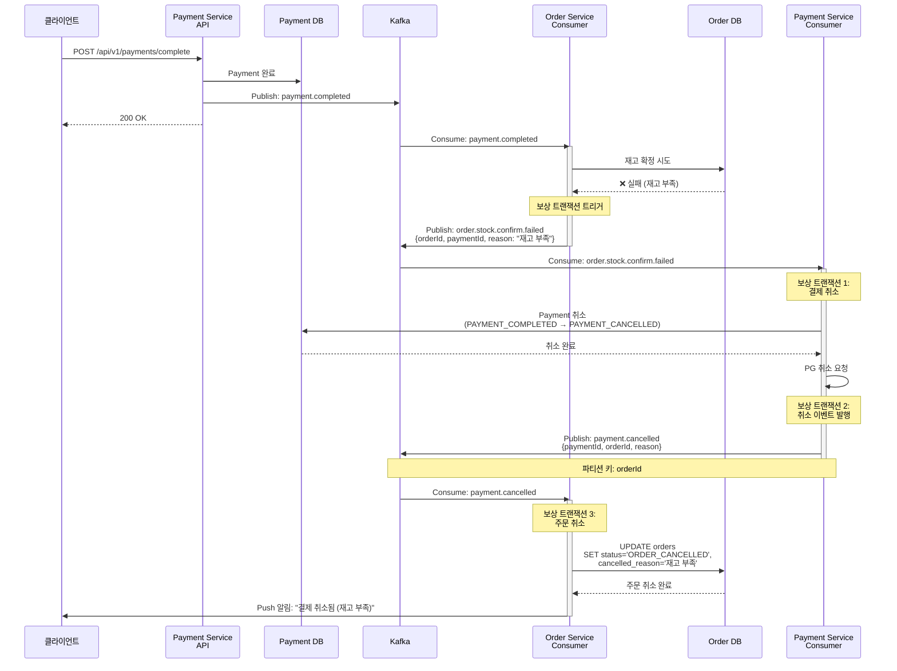
```mermaid
sequenceDiagram
    participant Client as 클라이언트
    participant PaymentAPI as Payment Service<br/>API
    participant PaymentDB as Payment DB
    participant Kafka as Kafka
    participant OrderConsumer as Order Service<br/>Consumer
    participant OrderDB as Order DB
    participant PaymentConsumer as Payment Service<br/>Consumer

    Client->>PaymentAPI: POST /api/v1/payments/complete
    PaymentAPI->>PaymentDB: Payment 완료
    PaymentAPI->>Kafka: Publish: payment.completed
    PaymentAPI-->>Client: 200 OK

    Kafka->>OrderConsumer: Consume: payment.completed

    activate OrderConsumer
    OrderConsumer->>OrderDB: 재고 확정 시도
    OrderDB-->>OrderConsumer: ❌ 실패 (재고 부족)

    Note over OrderConsumer: 보상 트랜잭션 트리거
    OrderConsumer->>Kafka: Publish: order.stock.confirm.failed<br/>{orderId, paymentId, reason: "재고 부족"}
    deactivate OrderConsumer

    Kafka->>PaymentConsumer: Consume: order.stock.confirm.failed

    activate PaymentConsumer
    Note over PaymentConsumer: 보상 트랜잭션 1:<br/>결제 취소
    PaymentConsumer->>PaymentDB: Payment 취소<br/>(PAYMENT_COMPLETED → PAYMENT_CANCELLED)
    PaymentDB-->>PaymentConsumer: 취소 완료

    PaymentConsumer->>PaymentConsumer: PG 취소 요청

    Note over PaymentConsumer: 보상 트랜잭션 2:<br/>취소 이벤트 발행
    PaymentConsumer->>Kafka: Publish: payment.cancelled<br/>{paymentId, orderId, reason}
    Note over PaymentConsumer,Kafka: 파티션 키: orderId
    deactivate PaymentConsumer

    Kafka->>OrderConsumer: Consume: payment.cancelled

    activate OrderConsumer
    Note over OrderConsumer: 보상 트랜잭션 3:<br/>주문 취소
    OrderConsumer->>OrderDB: UPDATE orders<br/>SET status='ORDER_CANCELLED',<br/>cancelled_reason='재고 부족'
    OrderDB-->>OrderConsumer: 주문 취소 완료

    OrderConsumer->>Client: Push 알림: "결제 취소됨 (재고 부족)"
    deactivate OrderConsumer
```

**보상 트랜잭션 체인**:
1. Order Service: 재고 확정 실패 감지
2. `order.stock.confirm.failed` 이벤트 발행
3. Payment Service: 결제 자동 취소 + PG사 API 호출
4. `payment.cancelled` 이벤트 발행
5. Order Service: 주문 상태 ORDER_CANCELLED로 업데이트
6. 고객 알림 발송

**주요 포인트**:
- ✅ **연쇄 보상**: 재고 부족 → 결제 취소 → 주문 취소 자동 처리
- ✅ **이벤트 체인**: `order.stock.confirm.failed` → `payment.cancelled`
- ✅ **멱등성**: 중복 취소 방지 (eventId 체크)
- ✅ **알림**: 고객에게 취소 사유 통지

---

## 7. 스케줄 작업 시나리오

### 7.1 만료된 주문 자동 취소 (Scheduled Job)

#### 시나리오
결제 대기 중인 주문이 30분 이상 경과하면 자동으로 취소되고 재고가 복원됩니다.

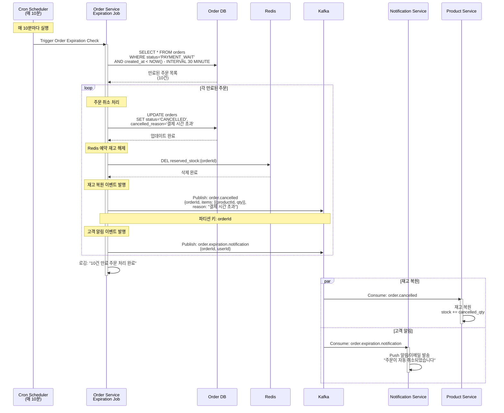
```mermaid
sequenceDiagram
    participant Scheduler as Cron Scheduler<br/>(매 10분)
    participant OrderJob as Order Service<br/>Expiration Job
    participant OrderDB as Order DB
    participant Redis as Redis
    participant Kafka as Kafka
    participant NotificationConsumer as Notification Service
    participant ProductConsumer as Product Service

    Note over Scheduler: 매 10분마다 실행

    Scheduler->>OrderJob: Trigger Order Expiration Check

    activate OrderJob
    OrderJob->>OrderDB: SELECT * FROM orders<br/>WHERE status='PAYMENT_WAIT'<br/>AND created_at < NOW() - INTERVAL 30 MINUTE
    OrderDB-->>OrderJob: 만료된 주문 목록<br/>(10건)

    loop 각 만료된 주문
        Note over OrderJob: 주문 취소 처리
        OrderJob->>OrderDB: UPDATE orders<br/>SET status='CANCELLED',<br/>cancelled_reason='결제 시간 초과'
        OrderDB-->>OrderJob: 업데이트 완료

        Note over OrderJob: Redis 예약 재고 해제
        OrderJob->>Redis: DEL reserved_stock:{orderId}
        Redis-->>OrderJob: 삭제 완료

        Note over OrderJob: 재고 복원 이벤트 발행
        OrderJob->>Kafka: Publish: order.cancelled<br/>{orderId, items: [{productId, qty}],<br/>reason: "결제 시간 초과"}
        Note over OrderJob,Kafka: 파티션 키: orderId

        Note over OrderJob: 고객 알림 이벤트 발행
        OrderJob->>Kafka: Publish: order.expiration.notification<br/>{orderId, userId}
    end

    OrderJob->>OrderJob: 로깅: "10건 만료 주문 처리 완료"
    deactivate OrderJob

    par 재고 복원
        Kafka->>ProductConsumer: Consume: order.cancelled
        activate ProductConsumer
        ProductConsumer->>ProductConsumer: 재고 복원<br/>stock += cancelled_qty
        deactivate ProductConsumer
    and 고객 알림
        Kafka->>NotificationConsumer: Consume: order.expiration.notification
        activate NotificationConsumer
        NotificationConsumer->>NotificationConsumer: Push 알림/이메일 발송<br/>"주문이 자동 취소되었습니다"
        deactivate NotificationConsumer
    end
```

**스케줄 설정**:
```kotlin
@Scheduled(cron = "0 */10 * * * *")  // 매 10분
fun cancelExpiredOrders() {
    val expiredOrders = orderRepository.findExpiredOrders(
        status = OrderStatus.PAYMENT_WAIT,
        expiredBefore = LocalDateTime.now().minusMinutes(30)
    )

    expiredOrders.forEach { order ->
        order.cancel("결제 시간 초과")
        orderRepository.save(order)

        // Redis 재고 해제
        redisTemplate.delete("reserved_stock:${order.id}")

        // 이벤트 발행
        eventPublisher.publish("order.cancelled", OrderCancelledEvent(...))
    }

    logger.info("Expired orders cancelled: ${expiredOrders.size}")
}
```

**주요 포인트**:
- ✅ 배치 처리: 한 번에 최대 100건 처리
- ✅ 재고 복원: Redis 예약 해제 + Product 재고 증가
- ✅ 고객 알림: 비동기 알림 발송
- ✅ 멱등성: 이미 취소된 주문 skip

---

### 7.2 배치 재고 동기화 (Scheduled Job)

#### 시나리오
매일 새벽 Redis 재고와 DB 재고를 동기화하여 불일치를 해소합니다.

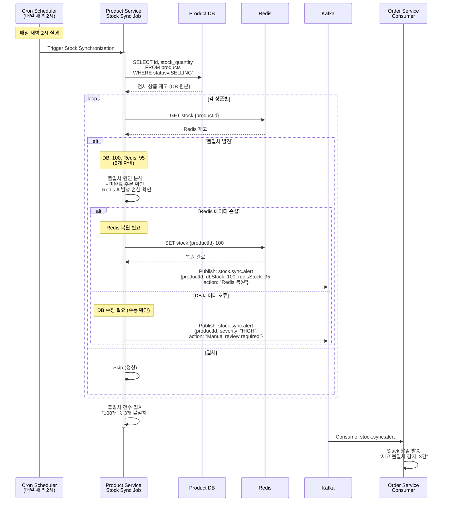
```mermaid
sequenceDiagram
    participant Scheduler as Cron Scheduler<br/>(매일 새벽 2시)
    participant ProductJob as Product Service<br/>Stock Sync Job
    participant ProductDB as Product DB
    participant Redis as Redis
    participant Kafka as Kafka
    participant OrderConsumer as Order Service<br/>Consumer

    Note over Scheduler: 매일 새벽 2시 실행

    Scheduler->>ProductJob: Trigger Stock Synchronization

    activate ProductJob
    ProductJob->>ProductDB: SELECT id, stock_quantity<br/>FROM products<br/>WHERE status='SELLING'
    ProductDB-->>ProductJob: 전체 상품 재고 (DB 원본)

    loop 각 상품별
        ProductJob->>Redis: GET stock:{productId}
        Redis-->>ProductJob: Redis 재고

        alt 불일치 발견
            Note over ProductJob: DB: 100, Redis: 95<br/>(5개 차이)

            ProductJob->>ProductJob: 불일치 원인 분석<br/>- 미완료 주문 확인<br/>- Redis 휘발성 손실 확인

            alt Redis 데이터 손실
                Note over ProductJob: Redis 복원 필요
                ProductJob->>Redis: SET stock:{productId} 100
                Redis-->>ProductJob: 복원 완료

                ProductJob->>Kafka: Publish: stock.sync.alert<br/>{productId, dbStock: 100, redisStock: 95,<br/>action: "Redis 복원"}
            else DB 데이터 오류
                Note over ProductJob: DB 수정 필요 (수동 확인)
                ProductJob->>Kafka: Publish: stock.sync.alert<br/>{productId, severity: "HIGH",<br/>action: "Manual review required"}
            end
        else 일치
            ProductJob->>ProductJob: Skip (정상)
        end
    end

    ProductJob->>ProductJob: 불일치 건수 집계<br/>"100개 중 3개 불일치"
    deactivate ProductJob

    Kafka->>OrderConsumer: Consume: stock.sync.alert
    OrderConsumer->>OrderConsumer: Slack 알림 발송<br/>"재고 불일치 감지: 3건"
```

**스케줄 설정**:
```kotlin
@Scheduled(cron = "0 0 2 * * *")  // 매일 새벽 2시
fun synchronizeStock() {
    val products = productRepository.findByStatus(ProductStatus.SELLING)
    var mismatchCount = 0

    products.forEach { product ->
        val dbStock = product.stockQuantity
        val redisStock = redisTemplate.opsForValue()
            .get("stock:${product.id}")?.toInt() ?: 0

        if (dbStock != redisStock) {
            mismatchCount++

            // Redis 복원 (DB를 신뢰)
            redisTemplate.opsForValue().set("stock:${product.id}", dbStock.toString())

            // 알림 이벤트 발행
            eventPublisher.publish("stock.sync.alert", StockSyncAlertEvent(
                productId = product.id,
                dbStock = dbStock,
                redisStock = redisStock,
                action = "Redis 복원"
            ))
        }
    }

    logger.info("Stock sync completed: $mismatchCount mismatches found")
}
```

**주요 포인트**:
- ✅ **DB를 신뢰**: 재고 불일치 시 DB 기준으로 Redis 복원
- ✅ **트래픽 낮은 시간대**: 새벽 2시 실행
- ✅ **알림**: 불일치 건수가 임계값(10건) 초과 시 긴급 알림

---

### 7.3 Read Model 캐시 워밍 (Scheduled Job)

#### 시나리오
서비스 시작 시 또는 매일 새벽 인기 상품의 Read Model을 미리 캐시에 로드합니다.

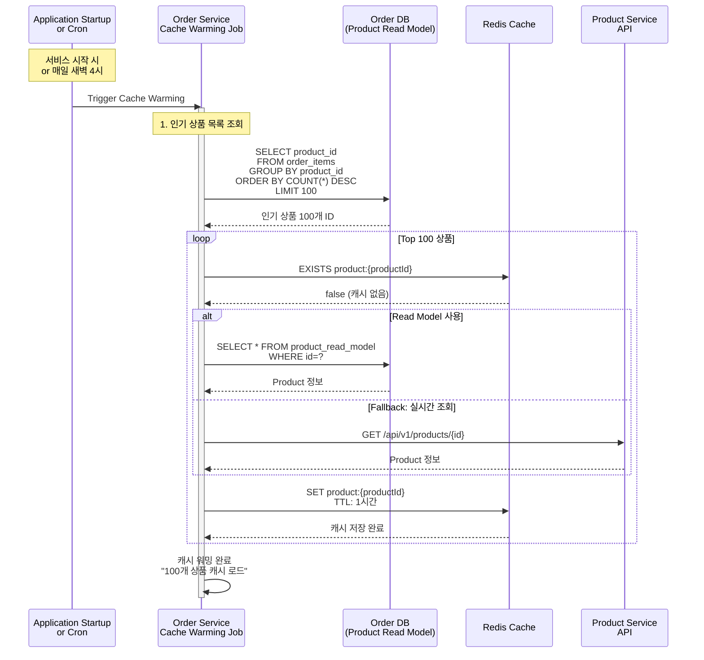
```mermaid
sequenceDiagram
    participant Scheduler as Application Startup<br/>or Cron
    participant OrderJob as Order Service<br/>Cache Warming Job
    participant ReadModelDB as Order DB<br/>(Product Read Model)
    participant Cache as Redis Cache
    participant ProductAPI as Product Service<br/>API

    Note over Scheduler: 서비스 시작 시<br/>or 매일 새벽 4시

    Scheduler->>OrderJob: Trigger Cache Warming

    activate OrderJob
    Note over OrderJob: 1. 인기 상품 목록 조회
    OrderJob->>ReadModelDB: SELECT product_id<br/>FROM order_items<br/>GROUP BY product_id<br/>ORDER BY COUNT(*) DESC<br/>LIMIT 100
    ReadModelDB-->>OrderJob: 인기 상품 100개 ID

    loop Top 100 상품
        OrderJob->>Cache: EXISTS product:{productId}
        Cache-->>OrderJob: false (캐시 없음)

        alt Read Model 사용
            OrderJob->>ReadModelDB: SELECT * FROM product_read_model<br/>WHERE id=?
            ReadModelDB-->>OrderJob: Product 정보
        else Fallback: 실시간 조회
            OrderJob->>ProductAPI: GET /api/v1/products/{id}
            ProductAPI-->>OrderJob: Product 정보
        end

        OrderJob->>Cache: SET product:{productId}<br/>TTL: 1시간
        Cache-->>OrderJob: 캐시 저장 완료
    end

    OrderJob->>OrderJob: 캐시 워밍 완료<br/>"100개 상품 캐시 로드"
    deactivate OrderJob
```

**스케줄 설정**:
```kotlin
@EventListener(ApplicationReadyEvent::class)  // 서비스 시작 시
@Scheduled(cron = "0 0 4 * * *")  // 매일 새벽 4시
fun warmUpCache() {
    // 인기 상품 100개 조회
    val topProducts = orderItemRepository.findTopProducts(limit = 100)

    topProducts.forEach { productId ->
        val cacheKey = "product:$productId"

        if (!cacheManager.getCache("products")?.get(cacheKey)?.get()) {
            val product = productReadModelRepository.findById(productId)
                .orElse(null)

            if (product != null) {
                cacheManager.getCache("products")
                    ?.put(cacheKey, product)
            }
        }
    }

    logger.info("Cache warming completed: ${topProducts.size} products")
}
```

**주요 포인트**:
- ✅ **Cold Start 방지**: 서비스 시작 시 캐시 미리 로드
- ✅ **인기 상품 우선**: 주문 빈도 기준 Top 100
- ✅ **TTL 설정**: 1시간 후 자동 만료

---

### 7.4 통계 집계 및 리포트 생성 (Scheduled Job)

#### 시나리오
매일 판매 통계를 집계하고 Kafka 이벤트로 발행합니다.

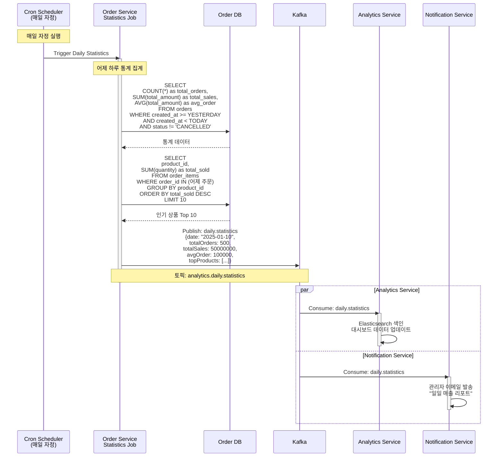
```mermaid
sequenceDiagram
    participant Scheduler as Cron Scheduler<br/>(매일 자정)
    participant OrderJob as Order Service<br/>Statistics Job
    participant OrderDB as Order DB
    participant Kafka as Kafka
    participant AnalyticsConsumer as Analytics Service
    participant NotificationConsumer as Notification Service

    Note over Scheduler: 매일 자정 실행

    Scheduler->>OrderJob: Trigger Daily Statistics

    activate OrderJob
    Note over OrderJob: 어제 하루 통계 집계
    OrderJob->>OrderDB: SELECT<br/>  COUNT(*) as total_orders,<br/>  SUM(total_amount) as total_sales,<br/>  AVG(total_amount) as avg_order<br/>FROM orders<br/>WHERE created_at >= YESTERDAY<br/>AND created_at < TODAY<br/>AND status != 'CANCELLED'
    OrderDB-->>OrderJob: 통계 데이터

    OrderJob->>OrderDB: SELECT<br/>  product_id,<br/>  SUM(quantity) as total_sold<br/>FROM order_items<br/>WHERE order_id IN (어제 주문)<br/>GROUP BY product_id<br/>ORDER BY total_sold DESC<br/>LIMIT 10
    OrderDB-->>OrderJob: 인기 상품 Top 10

    OrderJob->>Kafka: Publish: daily.statistics<br/>{date: "2025-01-10",<br/>totalOrders: 500,<br/>totalSales: 50000000,<br/>avgOrder: 100000,<br/>topProducts: [...]}
    Note over OrderJob,Kafka: 토픽: analytics.daily.statistics
    deactivate OrderJob

    par Analytics Service
        Kafka->>AnalyticsConsumer: Consume: daily.statistics
        activate AnalyticsConsumer
        AnalyticsConsumer->>AnalyticsConsumer: Elasticsearch 색인<br/>대시보드 데이터 업데이트
        deactivate AnalyticsConsumer
    and Notification Service
        Kafka->>NotificationConsumer: Consume: daily.statistics
        activate NotificationConsumer
        NotificationConsumer->>NotificationConsumer: 관리자 이메일 발송<br/>"일일 매출 리포트"
        deactivate NotificationConsumer
    end
```

**스케줄 설정**:
```kotlin
@Scheduled(cron = "0 0 0 * * *")  // 매일 자정
fun generateDailyStatistics() {
    val yesterday = LocalDate.now().minusDays(1)
    val statistics = orderRepository.getDailyStatistics(yesterday)

    val topProducts = orderItemRepository.getTopSellingProducts(
        date = yesterday,
        limit = 10
    )

    val event = DailyStatisticsEvent(
        date = yesterday,
        totalOrders = statistics.totalOrders,
        totalSales = statistics.totalSales,
        avgOrderAmount = statistics.avgOrderAmount,
        topProducts = topProducts
    )

    eventPublisher.publish("analytics.daily.statistics", event)

    logger.info("Daily statistics generated for $yesterday")
}
```

**주요 포인트**:
- ✅ **일일 통계**: 매일 자정 전날 데이터 집계
- ✅ **이벤트 발행**: Analytics, Notification 서비스로 전파
- ✅ **비동기 처리**: 집계 부하가 실시간 서비스에 영향 없음

---

### 7.5 Dead Letter Queue 재처리 (Scheduled Job)

#### 시나리오
Dead Letter Topic에 쌓인 실패 메시지를 주기적으로 재처리합니다.

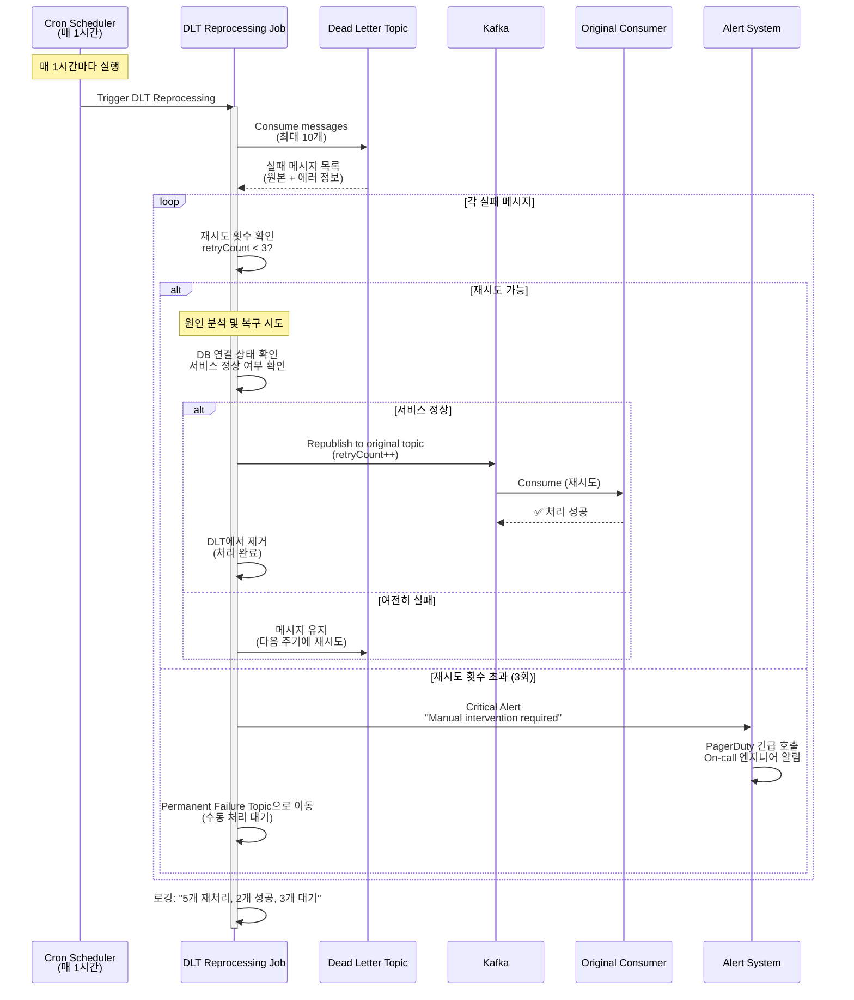
```mermaid
sequenceDiagram
    participant Scheduler as Cron Scheduler<br/>(매 1시간)
    participant DLTJob as DLT Reprocessing Job
    participant DLT as Dead Letter Topic
    participant Kafka as Kafka
    participant Consumer as Original Consumer
    participant AlertSystem as Alert System

    Note over Scheduler: 매 1시간마다 실행

    Scheduler->>DLTJob: Trigger DLT Reprocessing

    activate DLTJob
    DLTJob->>DLT: Consume messages<br/>(최대 10개)
    DLT-->>DLTJob: 실패 메시지 목록<br/>(원본 + 에러 정보)

    loop 각 실패 메시지
        DLTJob->>DLTJob: 재시도 횟수 확인<br/>retryCount < 3?

        alt 재시도 가능
            Note over DLTJob: 원인 분석 및 복구 시도
            DLTJob->>DLTJob: DB 연결 상태 확인<br/>서비스 정상 여부 확인

            alt 서비스 정상
                DLTJob->>Kafka: Republish to original topic<br/>(retryCount++)
                Kafka->>Consumer: Consume (재시도)
                Consumer-->>Kafka: ✅ 처리 성공

                DLTJob->>DLTJob: DLT에서 제거<br/>(처리 완료)
            else 여전히 실패
                DLTJob->>DLT: 메시지 유지<br/>(다음 주기에 재시도)
            end
        else 재시도 횟수 초과 (3회)
            DLTJob->>AlertSystem: Critical Alert<br/>"Manual intervention required"
            AlertSystem->>AlertSystem: PagerDuty 긴급 호출<br/>On-call 엔지니어 알림

            DLTJob->>DLTJob: Permanent Failure Topic으로 이동<br/>(수동 처리 대기)
        end
    end

    DLTJob->>DLTJob: 로깅: "5개 재처리, 2개 성공, 3개 대기"
    deactivate DLTJob
```

**스케줄 설정**:
```kotlin
@Scheduled(cron = "0 0 * * * *")  // 매 1시간
fun reprocessDeadLetterQueue() {
    val dlqMessages = kafkaTemplate.receive(
        topic = "product.created.dlt",
        maxMessages = 10
    )

    var successCount = 0
    var failureCount = 0

    dlqMessages.forEach { message ->
        val retryCount = message.headers["retry_count"]?.toInt() ?: 0

        if (retryCount < 3) {
            try {
                // 원본 토픽으로 재발행
                val newHeaders = message.headers.toMutableMap()
                newHeaders["retry_count"] = (retryCount + 1).toString()

                kafkaTemplate.send(
                    topic = "product.created",
                    key = message.key,
                    value = message.value,
                    headers = newHeaders
                )

                successCount++
            } catch (e: Exception) {
                logger.warn("Failed to reprocess DLQ message", e)
                failureCount++
            }
        } else {
            // 3회 초과 → 수동 처리 필요
            alertSystem.sendCriticalAlert(
                "DLQ message exceeded retry limit",
                message
            )

            kafkaTemplate.send("permanent.failure", message)
        }
    }

    logger.info("DLT reprocessing: $successCount success, $failureCount failed")
}
```

**주요 포인트**:
- ✅ **자동 재시도**: 최대 3회까지 자동 재처리
- ✅ **점진적 재시도**: Exponential Backoff (1시간 간격)
- ✅ **수동 개입 필요 시 알림**: PagerDuty 긴급 호출

---

### 7.6 스케줄 작업 요약표

| 작업 | 실행 주기 | 목적 | 이벤트 발행 | HTTP 호출 |
|------|----------|------|-----------|----------|
| 만료 주문 취소 | 매 10분 | 결제 대기 주문 자동 취소 | `order.cancelled` | - |
| 배치 재고 동기화 | 매일 새벽 2시 | Redis-DB 재고 불일치 해소 | `stock.sync.alert` | - |
| 일일 통계 집계 | 매일 자정 | 판매 통계 및 리포트 생성 | `daily.statistics` | - |
| DLT 재처리 | 매 1시간 | 실패 메시지 재시도 | 원본 토픽으로 Republish | - |

**공통 설정**:
```yaml
spring:
  task:
    scheduling:
      pool:
        size: 10  # 동시 실행 가능한 스케줄 작업 수
      thread-name-prefix: scheduled-task-
```

---

## 8. 통신 방식 비교표

| 시나리오 | 통신 방식 | 응답 시간 | 장애 대응 | 일관성 |
|---------|----------|----------|----------|--------|
| Store 생성 (Store→User) | HTTP API | ~150ms (동기) | Circuit Breaker | Strong |
| Order 생성 (재고 예약) | Kafka Saga | ~100ms + 1~3초 | 보상 트랜잭션 | Eventual |
| 결제 완료 (재고 확정) | Kafka Saga | ~100ms + 1~3초 | 보상 트랜잭션 | Eventual |

**범례**:
- **Strong Consistency**: 실시간 정합성 보장
- **Eventual Consistency**: 최종 정합성 보장 (1~3초 지연)

---

## 9. 에러 처리 시나리오

### 9.1 Kafka Consumer 실패

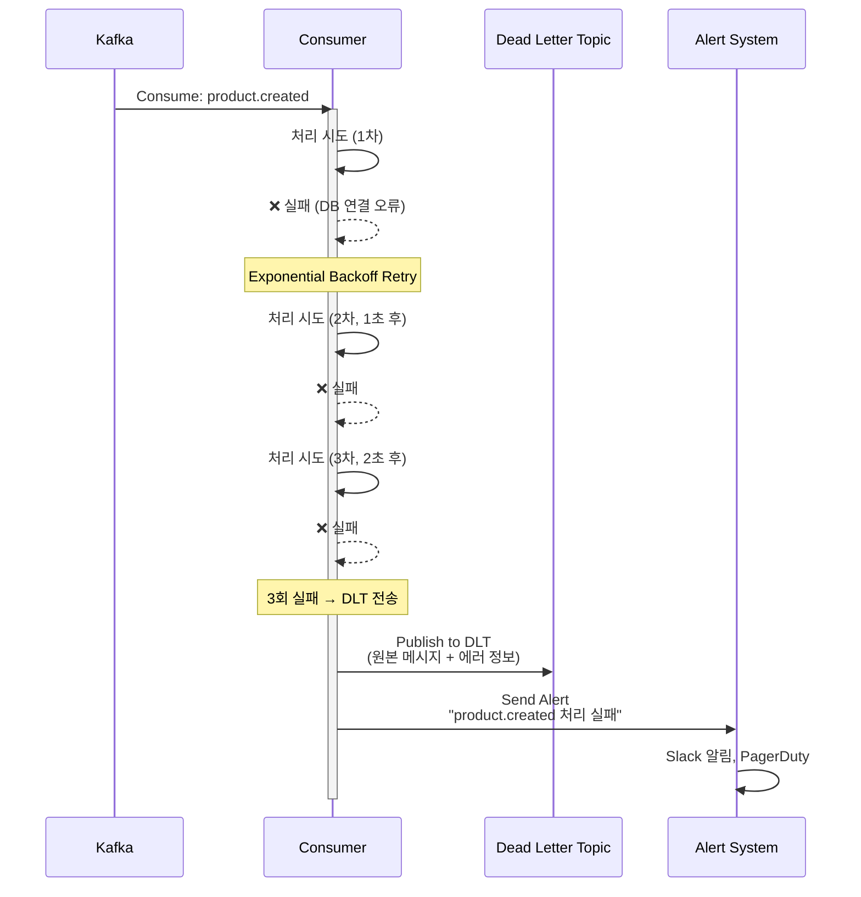
```mermaid
sequenceDiagram
    participant Kafka as Kafka
    participant Consumer as Consumer
    participant DLT as Dead Letter Topic
    participant AlertSystem as Alert System

    Kafka->>Consumer: Consume: product.created

    activate Consumer
    Consumer->>Consumer: 처리 시도 (1차)
    Consumer-->>Consumer: ❌ 실패 (DB 연결 오류)

    Note over Consumer: Exponential Backoff Retry
    Consumer->>Consumer: 처리 시도 (2차, 1초 후)
    Consumer-->>Consumer: ❌ 실패

    Consumer->>Consumer: 처리 시도 (3차, 2초 후)
    Consumer-->>Consumer: ❌ 실패

    Note over Consumer: 3회 실패 → DLT 전송
    Consumer->>DLT: Publish to DLT<br/>(원본 메시지 + 에러 정보)

    Consumer->>AlertSystem: Send Alert<br/>"product.created 처리 실패"
    AlertSystem->>AlertSystem: Slack 알림, PagerDuty
    deactivate Consumer
```

**Retry 전략**:
- 1차: 즉시
- 2차: 1초 후
- 3차: 2초 후
- 실패 → Dead Letter Topic + 알림

---

### 9.2 Circuit Breaker Half-Open

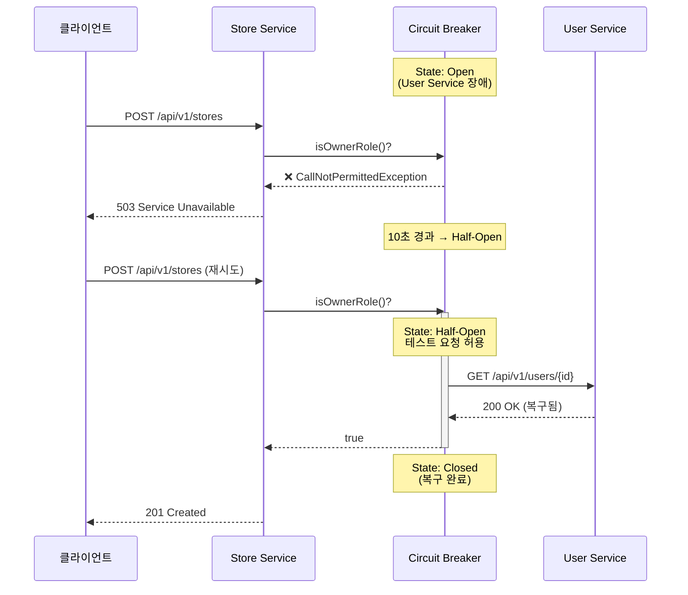
```mermaid
sequenceDiagram
    participant Client as 클라이언트
    participant StoreAPI as Store Service
    participant CB as Circuit Breaker
    participant UserAPI as User Service

    Note over CB: State: Open<br/>(User Service 장애)
    Client->>StoreAPI: POST /api/v1/stores
    StoreAPI->>CB: isOwnerRole()?
    CB-->>StoreAPI: ❌ CallNotPermittedException
    StoreAPI-->>Client: 503 Service Unavailable

    Note over CB: 10초 경과 → Half-Open

    Client->>StoreAPI: POST /api/v1/stores (재시도)
    StoreAPI->>CB: isOwnerRole()?

    activate CB
    Note over CB: State: Half-Open<br/>테스트 요청 허용
    CB->>UserAPI: GET /api/v1/users/{id}
    UserAPI-->>CB: 200 OK (복구됨)
    CB-->>StoreAPI: true
    deactivate CB

    Note over CB: State: Closed<br/>(복구 완료)
    StoreAPI-->>Client: 201 Created
```

**Circuit Breaker States**:
- **Closed**: 정상 동작
- **Open**: 모든 요청 차단 (10초)
- **Half-Open**: 테스트 요청 허용 → 성공 시 Closed

---

## 10. 부록: 주요 이벤트 목록

| 이벤트 | 토픽 | Producer | Consumer(s) | 다이어그램 참조 |
|--------|------|----------|-------------|---------------|
| StoreDeleted | `store.deleted` | Store | Product | [#2](#2-store-삭제-cascade-operation) |
| **OrderCreated** | `order.created` | Order | Product | [#3](#3-order-생성-완전-비동기-saga) |
| **StockReserved** | `stock.reserved` | Product | Order | [#3](#3-order-생성-완전-비동기-saga) |
| **StockReservationFailed** | `stock.reservation.failed` | Product | Order | [#3](#3-order-생성-완전-비동기-saga) |
| **OrderConfirmed** | `order.confirmed` | Order | Payment | [#3](#3-order-생성-완전-비동기-saga) |
| OrderCancelled | `order.cancelled` | Order | Product | [#7.1](#71-만료된-주문-자동-취소-scheduled-job), [#5](#5-payment-saga-결제-실패) |
| OrderExpirationNotification | `order.expiration.notification` | Order | Notification | [#7.1](#71-만료된-주문-자동-취소-scheduled-job) |
| PaymentCompleted | `payment.completed` | Payment | Order, Notification | [#4](#4-payment-order-saga-결제-완료) |
| PaymentFailed | `payment.failed` | Payment | Order | [#5](#5-payment-saga-결제-실패) |
| PaymentCancelled | `payment.cancelled` | Payment | Order | [#6](#6-payment-order-saga-재고-부족-실패) |
| StockConfirmed | `order.stock.confirmed` | Order | Payment | [#4](#4-payment-order-saga-결제-완료) |
| StockConfirmFailed | `order.stock.confirm.failed` | Order | Payment | [#6](#6-payment-order-saga-재고-부족-실패) |
| StockSyncAlert | `stock.sync.alert` | Product | Notification | [#7.2](#72-배치-재고-동기화-scheduled-job) |
| DailyStatistics | `analytics.daily.statistics` | Order | Analytics, Notification | [#7.4](#74-통계-집계-및-리포트-생성-scheduled-job) |

---

## 11. FAQ

**Q: 도메인 간 통신은 왜 동기 HTTP를 사용하나요?**
A: 실시간 데이터 정합성이 필요한 경우 (재고 확인, 역할 검증 등) 동기 HTTP를 사용합니다. Circuit Breaker로 장애를 격리하며, 503 에러 발생 시 클라이언트가 재시도합니다.

**Q: Saga 실패 시 수동 개입이 필요한가요?**
A: 대부분 자동 보상 트랜잭션으로 처리됩니다. Dead Letter Topic에 쌓인 메시지만 수동 확인이 필요합니다.

**Q: Circuit Breaker Open 시 모든 요청이 차단되나요?**
A: 네. 하지만 10초 후 Half-Open 상태로 전환되어 테스트 요청을 허용하고, 성공 시 자동 복구됩니다.

---

**문의**: #msa-architecture 채널
**마지막 업데이트**: 2025-11-10
