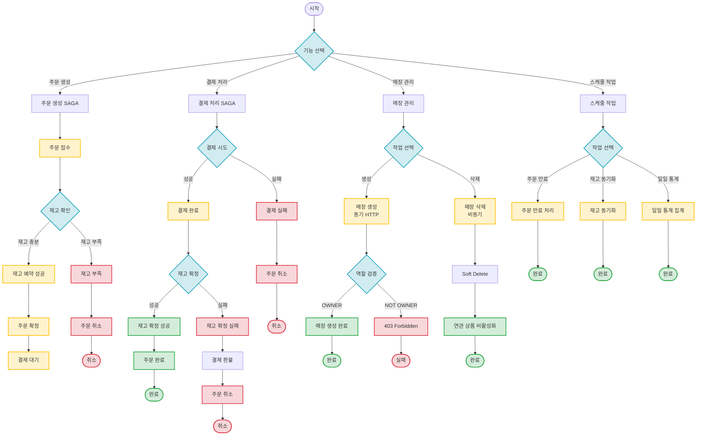

# Event Flows

이벤트 기반 MSA의 기능별 이벤트 흐름을 정리한 문서입니다.

## 📋 목차

- [개요](#개요)
- [전체 시나리오 플로우차트](#전체-시나리오-플로우차트)
- [기능별 이벤트 플로우](#기능별-이벤트-플로우)
- [이벤트 스키마 참조](#이벤트-스키마-참조)

---

## 개요

이 디렉토리는 **기능 단위**로 이벤트 흐름을 정리합니다. 각 기능별로 성공/실패 케이스에 대한 시퀀스 다이어그램과 상태 전이도를 제공합니다.

**문서 구조:**
- 각 기능별 서브 디렉토리
- 케이스별 상세 시퀀스 다이어그램 (`.md` 파일)
- `README.md`: 전체 시나리오 분기 플로우차트

**이벤트 명세:**
- 이벤트 필드 상세 정보는 생략하고, **Avro 스키마 파일**을 직접 참조합니다.
- 각 문서에서 관련 Avro 스키마로 링크를 제공합니다.

---

## 전체 시나리오 플로우차트



---

## 기능별 이벤트 플로우

### 1. 주문 생성 (Order Creation)

주문 접수부터 재고 예약, 주문 확정, 결제 대기까지의 완전 비동기 SAGA 패턴.

**케이스:**
- [정상 플로우](./order-creation/success.md) - 주문 생성 → 재고 예약 → 주문 확정 → 결제 대기
- [재고 부족 실패](./order-creation/stock-reservation-failed.md) - 재고 부족으로 인한 주문 취소

**주요 이벤트:**
- `order.created` - 주문 생성
- `stock.reserved` - 재고 예약 성공
- `stock.reservation.failed` - 재고 예약 실패
- `order.confirmed` - 주문 확정

[📂 Order Creation 디렉토리](./order-creation/)

---

### 2. 결제 처리 (Payment Processing)

결제 완료 후 재고 확정까지의 SAGA 패턴. 결제 실패 및 재고 확정 실패 시 보상 트랜잭션 포함.

**케이스:**
- [결제 성공 플로우](./payment-processing/payment-success.md) - 결제 완료 → 재고 확정 → 주문 완료
- [결제 실패](./payment-processing/payment-failed.md) - 결제 실패로 인한 주문 취소
- [재고 확정 실패](./payment-processing/stock-confirmation-failed.md) - 재고 확정 실패로 인한 결제 환불

**주요 이벤트:**
- `payment.completed` - 결제 완료
- `payment.failed` - 결제 실패
- `stock.confirmed` - 재고 확정
- `stock.confirmation.failed` - 재고 확정 실패
- `payment.cancelled` - 결제 취소 (환불)

[📂 Payment Processing 디렉토리](./payment-processing/)

---

### 3. 매장 관리 (Store Management)

매장 생성 및 삭제 시나리오. 매장 생성은 동기 HTTP, 삭제는 비동기 이벤트 처리.

**케이스:**
- [매장 생성](./store-management/create-store.md) - OWNER 역할 검증 후 매장 생성 (동기 HTTP)
- [매장 삭제](./store-management/delete-store.md) - Soft Delete 후 연관 상품 비활성화 (비동기)

**주요 이벤트:**
- `store.deleted` - 매장 삭제

[📂 Store Management 디렉토리](./store-management/)

---

### 4. 스케줄 작업 (Scheduled Jobs)

주기적으로 실행되는 백그라운드 작업들.

**케이스:**
- [주문 만료 처리](./scheduled-jobs/order-expiration.md) - 5분 이상 결제되지 않은 주문 자동 취소
- [재고 동기화](./scheduled-jobs/stock-sync.md) - Product Service와 Order Service 간 재고 데이터 정합성 검증
- [일일 통계 집계](./scheduled-jobs/daily-statistics.md) - 매일 자정 판매 통계 집계 및 이벤트 발행

**주요 이벤트:**
- `order.expiration.notification` - 주문 만료 알림
- `order.cancelled` - 주문 취소
- `stock.sync.alert` - 재고 불일치 알림
- `daily.statistics` - 일일 통계

[📂 Scheduled Jobs 디렉토리](./scheduled-jobs/)

---

## 이벤트 스키마 참조

모든 이벤트의 상세 스키마는 프로젝트의 **Avro 스키마 파일**을 참조하세요.

### Avro 스키마 위치

```
src/main/avro/
├── order/           # 주문 관련 이벤트
├── payment/         # 결제 관련 이벤트
├── product/         # 상품 관련 이벤트
├── store/           # 매장 관련 이벤트
├── saga/            # SAGA 보상 트랜잭션
├── analytics/       # 분석 이벤트
└── monitoring/      # 모니터링 이벤트
```

### 스키마 파일 링크

각 이벤트 문서에서 관련 Avro 스키마 파일로 직접 링크를 제공합니다.

**예시:**
```markdown
**관련 이벤트:**
- [`OrderCreated.avsc`](../src/main/avro/order/OrderCreated.avsc) - 주문 생성 이벤트
- [`StockReserved.avsc`](../src/main/avro/product/StockReserved.avsc) - 재고 예약 이벤트
```

### 자동 생성 문서

Gradle 태스크로 Avro 스키마에서 자동 생성되는 문서:
- [`docs/generated/event-specifications.md`](../docs/generated/event-specifications.md)

```bash
./gradlew generateAvroEventDocs
```

---

## 관련 문서

- [Kafka 이벤트 명세](../docs/interface/kafka-event-specifications.md) - 전체 이벤트 상세 명세
- [Kafka 이벤트 시퀀스](../docs/interface/kafka-event-sequence.md) - 서비스 간 통신 흐름 시각화
- [README](../README.md) - 프로젝트 메인 문서

---

## 컨벤션

### 파일 명명 규칙
- `README.md`: 해당 기능의 전체 플로우차트
- `success.md`: 정상 플로우
- `{failure-case}.md`: 실패 케이스 (예: `payment-failed.md`)

### 문서 구조
각 시나리오 문서는 다음 섹션을 포함합니다:
1. **개요**: 시나리오 설명
2. **시퀀스 다이어그램**: Mermaid 기반 시각화
3. **관련 이벤트**: Avro 스키마 파일 링크
4. **상태 전이**: 상태 변화 다이어그램
5. **주요 포인트**: 핵심 특징 및 주의사항
6. **타임아웃/재시도 정책**: 시간 제약 및 재시도 규칙
