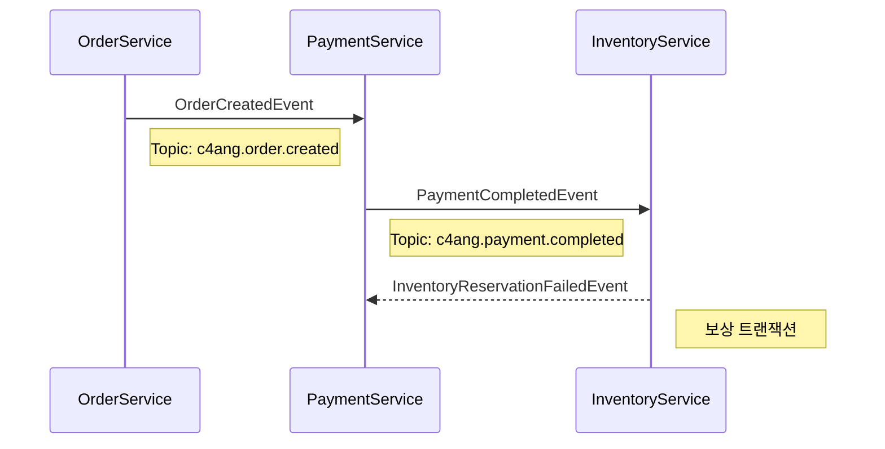
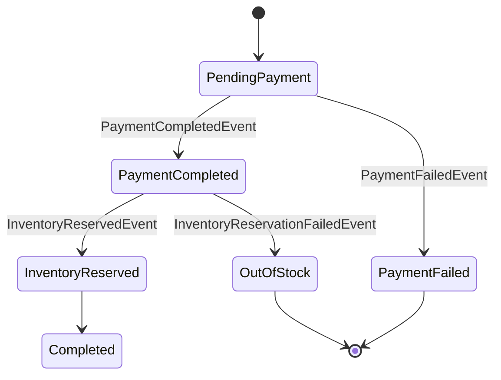

# 이벤트 흐름 문서화 가이드

## 개요

이 디렉토리는 C4ang MSA 시스템의 Choreography Saga 패턴 이벤트 흐름을 문서화합니다. Kafka를 통해 비동기적으로 전달되는 이벤트들의 흐름을 시각화하고 명세를 관리합니다.

## 기술 스택

- **메시지 브로커**: Apache Kafka
- **직렬화**: Apache Avro
- **스키마 레지스트리**: Confluent Schema Registry
- **패턴**: Choreography Saga Pattern

## 디렉토리 구조

```
event-flows/
├── README.md                      # 이 문서
├── order-saga/                    # 주문 Saga 플로우
│   └── README.md                 # 주문 Saga 상세 문서
├── payment-saga/                  # 결제 Saga 플로우 (예정)
└── diagrams/                      # 공통 다이어그램
```

## Kafka 토픽 명명 규칙

모든 이벤트는 다음 명명 규칙을 따르는 Kafka 토픽으로 발행됩니다:

**형식**: `c4ang.{domain}.{event-action}`

**예시**:
- `c4ang.order.created` - 주문 생성 이벤트
- `c4ang.payment.completed` - 결제 완료 이벤트
- `c4ang.payment.failed` - 결제 실패 이벤트 (보상)
- `c4ang.inventory.reserved` - 재고 예약 이벤트
- `c4ang.inventory.reservation-failed` - 재고 예약 실패 이벤트 (보상)

## Avro 스키마 관리

### 스키마 위치

모든 이벤트의 Avro 스키마는 `src/main/avro/events/` 디렉토리에 위치합니다.

```
src/main/avro/
├── common/
│   └── EventMetadata.avsc         # 공통 메타데이터
└── events/
    ├── OrderCreatedEvent.avsc
    ├── PaymentCompletedEvent.avsc
    ├── PaymentFailedEvent.avsc
    ├── InventoryReservedEvent.avsc
    └── ...
```

### 스키마 구조

모든 이벤트는 공통 메타데이터를 포함합니다:

```json
{
  "metadata": {
    "eventId": "이벤트 고유 ID (UUID)",
    "eventType": "이벤트 타입",
    "timestamp": "발생 시각 (Epoch millis)",
    "correlationId": "비즈니스 상관 ID",
    "version": "스키마 버전",
    "source": "발행 서비스명"
  },
  // 이벤트별 고유 필드들...
}
```

### 스키마 버전 관리

- **하위 호환성 유지**: 기존 필드 제거 금지, 필수 필드 추가 금지
- **버전 업데이트**: `metadata.version` 필드로 관리
- **Schema Registry**: Confluent Schema Registry를 통한 중앙 관리

## 이벤트 흐름 문서 작성 가이드

### 1. 새로운 Saga 플로우 추가

```bash
# 디렉토리 생성
mkdir event-flows/{saga-name}

# README.md 작성
touch event-flows/{saga-name}/README.md
```

### 2. README.md 구조

각 Saga의 README.md는 다음 구조를 따릅니다:

```markdown
# {Saga 이름} 플로우

## 개요
간단한 설명

## 정상 플로우
Mermaid 다이어그램으로 시각화

## 실패 시나리오
각 실패 케이스별 다이어그램

## 이벤트 명세
각 이벤트의 상세 스펙 (토픽, 스키마, 페이로드 예시)

## 상태 전이도
비즈니스 상태 변화

## 정책
- 타임아웃 정책
- 재시도 정책
- 멱등성 보장 방법

## 모니터링 포인트
```

### 3. Mermaid 다이어그램 작성

#### Sequence Diagram (이벤트 흐름)



#### State Diagram (상태 전이)



### 4. 이벤트 명세 템플릿

각 이벤트는 다음 정보를 포함해야 합니다:

```markdown
### {EventName}

**발행자**: {Service Name}
**구독자**: {Service Name}
**Kafka 토픽**: `c4ang.{domain}.{action}`
**Avro 스키마**: `src/main/avro/events/{EventName}.avsc`

**페이로드** (Avro 직렬화):
\`\`\`json
{
  "metadata": {
    "eventId": "EVT-12345",
    "eventType": "EventName",
    "timestamp": 1704880800000,
    "correlationId": "BUSINESS-ID",
    "version": "1.0",
    "source": "service-name"
  },
  // 이벤트별 필드...
}
\`\`\`

**트리거 조건**:
- 언제 이 이벤트가 발행되는가?

**비즈니스 로직**:
- 이벤트 발행 시 수행되는 작업

**부작용 (Side Effects)**:
- DB 변경
- 외부 API 호출
- 상태 변경

**오류 처리**:
- 실패 시 동작
- 재시도 정책
```

## 보상 트랜잭션 (Compensation)

### 보상 이벤트 정의

실패 시나리오에서 발행되는 보상 이벤트:

- `PaymentFailedEvent` - 결제 실패 시
- `PaymentCancelledEvent` - 결제 취소 (환불)
- `InventoryReservationFailedEvent` - 재고 예약 실패
- `InventoryReleasedEvent` - 재고 예약 해제

### 보상 트랜잭션 문서화

```markdown
## 보상 트랜잭션

### 시나리오: 재고 부족

1. **트리거**: InventoryReservationFailedEvent 발행
2. **보상 액션**:
   - PaymentService가 PaymentCancelledEvent 발행
   - 결제 금액 환불 처리
   - 주문 상태를 OUT_OF_STOCK으로 업데이트
3. **최종 상태**: OUT_OF_STOCK
4. **사용자 알림**: 재고 부족 안내 이메일/푸시
```

## 정책 정의

### 타임아웃 정책

각 Saga 단계별 타임아웃 설정:

| 단계 | 타임아웃 | 초과 시 동작 |
|------|----------|--------------|
| 결제 대기 | 5분 | 자동 취소 |
| 재고 예약 대기 | 3분 | 결제 환불 |
| 전체 Saga | 10분 | 강제 종료 및 보상 |

### 재시도 정책

| 이벤트 | 재시도 횟수 | 간격 | 실패 시 |
|--------|-------------|------|---------|
| PaymentCompletedEvent | 3회 | 1분 | 주문 취소 |
| InventoryReservedEvent | 2회 | 30초 | 결제 환불 |
| NotificationEvent | 5회 | 2분 | 로깅만 (비즈니스 실패 X) |

### 멱등성 보장

모든 이벤트 핸들러는 `metadata.eventId`를 기반으로 중복 처리를 방지합니다:

```java
@KafkaListener(topics = "c4ang.payment.completed")
public void handlePaymentCompleted(PaymentCompletedEvent event) {
    String eventId = event.getMetadata().getEventId();

    // 중복 체크
    if (processedEventRepository.existsByEventId(eventId)) {
        log.info("Duplicate event ignored: {}", eventId);
        return;
    }

    // 비즈니스 로직 처리
    processPayment(event);

    // 처리 완료 기록
    processedEventRepository.save(new ProcessedEvent(eventId));
}
```

## Kafka Consumer 설정 예시

### application.yml

```yaml
spring:
  kafka:
    bootstrap-servers: localhost:9092
    consumer:
      group-id: ${spring.application.name}
      auto-offset-reset: earliest
      key-deserializer: org.apache.kafka.common.serialization.StringDeserializer
      value-deserializer: io.confluent.kafka.serializers.KafkaAvroDeserializer
      properties:
        schema.registry.url: http://localhost:8081
        specific.avro.reader: true
    producer:
      key-serializer: org.apache.kafka.common.serialization.StringSerializer
      value-serializer: io.confluent.kafka.serializers.KafkaAvroSerializer
      properties:
        schema.registry.url: http://localhost:8081
```

### 이벤트 발행 예시

```java
@Service
@RequiredArgsConstructor
public class OrderEventPublisher {

    private final KafkaTemplate<String, OrderCreatedEvent> kafkaTemplate;

    public void publishOrderCreated(Order order) {
        OrderCreatedEvent event = OrderCreatedEvent.newBuilder()
            .setMetadata(EventMetadata.newBuilder()
                .setEventId(UUID.randomUUID().toString())
                .setEventType("OrderCreated")
                .setTimestamp(System.currentTimeMillis())
                .setCorrelationId(order.getOrderId())
                .setVersion("1.0")
                .setSource("order-service")
                .build())
            .setOrderId(order.getOrderId())
            .setCustomerId(order.getCustomerId())
            .setProductId(order.getProductId())
            .setQuantity(order.getQuantity())
            .setTotalAmount(order.getTotalAmount())
            .setOrderStatus(OrderStatus.PENDING_PAYMENT)
            .build();

        kafkaTemplate.send("c4ang.order.created", order.getOrderId(), event);
    }
}
```

### 이벤트 구독 예시

```java
@Service
@Slf4j
public class PaymentEventListener {

    @KafkaListener(topics = "c4ang.order.created", groupId = "payment-service")
    public void handleOrderCreated(OrderCreatedEvent event) {
        String orderId = event.getOrderId();
        String eventId = event.getMetadata().getEventId();

        log.info("Received OrderCreatedEvent: orderId={}, eventId={}", orderId, eventId);

        // 멱등성 체크
        if (isDuplicate(eventId)) {
            return;
        }

        // 결제 처리 로직
        processPayment(event);
    }
}
```

## 모니터링 및 관찰성

### 메트릭

각 Saga별로 다음 메트릭을 수집합니다:

- `saga.{saga-name}.duration` - Saga 전체 소요 시간
- `saga.{saga-name}.success_rate` - 성공률
- `saga.{saga-name}.compensation_rate` - 보상 트랜잭션 발생률
- `event.{event-name}.processing_time` - 이벤트 처리 시간
- `event.{event-name}.lag` - Kafka Consumer Lag

### 로깅

구조화된 로깅 형식:

```json
{
  "level": "INFO",
  "timestamp": "2025-01-10T10:00:00Z",
  "service": "payment-service",
  "saga": "order-saga",
  "correlationId": "ORD-12345",
  "eventType": "PaymentCompletedEvent",
  "eventId": "EVT-12346",
  "message": "Payment completed successfully",
  "duration_ms": 234
}
```

### 알림

다음 상황에서 알림 발송:

- Saga 완료 시간이 평균 대비 2배 초과
- 보상 트랜잭션 발생률 5% 초과
- 특정 이벤트 처리 실패율 1% 초과
- Consumer Lag이 임계값 초과

## Avro 스키마 개발 워크플로우

### 1. 스키마 정의

`src/main/avro/events/{EventName}.avsc` 파일 생성

### 2. 스키마 컴파일

```bash
# Avro 플러그인이 자동으로 Java 클래스 생성
./gradlew generateAvroJava
```

생성된 클래스 위치: `build/generated-main-avro-java/`

### 3. 스키마 등록

Schema Registry에 스키마 등록:

```bash
# Schema Registry에 스키마 등록
curl -X POST http://localhost:8081/subjects/c4ang.order.created-value/versions \
  -H "Content-Type: application/vnd.schemaregistry.v1+json" \
  -d @src/main/avro/events/OrderCreatedEvent.avsc
```

### 4. 스키마 호환성 검증

```bash
# 호환성 체크
curl -X POST http://localhost:8081/compatibility/subjects/c4ang.order.created-value/versions/latest \
  -H "Content-Type: application/vnd.schemaregistry.v1+json" \
  -d @src/main/avro/events/OrderCreatedEvent.avsc
```

## 체크리스트

새로운 Saga 플로우 추가 시:

- [ ] Saga 디렉토리 생성 (`event-flows/{saga-name}/`)
- [ ] README.md 작성 (정상/실패 플로우, 이벤트 명세)
- [ ] Mermaid 다이어그램 작성
- [ ] Avro 스키마 정의 (`src/main/avro/events/`)
- [ ] Kafka 토픽명 정의 (`c4ang.{domain}.{action}`)
- [ ] 타임아웃 정책 정의
- [ ] 재시도 정책 정의
- [ ] 멱등성 보장 방법 문서화
- [ ] 보상 트랜잭션 정의
- [ ] 모니터링 포인트 정의

## 참고 자료

- [Saga Pattern](https://microservices.io/patterns/data/saga.html)
- [Apache Kafka](https://kafka.apache.org/documentation/)
- [Apache Avro](https://avro.apache.org/docs/current/)
- [Confluent Schema Registry](https://docs.confluent.io/platform/current/schema-registry/index.html)
- [Event-Driven Architecture](https://martinfowler.com/articles/201701-event-driven.html)
- [이벤트 플로우 가이드라인](../docs/event-flow-guidelines.md)

## 기존 Saga 플로우

- [주문 Saga](./order-saga/README.md) - 주문 생성부터 완료까지의 전체 플로우
