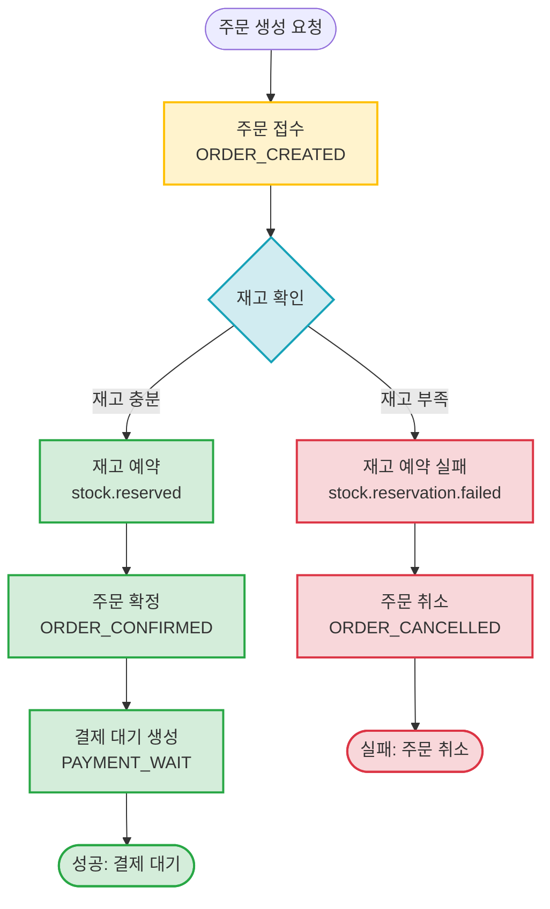
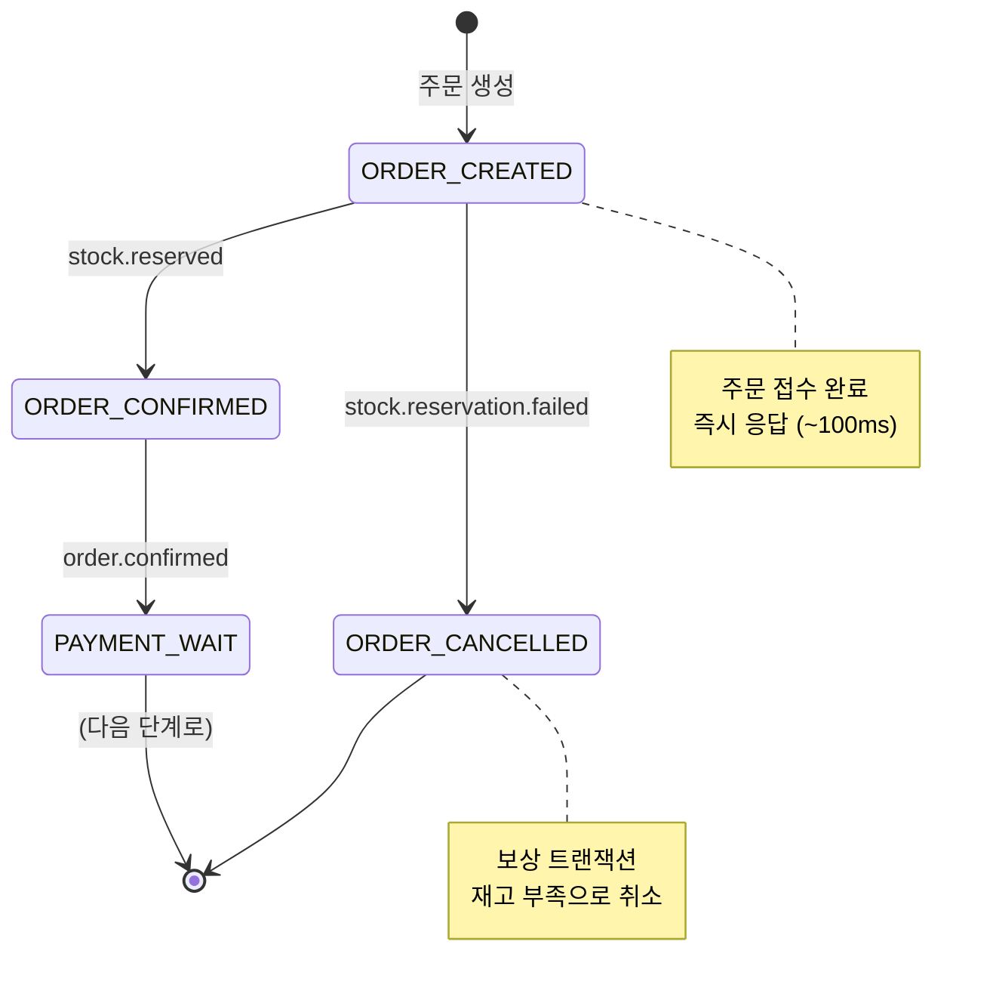

# Order Creation SAGA

주문 생성부터 재고 예약, 주문 확정, 결제 대기까지의 완전 비동기 SAGA 패턴

## 개요

고객이 주문을 생성하면 즉시 접수되고, 비동기로 재고 예약 → 주문 확정 → 결제 대기 흐름이 진행됩니다.

**특징:**
- ✅ **빠른 응답**: 재고 확인 전에 주문 접수 완료 (~100ms)
- ✅ **약결합**: Product Service 장애와 무관하게 주문 접수
- ✅ **Choreography 패턴**: 각 서비스가 자율적으로 이벤트 처리
- ✅ **보상 트랜잭션**: 재고 부족 시 자동 주문 취소
- ✅ **순서 보장**: 파티션 키 = `orderId`

---

## 시나리오 플로우차트

---

## 케이스별 문서

### ✅ 정상 플로우
주문 생성 → 재고 예약 성공 → 주문 확정 → 결제 대기

**문서:** [success.md](./success.md)

**주요 이벤트:**
- `order.created` - 주문 생성
- `stock.reserved` - 재고 예약 성공
- `order.confirmed` - 주문 확정

**최종 상태:** `PAYMENT_WAIT` (결제 대기)

---

### ❌ 재고 부족 실패
재고 부족으로 인한 주문 취소 (보상 트랜잭션)

**문서:** [stock-reservation-failed.md](./stock-reservation-failed.md)

**주요 이벤트:**
- `order.created` - 주문 생성
- `stock.reservation.failed` - 재고 예약 실패

**보상 트랜잭션:**
- 주문 상태를 `ORDER_CANCELLED`로 업데이트
- 고객에게 Push 알림 발송

**최종 상태:** `ORDER_CANCELLED` (주문 취소)

---

## 상태 전이도

---

## 관련 이벤트 (Avro 스키마)

### 주문 생성 이벤트
- [`OrderCreated.avsc`](../../src/main/avro/order/OrderCreated.avsc)

**Kafka 토픽:** `order.created`

**파티션 키:** `orderId`

---

### 재고 예약 이벤트
- [`StockReserved.avsc`](../../src/main/avro/product/StockReserved.avsc)

**Kafka 토픽:** `stock.reserved`

**파티션 키:** `orderId`

---

### 주문 확정 이벤트
- [`OrderConfirmed.avsc`](../../src/main/avro/order/OrderConfirmed.avsc)

**Kafka 토픽:** `order.confirmed`

**파티션 키:** `orderId`

---

### 주문 취소 이벤트
- [`OrderCancelled.avsc`](../../src/main/avro/order/OrderCancelled.avsc)

**Kafka 토픽:** `order.cancelled`

**파티션 키:** `orderId`

---

## 타임아웃 및 재시도 정책

### 타임아웃
| 단계 | 타임아웃 | 초과 시 동작 |
|------|----------|--------------|
| 재고 예약 대기 | 3분 | 주문 자동 취소 |
| 주문 확정 대기 | 2분 | 재시도 후 실패 시 취소 |
| 전체 SAGA | 10분 | 강제 종료 |

### 재시도 정책
| 이벤트 | 재시도 횟수 | 간격 | 실패 시 |
|--------|-------------|------|---------|
| stock.reserved | 2회 | 30초 | 주문 취소 |
| order.confirmed | 3회 | 1분 | 주문 취소 |

### 멱등성 보장
모든 이벤트 핸들러는 `eventId`를 기반으로 중복 처리를 방지합니다.

---

## 응답 시간

- **주문 접수**: ~100ms (동기)
- **재고 예약**: 1~2초 (비동기)
- **주문 확정**: 0.5~1초 (비동기)
- **결제 대기 생성**: 0.5~1초 (비동기)

**전체 SAGA 소요 시간**: 2~5초

---

## 모니터링 포인트

- 주문 생성 성공률
- 재고 예약 실패율
- 단계별 처리 시간
- SAGA 완료율
- 보상 트랜잭션 발생 빈도

---

## 관련 문서

- [Kafka 이벤트 시퀀스](../../docs/interface/kafka-event-sequence.md) - 전체 서비스 간 통신 흐름
- [Kafka 이벤트 명세](../../docs/interface/kafka-event-specifications.md) - 이벤트 상세 명세
- [전체 이벤트 플로우](../README.md) - 기능별 이벤트 플로우 목록
