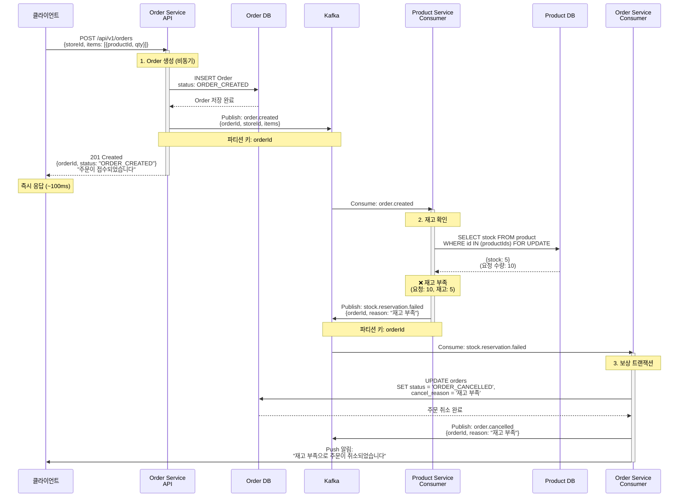
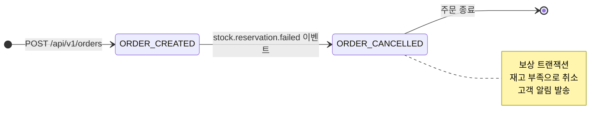

# Order Creation - 재고 부족 실패

재고 부족으로 인한 주문 취소 (보상 트랜잭션)

## 개요

고객이 주문을 생성했지만, Product Service가 재고를 확인한 결과 재고가 부족한 경우:
1. **주문 접수** - Order Service가 주문을 즉시 저장하고 응답
2. **재고 확인** - Product Service가 재고 부족 확인
3. **보상 트랜잭션** - Order Service가 주문을 취소하고 고객에게 알림

**최종 상태**: `ORDER_CANCELLED` (주문 취소)

---

## 시퀀스 다이어그램



---

## 상태 전이



---

## 관련 이벤트

### 1. order.created
**발행자:** Order Service
**구독자:** Product Service
**Avro 스키마:** [`OrderCreated.avsc`](../../src/main/avro/order/OrderCreated.avsc)

**트리거 조건:**
- 고객이 주문 생성 API를 호출했을 때

**비즈니스 로직:**
- 주문 정보를 DB에 저장
- 주문 상태를 `ORDER_CREATED`로 설정
- Kafka에 이벤트 발행

---

### 2. stock.reservation.failed (보상 이벤트)
**발행자:** Product Service
**구독자:** Order Service
**Avro 스키마:** Saga 관련 스키마 참조

**트리거 조건:**
- `order.created` 이벤트를 받았으나 재고가 부족할 때
- 요청 수량 > 사용 가능 재고

**비즈니스 로직:**
- 재고 부족 확인
- 재고 예약 시도 없음 (롤백 불필요)
- 실패 이유와 함께 이벤트 발행

---

### 3. order.cancelled (보상 트랜잭션 결과)
**발행자:** Order Service
**구독자:** Notification Service (선택)
**Avro 스키마:** [`OrderCancelled.avsc`](../../src/main/avro/order/OrderCancelled.avsc)

**트리거 조건:**
- `stock.reservation.failed` 이벤트를 받았을 때

**비즈니스 로직:**
- 주문 상태를 `ORDER_CANCELLED`로 업데이트
- 취소 사유 기록 ("재고 부족")
- Kafka에 이벤트 발행
- 고객에게 Push 알림 발송

---

## 보상 트랜잭션 (Compensation)

### 보상이 필요한 이유
재고 예약이 실패했으므로, 주문을 취소하여 고객에게 즉시 알려야 합니다.

### 보상 액션
1. **주문 상태 업데이트**: `ORDER_CREATED` → `ORDER_CANCELLED`
2. **취소 사유 기록**: "재고 부족"
3. **고객 알림**: Push 알림 발송
4. **이벤트 발행**: `order.cancelled` 이벤트

### 롤백이 불필요한 이유
- 재고 예약을 시도하지 않았으므로 롤백할 데이터 없음
- 주문 데이터는 취소 상태로 유지 (감사 추적용)

---

## 주요 포인트

### ❌ 보상 트랜잭션
- 재고 부족 시 주문을 자동으로 취소
- 고객에게 즉시 알림 발송

### ✅ 빠른 피드백
- 재고 부족을 비동기로 확인하지만, 2~3초 내 고객에게 알림
- 결제 대기로 진행하지 않아 사용자 경험 개선

### ✅ 데이터 일관성
- 주문 데이터는 `ORDER_CANCELLED` 상태로 유지
- 감사 추적(Audit Trail) 가능

### ✅ 멱등성
- `stock.reservation.failed` 이벤트를 중복 수신해도 동일한 결과
- `eventId`를 기반으로 중복 처리 방지

---

## 처리 시간

| 단계 | 소요 시간 | 방식 |
|------|-----------|------|
| 1. 주문 접수 | ~100ms | 동기 |
| 2. 재고 확인 (부족) | 1~2초 | 비동기 |
| 3. 주문 취소 | 0.5~1초 | 비동기 |
| **전체** | **2~4초** | - |

---

## 재고 부족 시나리오 예시

### 시나리오 1: 단일 상품 주문
```
요청: productId=P-001, quantity=10
재고: stock=5
결과: 재고 부족 (5 < 10) → 주문 취소
```

### 시나리오 2: 여러 상품 주문
```
요청:
  - productId=P-001, quantity=5 (재고: 10)
  - productId=P-002, quantity=3 (재고: 1)

결과: P-002 재고 부족 (1 < 3) → 전체 주문 취소
```

---

## 고객 알림 메시지 예시

### Push 알림
```
제목: 주문이 취소되었습니다
내용: 재고 부족으로 주문이 취소되었습니다. 다른 상품을 확인해보세요.
```

### 이메일 (선택)
```
주문 번호: ORD-12345
상태: 취소됨
사유: 재고 부족

요청하신 상품의 재고가 부족하여 주문이 취소되었습니다.
불편을 드려 죄송합니다.
```

---

## 모니터링 포인트

- 재고 부족 실패율 (전체 주문 대비 %)
- `stock.reservation.failed` 발생 빈도
- 보상 트랜잭션 처리 시간
- 고객 알림 발송 성공률
- 재고 부족 상품 Top 10

---

## 개선 아이디어

### 재고 사전 확인 (선택)
- 주문 생성 전에 클라이언트에서 재고 확인 API 호출
- "장바구니에 담기" 단계에서 재고 여부 표시

### 대기열 기능 (선택)
- 재고 부족 시 대기열에 추가
- 재고 입고 시 자동 주문 생성

---

## 관련 문서

- [Order Creation README](./README.md) - 전체 플로우 개요
- [정상 플로우](./success.md) - 성공 시나리오
- [Kafka 이벤트 시퀀스](../../docs/interface/kafka-event-sequence.md) - 전체 시퀀스
