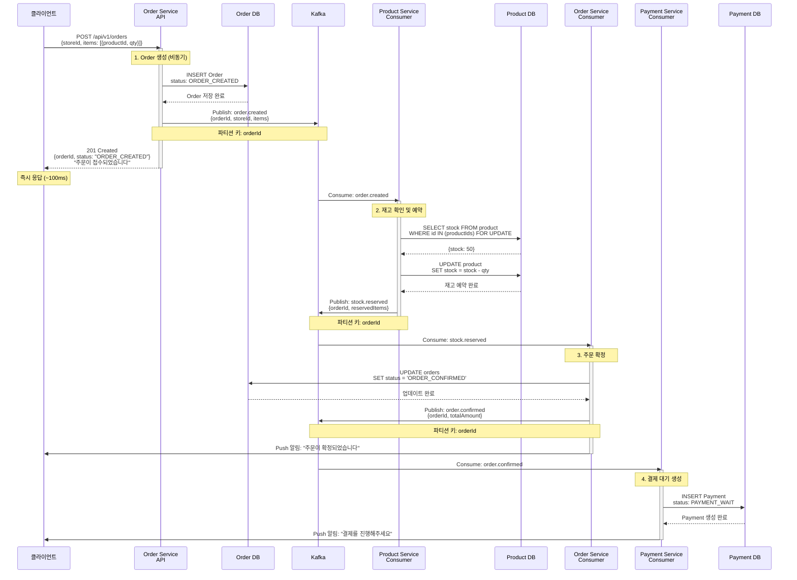
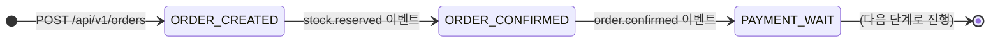

# Order Creation - 정상 플로우

주문 생성부터 결제 대기까지의 정상적인 이벤트 흐름

## 개요

고객이 주문을 생성하면:
1. **주문 접수** - Order Service가 주문을 즉시 저장하고 응답
2. **재고 예약** - Product Service가 재고를 확인하고 예약
3. **주문 확정** - Order Service가 주문을 확정
4. **결제 대기** - Payment Service가 결제 대기 상태를 생성

**최종 상태**: `PAYMENT_WAIT` (결제 대기)

---

## 시퀀스 다이어그램

---

## 상태 전이

---

## 관련 이벤트

### 1. order.created
**발행자:** Order Service
**구독자:** Product Service
**Avro 스키마:** [`OrderCreated.avsc`](../../src/main/avro/order/OrderCreated.avsc)

**트리거 조건:**
- 고객이 주문 생성 API를 호출했을 때

**비즈니스 로직:**
- 주문 정보를 DB에 저장
- 주문 상태를 `ORDER_CREATED`로 설정
- Kafka에 이벤트 발행

---

### 2. stock.reserved
**발행자:** Product Service
**구독자:** Order Service
**Avro 스키마:** [`StockReserved.avsc`](../../src/main/avro/product/StockReserved.avsc)

**트리거 조건:**
- `order.created` 이벤트를 받고 재고가 충분할 때

**비즈니스 로직:**
- 상품 재고 확인 (FOR UPDATE 락)
- 재고 수량 차감
- 예약 정보 저장
- Kafka에 이벤트 발행

---

### 3. order.confirmed
**발행자:** Order Service
**구독자:** Payment Service
**Avro 스키마:** [`OrderConfirmed.avsc`](../../src/main/avro/order/OrderConfirmed.avsc)

**트리거 조건:**
- `stock.reserved` 이벤트를 받았을 때

**비즈니스 로직:**
- 주문 상태를 `ORDER_CONFIRMED`로 업데이트
- Kafka에 이벤트 발행
- 고객에게 Push 알림 발송

---

## 주요 포인트

### ✅ 빠른 응답 (~100ms)
- 재고 확인을 기다리지 않고 즉시 주문 접수
- 클라이언트는 주문 ID를 즉시 받음

### ✅ 약결합 (Loose Coupling)
- Product Service 장애 시에도 주문 접수 가능
- 각 서비스가 독립적으로 동작

### ✅ Choreography 패턴
- 중앙 오케스트레이터 없음
- 각 서비스가 이벤트에 반응하여 자율적으로 처리

### ✅ 순서 보장
- 파티션 키를 `orderId`로 설정하여 같은 주문의 이벤트는 순서대로 처리

### ✅ 멱등성
- 모든 이벤트 핸들러는 `eventId`를 기반으로 중복 처리 방지

---

## 처리 시간

| 단계 | 소요 시간 | 방식 |
|------|-----------|------|
| 1. 주문 접수 | ~100ms | 동기 |
| 2. 재고 예약 | 1~2초 | 비동기 |
| 3. 주문 확정 | 0.5~1초 | 비동기 |
| 4. 결제 대기 생성 | 0.5~1초 | 비동기 |
| **전체** | **2~5초** | - |

---

## 예외 상황

이 문서는 정상 플로우만 다룹니다. 재고 부족 시나리오는 다음 문서를 참조하세요:
- [재고 부족 실패](./stock-reservation-failed.md)

---

## 다음 단계

주문이 `PAYMENT_WAIT` 상태가 되면, 다음 SAGA로 진행됩니다:
- [결제 처리 SAGA](../payment-processing/) - 결제 완료 → 재고 확정 → 주문 완료

---

## 모니터링 포인트

- `order.created` 발행 성공률
- `stock.reserved` 처리 시간
- `order.confirmed` 발행 성공률
- 단계별 Kafka Consumer Lag
- 전체 SAGA 완료 시간

---

## 관련 문서

- [Order Creation README](./README.md) - 전체 플로우 개요
- [재고 부족 실패](./stock-reservation-failed.md) - 실패 시나리오
- [Kafka 이벤트 시퀀스](../../docs/interface/kafka-event-sequence.md) - 전체 시퀀스
