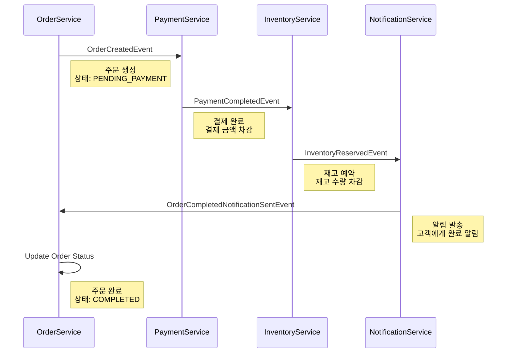
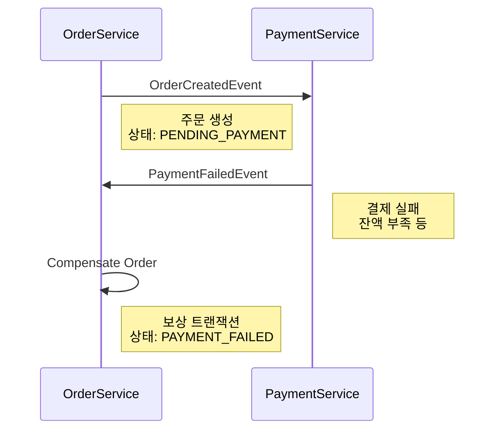
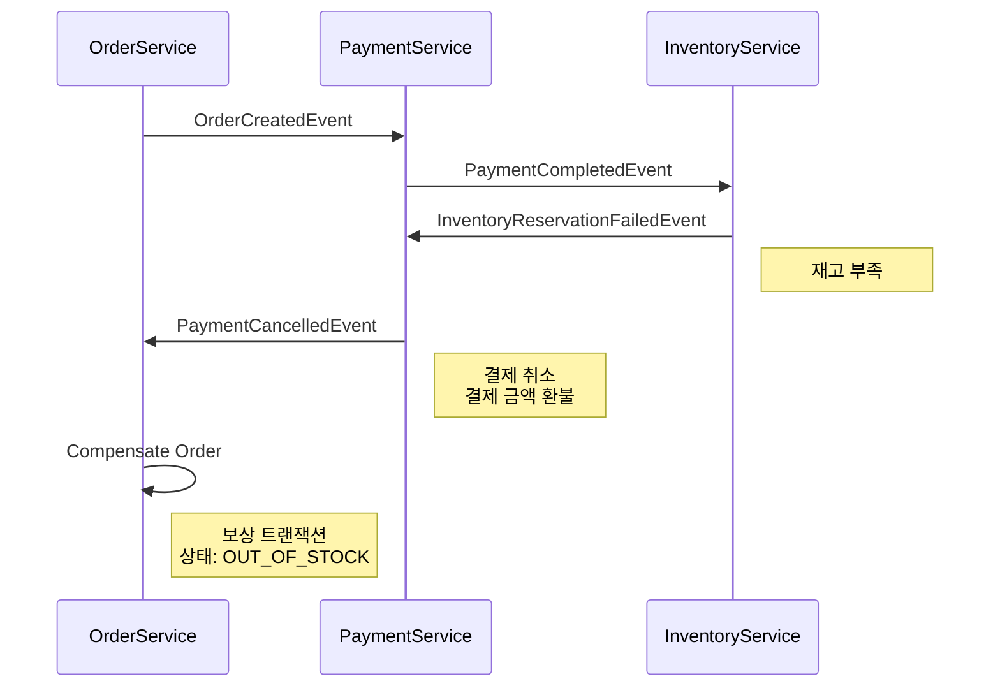

# 주문 Saga 플로우

## 개요

주문 생성부터 완료까지의 Choreography Saga 패턴 이벤트 흐름을 정의합니다.

## 정상 플로우



## 실패 시나리오 1: 결제 실패



## 실패 시나리오 2: 재고 부족



## 이벤트 명세

이 섹션의 이벤트 필드 정보는 Avro 스키마로부터 자동 생성됩니다.
**발행자/구독자 정보**와 **트리거 조건, 비즈니스 로직**은 수동으로 관리합니다.

<!-- AUTO_GENERATED_EVENT_SPEC_START -->
<!-- AUTO_GENERATED_EVENT_SPEC_END -->

### 이벤트별 추가 정보

#### 1. OrderCreatedEvent
**발행자**: Order Service
**구독자**: Payment Service
**트리거 조건**: 고객이 주문을 생성할 때
**비즈니스 로직**: 주문 정보를 DB에 저장하고 결제 대기 상태로 설정

#### 2. PaymentCompletedEvent
**발행자**: Payment Service
**구독자**: Inventory Service
**트리거 조건**: 결제가 성공적으로 완료되었을 때
**비즈니스 로직**: 결제 금액 차감 및 결제 내역 저장

#### 3. PaymentFailedEvent (보상)
**발행자**: Payment Service
**구독자**: Order Service
**트리거 조건**: 결제 처리 중 오류 발생 시
**비즈니스 로직**: 주문 상태를 PAYMENT_FAILED로 업데이트

#### 4. InventoryReservedEvent
**발행자**: Inventory Service
**구독자**: Notification Service
**트리거 조건**: 재고 예약이 성공했을 때
**비즈니스 로직**: 재고 수량 차감 및 예약 정보 저장

#### 5. InventoryReservationFailedEvent (보상)
**발행자**: Inventory Service
**구독자**: Payment Service
**트리거 조건**: 재고 부족으로 예약 실패 시
**비즈니스 로직**: 결제 취소 및 환불 트리거

#### 6. PaymentCancelledEvent (보상)
**발행자**: Payment Service
**구독자**: Order Service
**트리거 조건**: 재고 예약 실패로 결제 취소가 필요할 때
**비즈니스 로직**: 결제 금액 환불 및 주문 상태를 OUT_OF_STOCK으로 업데이트

## 상태 전이도

```
PENDING_PAYMENT (초기)
    ↓
    ├─→ PAYMENT_FAILED (결제 실패)
    └─→ PAYMENT_COMPLETED
            ↓
            ├─→ OUT_OF_STOCK (재고 부족)
            └─→ INVENTORY_RESERVED
                    ↓
                    └─→ COMPLETED (완료)
```

## 타임아웃 정책

- **결제 대기**: 5분 (이후 자동 취소)
- **재고 예약 대기**: 3분 (이후 결제 환불 및 주문 취소)
- **전체 Saga 타임아웃**: 10분

## 재시도 정책

- **결제 실패**: 재시도 없음 (즉시 실패 처리)
- **재고 예약 실패**: 재시도 없음 (결제 환불 및 주문 취소)
- **알림 발송 실패**: 최대 3회 재시도 (1분 간격)

## 멱등성 보장

모든 이벤트 핸들러는 `eventId`를 기반으로 중복 처리를 방지합니다.

## 모니터링 포인트

- 각 단계별 처리 시간
- 보상 트랜잭션 발생 빈도
- 실패 원인별 통계
- Saga 완료율
