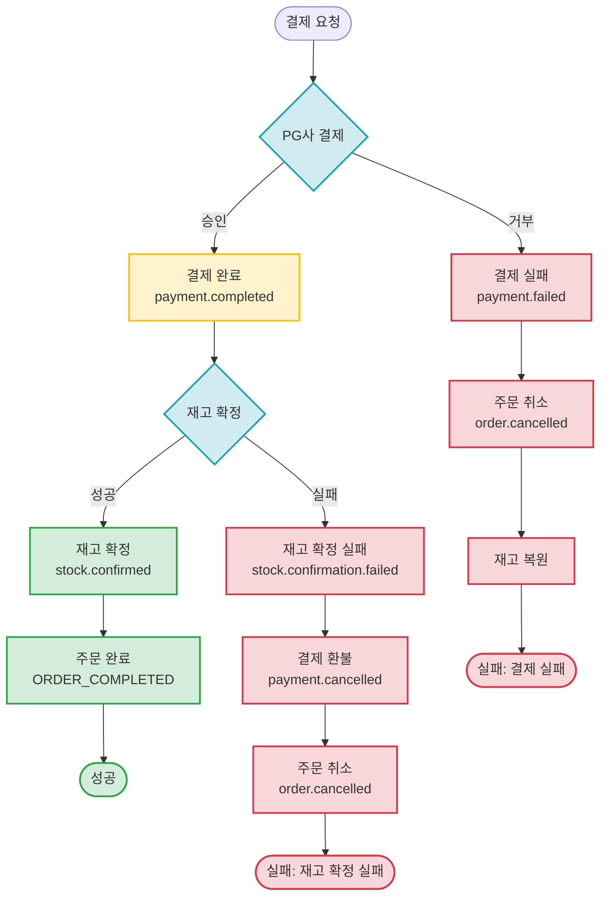
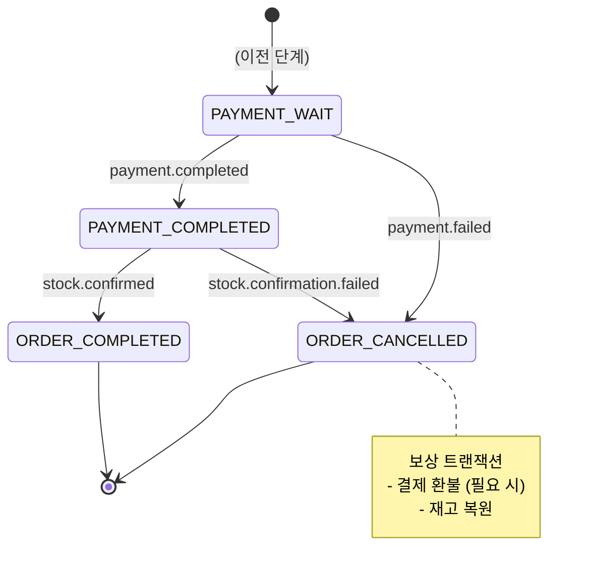

# Payment Processing SAGA

결제 완료 후 재고 확정까지의 SAGA 패턴

## 개요

고객이 결제를 진행하면:
- **정상 흐름**: 결제 완료 → 재고 확정 → 주문 완료
- **결제 실패**: 보상 트랜잭션으로 주문 취소 및 재고 복원
- **재고 확정 실패**: 결제 환불 및 주문 취소

**특징:**
- ✅ **PG사 연동**: 실시간 결제 승인/거부
- ✅ **재고 확정**: Redis 임시 예약 → DB 영구 저장
- ✅ **보상 트랜잭션**: 실패 시 자동 환불 및 재고 복원
- ✅ **순서 보장**: 파티션 키 = `orderId`

---

## 시나리오 플로우차트

---

## 케이스별 문서

### ✅ 결제 성공 플로우
결제 완료 → 재고 확정 → 주문 완료

**문서:** [payment-success.md](./payment-success.md)

**주요 이벤트:**
- `payment.completed` - 결제 완료
- `stock.confirmed` - 재고 확정

**최종 상태:** `ORDER_COMPLETED`

---

### ❌ 결제 실패
PG사 결제 거부 → 주문 취소 → 재고 복원

**문서:** [payment-failed.md](./payment-failed.md)

**주요 이벤트:**
- `payment.failed` - 결제 실패
- `order.cancelled` - 주문 취소

**보상 트랜잭션:**
- 주문 취소
- 예약된 재고 복원

**최종 상태:** `ORDER_CANCELLED`

---

### ❌ 재고 확정 실패
결제 완료했으나 재고 확정 실패 → 결제 환불 → 주문 취소

**문서:** [stock-confirmation-failed.md](./stock-confirmation-failed.md)

**주요 이벤트:**
- `payment.completed` - 결제 완료
- `stock.confirmation.failed` - 재고 확정 실패
- `payment.cancelled` - 결제 취소 (환불)

**보상 트랜잭션:**
- 결제 금액 환불
- 주문 취소

**최종 상태:** `ORDER_CANCELLED`

---

## 상태 전이도

---

## 관련 이벤트 (Avro 스키마)

### 결제 완료
- [`PaymentCompleted.avsc`](../../src/main/avro/payment/PaymentCompleted.avsc)

**Kafka 토픽:** `payment.completed`

---

### 결제 실패
- [`PaymentFailed.avsc`](../../src/main/avro/payment/PaymentFailed.avsc)

**Kafka 토픽:** `payment.failed`

---

### 재고 확정
- [`StockConfirmed.avsc`](../../src/main/avro/order/StockConfirmed.avsc)

**Kafka 토픽:** `stock.confirmed`

---

### 결제 취소 (환불)
- [`PaymentCancelled.avsc`](../../src/main/avro/payment/PaymentCancelled.avsc)

**Kafka 토픽:** `payment.cancelled`

---

## 타임아웃 및 재시도 정책

### 타임아웃
| 단계 | 타임아웃 | 초과 시 동작 |
|------|----------|--------------|
| PG사 결제 승인 | 30초 | 결제 실패 처리 |
| 재고 확정 대기 | 3분 | 결제 환불 |
| 전체 SAGA | 10분 | 강제 종료 및 환불 |

### 재시도 정책
| 이벤트 | 재시도 횟수 | 간격 | 실패 시 |
|--------|-------------|------|---------|
| payment.completed | 3회 | 1분 | 결제 환불 |
| stock.confirmed | 2회 | 30초 | 결제 환불 |
| payment.cancelled (환불) | 5회 | 2분 | 관리자 개입 필요 |

---

## 응답 시간

- **결제 완료**: ~200ms (PG사 응답 포함)
- **재고 확정**: 1~3초 (비동기)
- **결제 환불**: 1~5초 (PG사 API 호출)

**전체 SAGA 소요 시간**: 2~8초

---

## 모니터링 포인트

- 결제 성공률
- PG사 응답 시간
- 재고 확정 실패율
- 환불 처리 성공률
- SAGA 완료율

---

## 관련 문서

- [Order Creation SAGA](../order-creation/) - 이전 단계
- [Kafka 이벤트 시퀀스](../../docs/interface/kafka-event-sequence.md) - 전체 시퀀스
- [Kafka 이벤트 명세](../../docs/interface/kafka-event-specifications.md) - 이벤트 상세 명세
