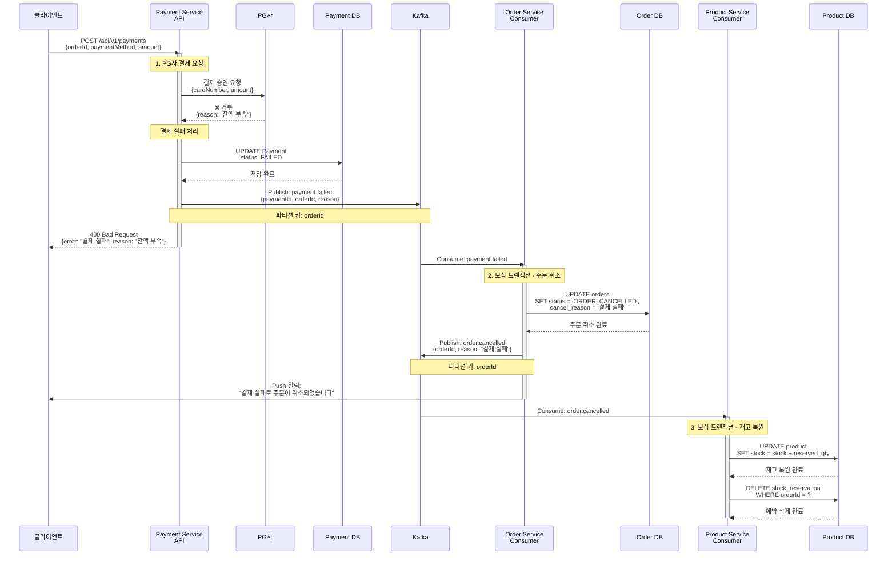
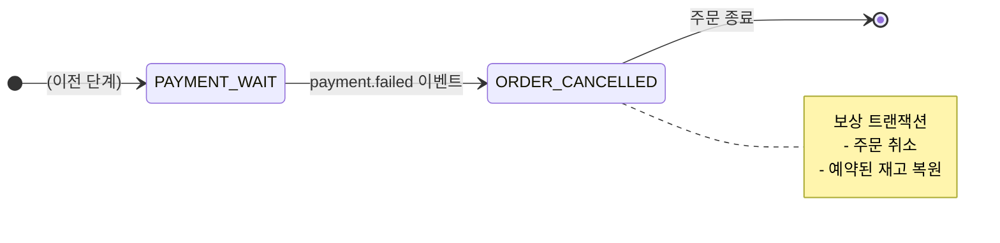

# Payment Processing - 결제 실패 플로우

PG사 결제 거부로 인한 주문 취소 (보상 트랜잭션)

## 개요

고객이 결제를 시도했지만 PG사에서 결제가 거부된 경우:
1. **결제 시도** - Payment Service가 PG사에 결제 승인 요청
2. **결제 실패** - PG사가 결제를 거부 (잔액 부족, 카드 한도 초과 등)
3. **보상 트랜잭션** - 주문 취소 및 예약된 재고 복원

**최종 상태**: `ORDER_CANCELLED` (주문 취소)

---

## 시퀀스 다이어그램



---

## 상태 전이



---

## 관련 이벤트

### 1. payment.failed
**발행자:** Payment Service
**구독자:** Order Service
**Avro 스키마:** [`PaymentFailed.avsc`](../../src/main/events/avro/payment/PaymentFailed.avsc)

**트리거 조건:**
- PG사가 결제를 거부했을 때
- 결제 타임아웃 (30초 초과)
- 시스템 오류

**비즈니스 로직:**
- PG사 결제 거부 응답 수신
- 결제 상태를 `FAILED`로 업데이트
- 실패 사유 기록
- Kafka에 이벤트 발행

**페이로드:**
```json
{
  "eventId": "evt-uuid",
  "paymentId": "PAY-12345",
  "orderId": "ORD-12345",
  "userId": "USR-001",
  "failureReason": "잔액 부족",
  "failedAt": 1699999999000
}
```

---

### 2. order.cancelled (보상 트랜잭션 결과)
**발행자:** Order Service
**구독자:** Product Service, Notification Service
**Avro 스키마:** [`OrderCancelled.avsc`](../../src/main/events/avro/order/OrderCancelled.avsc)

**트리거 조건:**
- `payment.failed` 이벤트를 받았을 때

**비즈니스 로직:**
- 주문 상태를 `ORDER_CANCELLED`로 업데이트
- 취소 사유 기록 ("결제 실패")
- Kafka에 이벤트 발행
- 고객에게 Push 알림 발송

---

## 보상 트랜잭션 (Compensation)

### 보상이 필요한 이유
결제가 실패했으므로, 주문 생성 단계에서 예약한 재고를 복원해야 합니다.

### 보상 액션
1. **주문 상태 업데이트**: `PAYMENT_WAIT` → `ORDER_CANCELLED`
2. **취소 사유 기록**: "결제 실패"
3. **재고 복원**: 예약된 재고를 다시 사용 가능 상태로 변경
4. **예약 정보 삭제**: stock_reservation 테이블에서 삭제
5. **고객 알림**: Push 알림 발송
6. **이벤트 발행**: `order.cancelled` 이벤트

### 재고 복원 상세
```sql
-- 재고 복원
UPDATE product SET stock = stock + reserved_qty
WHERE id IN (SELECT product_id FROM stock_reservation WHERE order_id = ?)

-- 예약 삭제
DELETE FROM stock_reservation WHERE order_id = ?
```

---

## 주요 포인트

### ❌ 보상 트랜잭션
- 결제 실패 시 주문을 자동으로 취소
- 예약된 재고를 자동으로 복원
- 고객에게 즉시 알림 발송

### ✅ 빠른 피드백
- 결제 실패를 동기적으로 응답 (400 Bad Request)
- 고객이 즉시 다른 결제 수단을 시도할 수 있음

### ✅ 데이터 일관성
- 주문 데이터는 `ORDER_CANCELLED` 상태로 유지
- 재고는 원래대로 복원
- 감사 추적(Audit Trail) 가능

### ✅ 멱등성
- `payment.failed` 이벤트를 중복 수신해도 동일한 결과
- `eventId`를 기반으로 중복 처리 방지

---

## 처리 시간

| 단계 | 소요 시간 | 방식 |
|------|-----------|------|
| 1. PG사 결제 시도 | ~200ms | 동기 |
| 2. 주문 취소 | 0.5~1초 | 비동기 |
| 3. 재고 복원 | 0.5~1초 | 비동기 |
| **전체** | **1~3초** | - |

---

## 결제 실패 시나리오 예시

### 시나리오 1: 잔액 부족
```
결제 수단: CARD
결제 금액: 500,000원
PG사 응답: 거부 (잔액 부족)
결과: ORDER_CANCELLED, 재고 복원
```

### 시나리오 2: 카드 한도 초과
```
결제 수단: CARD
결제 금액: 2,000,000원
PG사 응답: 거부 (한도 초과)
결과: ORDER_CANCELLED, 재고 복원
```

### 시나리오 3: 결제 타임아웃
```
결제 수단: KAKAO_PAY
결제 금액: 50,000원
PG사 응답: 타임아웃 (30초)
결과: ORDER_CANCELLED, 재고 복원
```

---

## 고객 알림 메시지 예시

### Push 알림
```
제목: 결제가 실패했습니다
내용: 주문번호 ORD-12345의 결제가 실패했습니다. 다른 결제 수단으로 다시 시도해주세요.
```

### 클라이언트 에러 응답
```json
{
  "error": "PAYMENT_FAILED",
  "message": "결제가 실패했습니다",
  "reason": "잔액 부족",
  "orderId": "ORD-12345",
  "retryable": true
}
```

---

## 재시도 정책

### 클라이언트 재시도
- 고객이 다른 결제 수단으로 재시도 가능
- 새로운 주문을 생성해야 함 (기존 주문은 취소됨)

### 서버 재시도 (선택)
- `payment.failed` 소비 실패 시 3회 재시도
- 재시도 간격: 1분
- 최종 실패 시 DLQ(Dead Letter Queue)로 이동

---

## 모니터링 포인트

- 결제 실패율 (전체 결제 대비 %)
- 결제 실패 사유별 분포
- 보상 트랜잭션 처리 시간
- 재고 복원 성공률
- 고객 알림 발송 성공률

---

## 관련 문서

- [Payment Processing README](./README.md) - 전체 플로우 개요
- [결제 성공](./payment-success.md) - 성공 시나리오
- [재고 확정 실패](./stock-confirmation-failed.md) - 재고 확정 실패 시나리오
- [Order Creation SAGA](../order-creation/) - 이전 단계
- [Kafka 이벤트 시퀀스](../../docs/interface/kafka-event-sequence.md) - 전체 시퀀스
