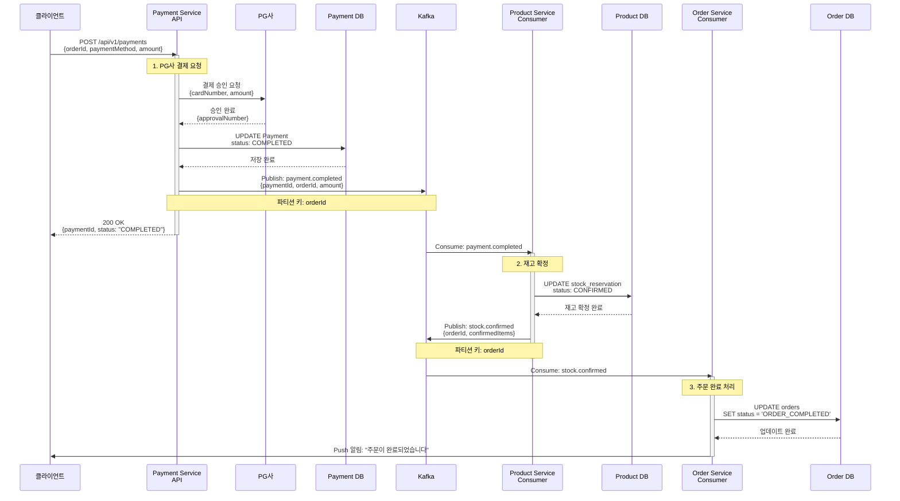
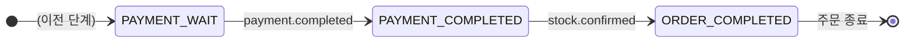

# Payment Processing - 결제 성공 플로우

결제 완료 후 재고 확정까지의 정상적인 이벤트 흐름

## 개요

고객이 결제를 완료하면:
1. **결제 완료** - Payment Service가 PG사 결제 승인을 받고 이벤트 발행
2. **재고 확정** - Product Service가 임시 예약된 재고를 영구 확정
3. **주문 완료** - Order Service가 주문 상태를 완료로 변경

**최종 상태**: `ORDER_COMPLETED` (주문 완료)

---

## 시퀀스 다이어그램



---

## 상태 전이



---

## 관련 이벤트

### 1. payment.completed
**발행자:** Payment Service
**구독자:** Product Service
**Avro 스키마:** [`PaymentCompleted.avsc`](../../src/main/events/avro/payment/PaymentCompleted.avsc)

**트리거 조건:**
- PG사 결제 승인이 완료되었을 때

**비즈니스 로직:**
- PG사에 결제 승인 요청
- 승인 번호 저장
- 결제 상태를 `COMPLETED`로 업데이트
- Kafka에 이벤트 발행

**페이로드:**
```json
{
  "eventId": "evt-uuid",
  "paymentId": "PAY-12345",
  "orderId": "ORD-12345",
  "userId": "USR-001",
  "totalAmount": 50000.00,
  "paymentMethod": "CARD",
  "pgApprovalNumber": "PG-APPROVE-001",
  "completedAt": 1699999999000
}
```

---

### 2. stock.confirmed
**발행자:** Product Service
**구독자:** Order Service
**Avro 스키마:** [`StockConfirmed.avsc`](../../src/main/events/avro/order/StockConfirmed.avsc)

**트리거 조건:**
- `payment.completed` 이벤트를 받고 재고 확정이 성공했을 때

**비즈니스 로직:**
- Redis 임시 예약 → DB 영구 저장
- 재고 예약 상태를 `CONFIRMED`로 업데이트
- Kafka에 이벤트 발행

**페이로드:**
```json
{
  "eventId": "evt-uuid",
  "orderId": "ORD-12345",
  "paymentId": "PAY-12345",
  "confirmedItems": [
    {"productId": "PRD-001", "quantity": 2},
    {"productId": "PRD-002", "quantity": 1}
  ],
  "confirmedAt": 1699999999000
}
```

---

## 주요 포인트

### ✅ PG사 연동
- 실시간 결제 승인/거부
- 승인 번호 저장으로 추후 환불 처리 가능

### ✅ 재고 확정 (2단계 커밋)
- **임시 예약**: Order Creation 단계에서 Redis에 임시 예약
- **영구 확정**: 결제 완료 후 DB에 영구 저장
- 결제 전 취소 시 임시 예약만 해제하면 됨

### ✅ 순서 보장
- 파티션 키를 `orderId`로 설정
- 같은 주문의 이벤트는 순서대로 처리

### ✅ 멱등성
- 모든 이벤트 핸들러는 `eventId`를 기반으로 중복 처리 방지

---

## 처리 시간

| 단계 | 소요 시간 | 방식 |
|------|-----------|------|
| 1. PG사 결제 승인 | ~200ms | 동기 |
| 2. 재고 확정 | 1~3초 | 비동기 |
| 3. 주문 완료 처리 | 0.5~1초 | 비동기 |
| **전체** | **2~5초** | - |

---

## 결제 성공 시나리오 예시

### 시나리오 1: 카드 결제
```
결제 수단: CARD
결제 금액: 50,000원
PG사 응답: 승인 (200ms)
재고 확정: 성공 (2초)
결과: ORDER_COMPLETED
```

### 시나리오 2: 간편결제 (카카오페이)
```
결제 수단: KAKAO_PAY
결제 금액: 30,000원
PG사 응답: 승인 (300ms)
재고 확정: 성공 (1.5초)
결과: ORDER_COMPLETED
```

---

## 고객 알림 메시지 예시

### Push 알림
```
제목: 주문이 완료되었습니다
내용: 주문번호 ORD-12345의 결제가 완료되었습니다. 배송 준비 중입니다.
```

---

## 예외 상황

이 문서는 정상 플로우만 다룹니다. 실패 시나리오는 다음 문서를 참조하세요:
- [결제 실패](./payment-failed.md)
- [재고 확정 실패](./stock-confirmation-failed.md)

---

## 모니터링 포인트

- 결제 성공률
- PG사 응답 시간
- 재고 확정 처리 시간
- 주문 완료율
- 단계별 Kafka Consumer Lag

---

## 관련 문서

- [Payment Processing README](./README.md) - 전체 플로우 개요
- [결제 실패](./payment-failed.md) - 결제 실패 시나리오
- [재고 확정 실패](./stock-confirmation-failed.md) - 재고 확정 실패 시나리오
- [Order Creation SAGA](../order-creation/) - 이전 단계
- [Kafka 이벤트 시퀀스](../../docs/interface/kafka-event-sequence.md) - 전체 시퀀스
