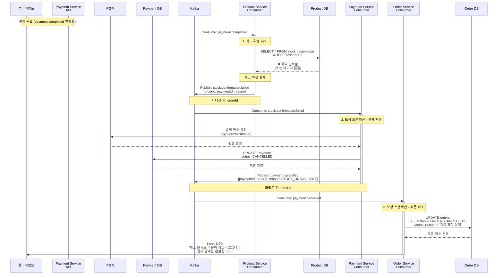
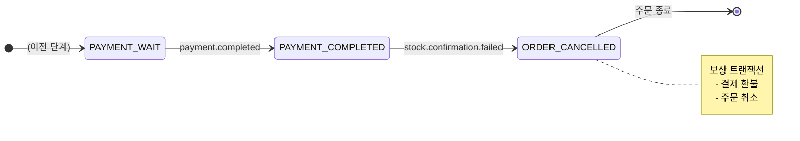

# Payment Processing - 재고 확정 실패 플로우

결제 완료 후 재고 확정 실패로 인한 환불 및 주문 취소 (보상 트랜잭션)

## 개요

고객이 결제를 완료했지만 재고 확정 단계에서 실패한 경우:
1. **결제 완료** - Payment Service가 PG사 결제 승인 완료
2. **재고 확정 시도** - Product Service가 임시 예약된 재고를 확정하려 함
3. **재고 확정 실패** - 임시 예약이 만료되었거나 시스템 오류
4. **보상 트랜잭션** - 결제 환불 및 주문 취소

**최종 상태**: `ORDER_CANCELLED` (주문 취소)

---

## 시퀀스 다이어그램



---

## 상태 전이



---

## 관련 이벤트

### 1. payment.completed
**발행자:** Payment Service
**구독자:** Product Service
**Avro 스키마:** [`PaymentCompleted.avsc`](../../src/main/events/avro/payment/PaymentCompleted.avsc)

**트리거 조건:**
- PG사 결제 승인이 완료되었을 때

---

### 2. stock.confirmation.failed (실패 이벤트)
**발행자:** Product Service
**구독자:** Payment Service
**Avro 스키마:** [`StockConfirmationFailed.avsc`](../../src/main/events/avro/saga/StockConfirmationFailed.avsc)

**트리거 조건:**
- `payment.completed` 이벤트를 받았으나 재고 확정에 실패했을 때
- 임시 예약이 만료됨
- 데이터베이스 오류
- 동시성 충돌

**비즈니스 로직:**
- 재고 예약 데이터 조회
- 확정 실패 확인 (예약 만료, 데이터 없음 등)
- 실패 이유와 함께 이벤트 발행

**페이로드:**
```json
{
  "eventId": "evt-uuid",
  "orderId": "ORD-12345",
  "paymentId": "PAY-12345",
  "failureReason": "임시 예약 만료",
  "failedAt": 1699999999000
}
```

---

### 3. payment.cancelled (보상 트랜잭션)
**발행자:** Payment Service
**구독자:** Order Service
**Avro 스키마:** [`PaymentCancelled.avsc`](../../src/main/events/avro/payment/PaymentCancelled.avsc)

**트리거 조건:**
- `stock.confirmation.failed` 이벤트를 받았을 때

**비즈니스 로직:**
- PG사에 결제 취소 요청
- 환불 처리
- 결제 상태를 `CANCELLED`로 업데이트
- Kafka에 이벤트 발행

**페이로드:**
```json
{
  "eventId": "evt-uuid",
  "paymentId": "PAY-12345",
  "orderId": "ORD-12345",
  "userId": "USR-001",
  "cancellationReason": "STOCK_UNAVAILABLE",
  "cancelledAt": 1699999999000
}
```

---

## 보상 트랜잭션 (Compensation)

### 보상이 필요한 이유
결제는 완료되었지만 재고 확정에 실패했으므로, 결제 금액을 환불해야 합니다.

### 보상 액션
1. **결제 환불**: PG사에 결제 취소 요청
2. **결제 상태 업데이트**: `COMPLETED` → `CANCELLED`
3. **환불 사유 기록**: "STOCK_UNAVAILABLE"
4. **주문 상태 업데이트**: `PAYMENT_COMPLETED` → `ORDER_CANCELLED`
5. **취소 사유 기록**: "재고 확정 실패"
6. **고객 알림**: Push 알림 발송
7. **이벤트 발행**: `payment.cancelled` 이벤트

### 환불 처리 상세
```
PG사 API 호출:
POST /api/cancel
{
  "approvalNumber": "PG-APPROVE-001",
  "cancelAmount": 50000,
  "reason": "재고 확정 실패로 인한 자동 환불"
}
```

---

## 주요 포인트

### ❌ 보상 트랜잭션 (환불)
- 결제 완료 후 재고 확정 실패 시 자동 환불
- PG사 API를 통한 실시간 환불 처리
- 고객에게 환불 알림 발송

### ⚠️ 주의: 결제 후 실패
- 이미 결제가 완료된 상태에서의 실패
- 고객 경험상 가장 불편한 케이스
- 빠른 환불 처리가 중요

### ✅ 데이터 일관성
- 결제 데이터는 `CANCELLED` 상태로 유지
- 주문 데이터는 `ORDER_CANCELLED` 상태로 유지
- 환불 이력 보관 (감사 추적용)

### ✅ 멱등성
- `stock.confirmation.failed` 이벤트를 중복 수신해도 동일한 결과
- PG사 환불도 멱등성 보장 (동일 승인번호로 중복 환불 방지)

---

## 처리 시간

| 단계 | 소요 시간 | 방식 |
|------|-----------|------|
| 1. 재고 확정 시도 | 1~3초 | 비동기 |
| 2. 결제 환불 (PG사) | 1~5초 | 동기 |
| 3. 주문 취소 | 0.5~1초 | 비동기 |
| **전체** | **3~10초** | - |

---

## 재고 확정 실패 시나리오 예시

### 시나리오 1: 임시 예약 만료
```
상황: 결제에 5분 이상 소요됨
임시 예약: Redis TTL 만료 (3분)
결과: 재고 확정 실패 → 환불 → 주문 취소
```

### 시나리오 2: 동시성 충돌
```
상황: 동일 상품에 대해 다른 주문이 먼저 확정됨
재고: 1개 남음, 2개 주문이 동시에 확정 시도
결과: 후순위 주문 실패 → 환불 → 주문 취소
```

### 시나리오 3: 데이터베이스 오류
```
상황: DB 연결 실패 또는 트랜잭션 오류
재시도: 2회 재시도 후에도 실패
결과: 재고 확정 실패 → 환불 → 주문 취소
```

---

## 고객 알림 메시지 예시

### Push 알림
```
제목: 주문이 취소되었습니다
내용: 재고 문제로 주문번호 ORD-12345가 취소되었습니다.
결제하신 50,000원은 3~5영업일 내 환불됩니다.
```

### 이메일 (선택)
```
주문 번호: ORD-12345
상태: 취소됨
사유: 재고 확정 실패

결제가 완료되었으나 재고 확보에 실패하여 주문이 취소되었습니다.
결제하신 금액은 자동으로 환불 처리됩니다.

환불 금액: 50,000원
환불 예상 기간: 3~5영업일

불편을 드려 죄송합니다.
```

---

## 재시도 정책

### 재고 확정 재시도
- 재시도 횟수: 2회
- 재시도 간격: 30초
- 최종 실패 시 `stock.confirmation.failed` 발행

### 환불 재시도
- 재시도 횟수: 5회 (환불은 반드시 성공해야 함)
- 재시도 간격: 2분
- 최종 실패 시 관리자 개입 필요 (알림 발송)

---

## 모니터링 포인트

- 재고 확정 실패율
- 임시 예약 만료율
- 환불 처리 성공률
- 환불 처리 시간
- PG사 API 응답 시간
- 관리자 개입이 필요한 환불 건수

---

## 개선 아이디어

### 임시 예약 TTL 연장
- 결제 진행 중 임시 예약 TTL 자동 연장
- 결제 시작 시점에 TTL 갱신

### 사전 재고 확정
- 결제 요청 전에 재고를 먼저 확정하는 옵션
- 확정 후 결제 실패 시 확정 취소

---

## 관련 문서

- [Payment Processing README](./README.md) - 전체 플로우 개요
- [결제 성공](./payment-success.md) - 성공 시나리오
- [결제 실패](./payment-failed.md) - 결제 실패 시나리오
- [Order Creation SAGA](../order-creation/) - 이전 단계
- [Kafka 이벤트 시퀀스](../../docs/interface/kafka-event-sequence.md) - 전체 시퀀스
