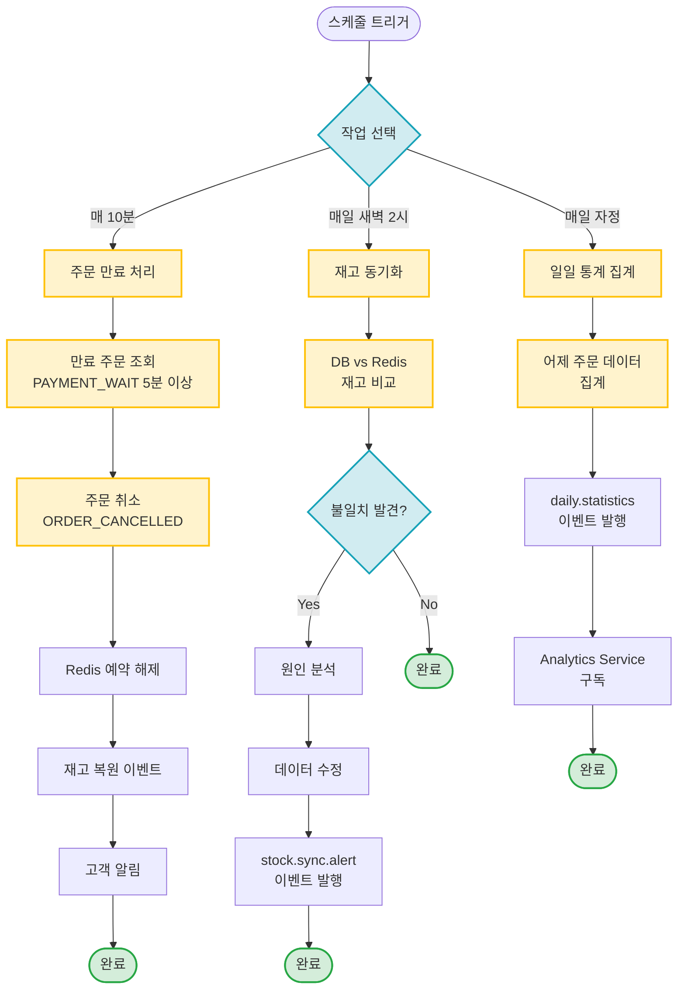

# Scheduled Jobs

주기적으로 실행되는 백그라운드 작업

## 개요

시스템 안정성과 데이터 정합성을 위해 주기적으로 실행되는 작업들:
1. **주문 만료 처리** - 5분 이상 결제되지 않은 주문 자동 취소 (매 10분)
2. **재고 동기화** - Product Service와 Order Service 간 재고 데이터 정합성 검증 (매일 새벽 2시)
3. **일일 통계 집계** - 매일 판매 통계 집계 및 이벤트 발행 (매일 자정)

**특징:**
- ✅ **배치 처리**: 대량 데이터를 효율적으로 처리
- ✅ **멱등성**: 중복 실행 시에도 안전
- ✅ **모니터링**: 처리 결과를 이벤트로 발행
- ✅ **데이터 정합성**: Redis와 DB 간 불일치 해소

---

## 시나리오 플로우차트



---

## 작업별 상세

### 1. 주문 만료 처리

**스케줄:** 매 10분 (`0 */10 * * * *`)

**목적:** 5분 이상 결제되지 않은 주문을 자동으로 취소하여 재고 정확성 유지

**문서:** [order-expiration.md](./order-expiration.md)

**플로우:**
1. `PAYMENT_WAIT` 상태이며 5분 이상 경과한 주문 조회
2. 주문 상태를 `ORDER_CANCELLED`로 업데이트
3. Redis 예약 재고 해제
4. `order.cancelled` 이벤트 발행 (재고 복원)
5. `order.expiration.notification` 이벤트 발행 (고객 알림)

**주요 이벤트:**
- `order.cancelled` - 주문 취소
- `order.expiration.notification` - 주문 만료 알림

**처리량:** 한 번에 최대 100건

**Avro 스키마:**
- [`OrderCancelled.avsc`](../../src/main/avro/order/OrderCancelled.avsc)
- [`OrderExpirationNotification.avsc`](../../src/main/avro/order/OrderExpirationNotification.avsc)

---

### 2. 재고 동기화

**스케줄:** 매일 새벽 2시 (`0 0 2 * * *`)

**목적:** Product Service의 DB 재고와 Redis 재고 간 불일치 해소

**문서:** [stock-sync.md](./stock-sync.md)

**플로우:**
1. 모든 상품의 DB 재고 조회
2. Redis 재고와 비교
3. 불일치 발견 시 원인 분석
4. 데이터 수정 (Redis 복원 또는 DB 수정)
5. `stock.sync.alert` 이벤트 발행

**주요 이벤트:**
- `stock.sync.alert` - 재고 불일치 알림

**알림 조건:** 불일치 건수 10건 초과 시 긴급 알림

**Avro 스키마:**
- [`StockSyncAlert.avsc`](../../src/main/avro/monitoring/StockSyncAlert.avsc)

---

### 3. 일일 통계 집계

**스케줄:** 매일 자정 (`0 0 0 * * *`)

**목적:** 어제 하루 판매 통계를 집계하고 Analytics Service에 전달

**문서:** [daily-statistics.md](./daily-statistics.md)

**플로우:**
1. 어제 주문 데이터 집계 (총 주문 수, 총 매출, 평균 주문 금액)
2. `daily.statistics` 이벤트 발행
3. Analytics Service가 이벤트 구독하여 리포트 생성

**주요 이벤트:**
- `daily.statistics` - 일일 통계

**집계 데이터:**
- 총 주문 수
- 총 매출
- 평균 주문 금액
- 취소 주문 수
- 환불 금액

**Avro 스키마:**
- [`DailyStatistics.avsc`](../../src/main/avro/analytics/DailyStatistics.avsc)

---

## 스케줄 설정 예시

### Kotlin (Spring Boot)

```kotlin
@Component
class ScheduledTasks {

    // 매 10분 - 주문 만료 처리
    @Scheduled(cron = "0 */10 * * * *")
    fun cancelExpiredOrders() {
        // ...
    }

    // 매일 새벽 2시 - 재고 동기화
    @Scheduled(cron = "0 0 2 * * *")
    fun synchronizeStock() {
        // ...
    }

    // 매일 자정 - 일일 통계 집계
    @Scheduled(cron = "0 0 0 * * *")
    fun aggregateDailyStatistics() {
        // ...
    }
}
```

---

## 멱등성 보장

모든 Scheduled Job은 중복 실행에도 안전하도록 설계:

### 주문 만료 처리
```kotlin
// 이미 취소된 주문은 skip
if (order.status == OrderStatus.ORDER_CANCELLED) {
    return
}
```

### 재고 동기화
```kotlin
// 불일치가 없으면 skip
if (dbStock == redisStock) {
    return
}
```

### 일일 통계 집계
```kotlin
// 이미 집계된 날짜는 skip
if (statisticsRepository.existsByDate(yesterday)) {
    return
}
```

---

## 타임아웃 설정

| 작업 | 타임아웃 | 초과 시 동작 |
|------|----------|--------------|
| 주문 만료 처리 | 5분 | 다음 실행 대기 |
| 재고 동기화 | 30분 | 다음 실행 대기 |
| 일일 통계 집계 | 10분 | 다음 실행 대기 |

---

## 배치 처리

대량 데이터를 효율적으로 처리하기 위한 배치 설정:

| 작업 | 배치 크기 | 설명 |
|------|-----------|------|
| 주문 만료 처리 | 100건 | 한 번에 최대 100건 처리 |
| 재고 동기화 | 1000건 | 상품별로 순차 처리 |
| 일일 통계 집계 | 전체 | 날짜별 집계 |

---

## 모니터링 포인트

### 주문 만료 처리
- 만료된 주문 수
- 재고 복원 성공률
- 고객 알림 발송 성공률
- 처리 시간

### 재고 동기화
- 불일치 발견 건수
- 수정 성공률
- Redis 복원 횟수
- 긴급 알림 발생 빈도

### 일일 통계 집계
- 집계 성공률
- 이벤트 발행 성공률
- Analytics Service 구독 성공률
- 처리 시간

---

## 알림 정책

### 주문 만료 처리
- Push 알림: "주문이 자동 취소되었습니다 (결제 시간 초과)"
- 이메일: 선택 사항

### 재고 동기화
- 불일치 10건 초과 시: 개발팀에 긴급 알림 (Slack, 이메일)
- 일일 요약 리포트: 매일 오전 9시

### 일일 통계 집계
- 집계 실패 시: 개발팀에 알림
- 일일 리포트: 매일 오전 10시 경영진에게 이메일

---

## 관련 문서

- [Kafka 이벤트 시퀀스](../../docs/interface/kafka-event-sequence.md) - 전체 시퀀스
- [Kafka 이벤트 명세](../../docs/interface/kafka-event-specifications.md) - 이벤트 상세 명세
- [전체 이벤트 플로우](../README.md) - 기능별 이벤트 플로우 목록
