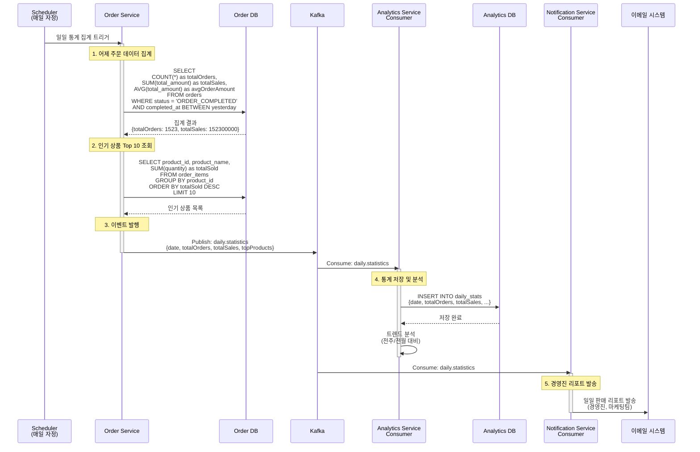

# Scheduled Jobs - 일일 통계 집계

매일 판매 통계를 집계하고 Analytics Service에 전달

## 개요

매일 자정에 전날 판매 데이터를 집계하여 Analytics Service에 전달합니다.

**스케줄:** 매일 자정 (`0 0 0 * * *`)

**집계 대상:** 전날 (00:00:00 ~ 23:59:59) 완료된 주문

**목적:**
- 일일 판매 통계 생성
- 인기 상품 분석
- 경영진 리포트 자동 생성

---

## 시퀀스 다이어그램



---

## 집계 데이터 구조

### 기본 통계
```json
{
  "eventId": "evt-uuid",
  "date": "2024-01-14",
  "totalOrders": 1523,
  "totalSales": 152300000.00,
  "avgOrderAmount": 100000.00,
  "generatedAt": 1699999999000
}
```

### 인기 상품 Top 10
```json
{
  "topProducts": [
    {"productId": "PRD-001", "productName": "인기 상품 A", "totalSold": 250},
    {"productId": "PRD-002", "productName": "인기 상품 B", "totalSold": 180},
    {"productId": "PRD-003", "productName": "인기 상품 C", "totalSold": 150}
  ]
}
```

---

## 관련 이벤트

### daily.statistics
**발행자:** Order Service (Scheduler)
**구독자:** Analytics Service, Notification Service
**Avro 스키마:** [`DailyStatistics.avsc`](../../src/main/events/avro/analytics/DailyStatistics.avsc)

**트리거 조건:**
- 매일 자정 Scheduler 실행

**페이로드:**
```json
{
  "eventId": "evt-uuid",
  "eventTimestamp": 1699999999000,
  "date": "2024-01-14",
  "totalOrders": 1523,
  "totalSales": 152300000.00,
  "avgOrderAmount": 100000.00,
  "topProducts": [
    {"productId": "PRD-001", "productName": "인기 상품 A", "totalSold": 250}
  ],
  "generatedAt": 1699999999000
}
```

---

## 집계 SQL 쿼리

### 기본 통계 집계
```sql
SELECT
    COUNT(*) AS totalOrders,
    COALESCE(SUM(total_amount), 0) AS totalSales,
    COALESCE(AVG(total_amount), 0) AS avgOrderAmount,
    COUNT(CASE WHEN status = 'ORDER_CANCELLED' THEN 1 END) AS cancelledOrders,
    COALESCE(SUM(CASE WHEN status = 'ORDER_CANCELLED' THEN refund_amount END), 0) AS totalRefunds
FROM orders
WHERE DATE(completed_at) = DATE(NOW() - INTERVAL 1 DAY)
    AND status IN ('ORDER_COMPLETED', 'ORDER_CANCELLED');
```

### 인기 상품 Top 10
```sql
SELECT
    oi.product_id,
    oi.product_name,
    SUM(oi.quantity) AS totalSold
FROM order_items oi
JOIN orders o ON o.id = oi.order_id
WHERE DATE(o.completed_at) = DATE(NOW() - INTERVAL 1 DAY)
    AND o.status = 'ORDER_COMPLETED'
GROUP BY oi.product_id, oi.product_name
ORDER BY totalSold DESC
LIMIT 10;
```

---

## 멱등성 보장

### 중복 집계 방지
```kotlin
fun aggregateDailyStatistics() {
    val yesterday = LocalDate.now().minusDays(1)

    // 이미 집계된 날짜인지 확인
    if (dailyStatsRepository.existsByDate(yesterday)) {
        log.info("Statistics for $yesterday already exists, skipping")
        return
    }

    // 집계 로직 실행
    val stats = aggregateStats(yesterday)
    dailyStatsRepository.save(stats)
    publishEvent(stats)
}
```

### 재집계 지원
```kotlin
// 수동 재집계 API (관리자용)
@PostMapping("/admin/statistics/regenerate")
fun regenerateStatistics(@RequestParam date: LocalDate) {
    // 기존 데이터 삭제
    dailyStatsRepository.deleteByDate(date)
    // 재집계
    aggregateDailyStatistics(date)
}
```

---

## 처리 시간

| 단계 | 소요 시간 | 방식 |
|------|-----------|------|
| 1. 기본 통계 집계 | 1~3초 | 동기 |
| 2. 인기 상품 조회 | 1~2초 | 동기 |
| 3. 이벤트 발행 | ~100ms | 비동기 |
| 4. Analytics 저장 | ~500ms | 비동기 |
| 5. 이메일 발송 | 1~2초 | 비동기 |
| **전체** | **3~8초** | - |

---

## 시나리오 예시

### 시나리오 1: 일반 영업일
```
날짜: 2024-01-14 (월요일)
총 주문: 1,523건
총 매출: 152,300,000원
평균 주문 금액: 100,000원
인기 상품 1위: 겨울 패딩 (250개)
```

### 시나리오 2: 이벤트 기간
```
날짜: 2024-11-11 (광군절)
총 주문: 15,230건 (10배 증가)
총 매출: 1,523,000,000원
평균 주문 금액: 100,000원
인기 상품 1위: 할인 상품 A (2,500개)
```

### 시나리오 3: 주문 없는 날 (새벽 점검)
```
날짜: 2024-01-15 (화요일 새벽 점검)
총 주문: 0건
총 매출: 0원
결과: 통계 이벤트 발행 (0으로 기록)
```

---

## 경영진 리포트 예시

### 이메일 리포트
```
=== 일일 판매 리포트 ===
날짜: 2024년 1월 14일 (월)

📊 요약
┌─────────────────────────────────┐
│ 총 주문 수    │     1,523건     │
│ 총 매출액     │ 152,300,000원   │
│ 평균 주문금액  │   100,000원     │
│ 취소 주문     │      23건       │
│ 환불 금액     │   2,300,000원   │
└─────────────────────────────────┘

📈 전일 대비
- 주문 수: +5.2% (전일: 1,448건)
- 매출액: +7.8% (전일: 141,200,000원)

🏆 인기 상품 Top 5
1. 겨울 패딩 자켓 - 250개 판매
2. 캐시미어 니트 - 180개 판매
3. 양털 부츠 - 150개 판매
4. 무선 이어폰 - 120개 판매
5. 스마트 워치 - 98개 판매

📌 주간 트렌드
- 주간 총 매출: 987,500,000원
- 주간 평균 일 매출: 141,071,429원
- 전주 대비: +12.3%

---
자동 생성 리포트 | 문의: analytics@company.com
```

---

## 확장 통계 (선택)

### 추가 집계 항목
- 시간대별 주문 분포
- 결제 수단별 통계
- 지역별 주문 분포
- 신규/기존 고객 비율
- 재구매율

### 트렌드 분석
- 전주 동일 요일 대비
- 전월 동일 일자 대비
- 전년 동월 대비
- 이동 평균 (7일/30일)

---

## 모니터링 포인트

- 집계 실행 성공률
- 집계 실행 시간
- 이벤트 발행 성공률
- 리포트 발송 성공률
- 매출 이상 감지 (급격한 증감)

---

## 알림 정책

### 정상 알림
- 매일 오전 9시: 경영진, 마케팅팀 이메일 발송

### 이상 감지 알림
- 매출 30% 이상 감소: 긴급 Slack 알림
- 집계 실패: 개발팀 Slack 알림

---

## 관련 문서

- [Scheduled Jobs README](./README.md) - 전체 작업 목록
- [주문 만료 처리](./order-expiration.md) - 주문 만료 처리
- [재고 동기화](./stock-sync.md) - 재고 정합성 검증
- [Kafka 이벤트 시퀀스](../../docs/interface/kafka-event-sequence.md) - 전체 시퀀스
