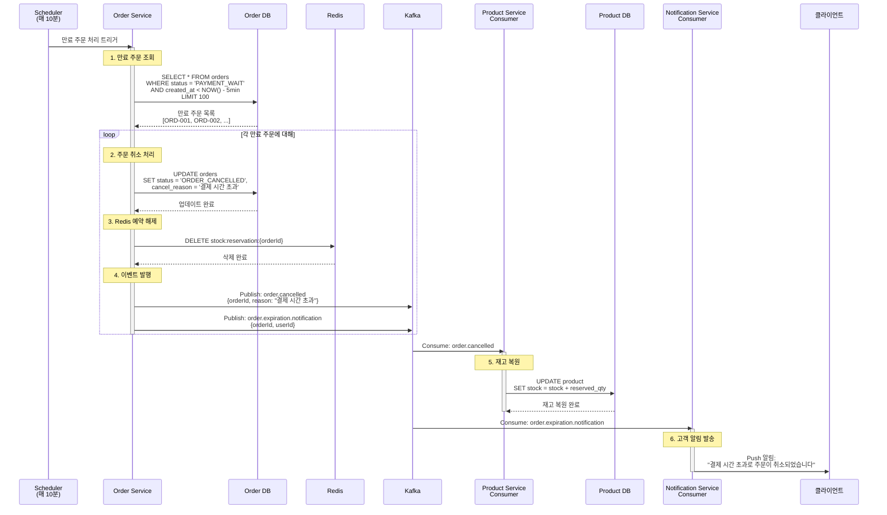
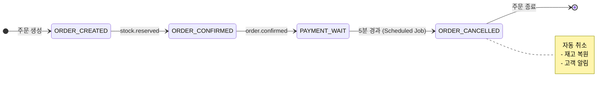

# Scheduled Jobs - 주문 만료 처리

결제 시간 초과로 인한 자동 주문 취소

## 개요

5분 이상 결제되지 않은 주문을 자동으로 취소하여 재고 정확성을 유지합니다.

**스케줄:** 매 10분 (`0 */10 * * * *`)

**대상 주문:**
- 상태: `PAYMENT_WAIT`
- 생성 시간: 5분 이상 경과

**최종 상태**: `ORDER_CANCELLED` (주문 취소)

---

## 시퀀스 다이어그램



---

## 상태 전이



---

## 관련 이벤트

### 1. order.cancelled
**발행자:** Order Service (Scheduler)
**구독자:** Product Service
**Avro 스키마:** [`OrderCancelled.avsc`](../../src/main/events/avro/order/OrderCancelled.avsc)

**트리거 조건:**
- Scheduled Job이 만료 주문을 발견했을 때

**비즈니스 로직:**
- 주문 상태를 `ORDER_CANCELLED`로 업데이트
- 취소 사유 기록 ("결제 시간 초과")
- Kafka에 이벤트 발행

---

### 2. order.expiration.notification
**발행자:** Order Service (Scheduler)
**구독자:** Notification Service
**Avro 스키마:** [`OrderExpirationNotification.avsc`](../../src/main/events/avro/order/OrderExpirationNotification.avsc)

**트리거 조건:**
- 주문 만료 취소 시

**비즈니스 로직:**
- 고객에게 Push 알림 발송
- 이메일 알림 (선택)

**페이로드:**
```json
{
  "eventId": "evt-uuid",
  "orderId": "ORD-12345",
  "userId": "USR-001",
  "expirationReason": "결제 시간 초과 (30분)",
  "expiredAt": 1699999999000
}
```

---

## 멱등성 보장

### 중복 실행 방지
```kotlin
// 이미 취소된 주문은 skip
fun processExpiredOrders() {
    val expiredOrders = orderRepository.findExpiredOrders(
        status = OrderStatus.PAYMENT_WAIT,  // 아직 취소되지 않은 주문만
        createdBefore = Instant.now().minus(5, ChronoUnit.MINUTES)
    )

    expiredOrders.forEach { order ->
        // 낙관적 락으로 동시 처리 방지
        if (order.status == OrderStatus.PAYMENT_WAIT) {
            cancelOrder(order)
        }
    }
}
```

### 이벤트 중복 처리 방지
```kotlin
// eventId 기반 중복 체크
fun handleOrderCancelled(event: OrderCancelled) {
    if (processedEventRepository.exists(event.eventId)) {
        return  // 이미 처리된 이벤트
    }
    // 재고 복원 로직
}
```

---

## 배치 처리

### 처리량 설정
| 설정 | 값 | 설명 |
|------|-----|------|
| 배치 크기 | 100건 | 한 번에 최대 100건 처리 |
| 실행 간격 | 10분 | 매 10분마다 실행 |
| 타임아웃 | 5분 | 5분 초과 시 다음 실행 대기 |

### 대량 만료 주문 처리
```kotlin
@Scheduled(cron = "0 */10 * * * *")
fun cancelExpiredOrders() {
    var hasMore = true
    while (hasMore) {
        val batch = orderRepository.findExpiredOrders(limit = 100)
        if (batch.isEmpty()) {
            hasMore = false
        } else {
            batch.forEach { cancelOrder(it) }
        }
    }
}
```

---

## 주요 포인트

### ✅ 재고 정확성
- 결제되지 않은 주문의 예약 재고를 자동 해제
- 다른 고객이 해당 재고를 구매할 수 있도록 함

### ✅ Redis + DB 일관성
- Redis 임시 예약 삭제
- DB 재고 복원

### ✅ 고객 경험
- 주문 취소 사실을 즉시 알림
- 재주문 유도

### ✅ 멱등성
- 중복 실행에도 안전
- 이미 취소된 주문은 skip

---

## 처리 시간

| 단계 | 소요 시간 | 방식 |
|------|-----------|------|
| 1. 만료 주문 조회 | ~100ms | 동기 |
| 2. 주문 취소 (100건) | 1~2초 | 동기 |
| 3. Redis 예약 해제 | 0.5~1초 | 동기 |
| 4. 이벤트 발행 | 0.5~1초 | 비동기 |
| 5. 재고 복원 | 1~2초 | 비동기 |
| 6. 고객 알림 | 0.5~1초 | 비동기 |
| **전체 (100건 기준)** | **3~7초** | - |

---

## 시나리오 예시

### 시나리오 1: 일반 만료
```
주문 생성: 10:00:00
결제 대기 상태: 10:02:00 (ORDER_CONFIRMED → PAYMENT_WAIT)
Scheduler 실행: 10:10:00
경과 시간: 8분 (> 5분)
결과: 주문 취소, 재고 복원, 고객 알림
```

### 시나리오 2: 대량 만료 (이벤트 종료 후)
```
상황: 이벤트 종료 후 1000건의 미결제 주문
Scheduler 실행: 10회 (10분 × 100건)
처리 시간: ~100분
결과: 1000건 모두 취소, 재고 복원
```

---

## 고객 알림 메시지 예시

### Push 알림
```
제목: 주문이 자동 취소되었습니다
내용: 주문번호 ORD-12345의 결제 시간이 초과되어 자동 취소되었습니다.
다시 주문하시려면 장바구니를 확인해주세요.
```

### 이메일 (선택)
```
주문 번호: ORD-12345
상태: 자동 취소
사유: 결제 시간 초과 (5분)

결제가 완료되지 않아 주문이 자동으로 취소되었습니다.
상품 재고는 다시 판매 가능 상태로 복원되었습니다.

다시 주문하시려면 아래 링크를 클릭해주세요.
[다시 주문하기]
```

---

## 모니터링 포인트

- 만료된 주문 수 (일별/시간별)
- 만료 주문 비율 (전체 주문 대비 %)
- 재고 복원 성공률
- 고객 알림 발송 성공률
- Scheduler 실행 시간
- 만료 후 재주문 비율

---

## 개선 아이디어

### 만료 전 알림
- 만료 3분 전에 Push 알림 발송
- "결제를 완료해주세요. 2분 후 주문이 취소됩니다."

### 장바구니 자동 저장
- 만료된 주문의 상품을 장바구니에 자동 저장
- 재주문 편의성 향상

### 만료 시간 동적 조정
- 피크 시간대: 5분 (빠른 재고 회전)
- 야간/새벽: 30분 (고객 편의)

---

## 관련 문서

- [Scheduled Jobs README](./README.md) - 전체 작업 목록
- [재고 동기화](./stock-sync.md) - 재고 정합성 검증
- [일일 통계 집계](./daily-statistics.md) - 통계 집계
- [Kafka 이벤트 시퀀스](../../docs/interface/kafka-event-sequence.md) - 전체 시퀀스
