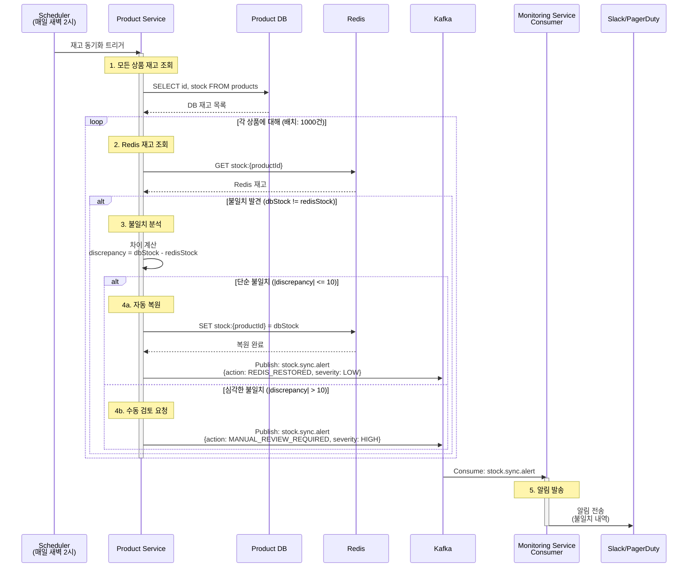
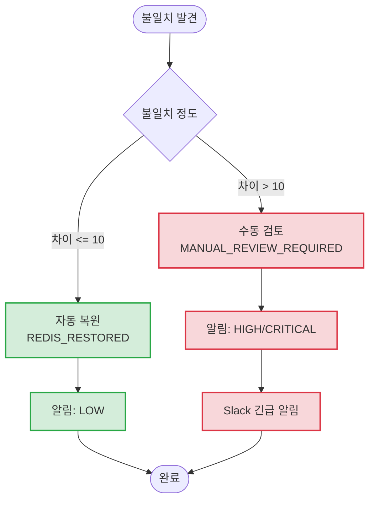

# Scheduled Jobs - 재고 동기화

Product Service의 DB 재고와 Redis 재고 간 정합성 검증 및 동기화

## 개요

매일 새벽 2시에 DB 재고와 Redis 캐시 재고를 비교하여 불일치를 해소합니다.

**스케줄:** 매일 새벽 2시 (`0 0 2 * * *`)

**목적:**
- DB 재고와 Redis 재고 간 불일치 탐지
- 불일치 발생 시 자동 복원 또는 수동 검토 요청
- 데이터 정합성 모니터링

---

## 시퀀스 다이어그램



---

## 불일치 분류



---

## 관련 이벤트

### stock.sync.alert
**발행자:** Product Service (Scheduler)
**구독자:** Monitoring Service, Notification Service
**Avro 스키마:** [`StockSyncAlert.avsc`](../../src/main/events/avro/monitoring/StockSyncAlert.avsc)

**트리거 조건:**
- DB와 Redis 재고 불일치 발견 시

**페이로드:**
```json
{
  "eventId": "evt-uuid",
  "productId": "PRD-001",
  "dbStock": 100,
  "redisStock": 95,
  "discrepancy": 5,
  "action": "REDIS_RESTORED",
  "severity": "LOW",
  "detectedAt": 1699999999000
}
```

### 심각도 (Severity) 분류

| 심각도 | 조건 | 조치 |
|--------|------|------|
| LOW | 차이 1~5 | 자동 복원, 로그 기록 |
| MEDIUM | 차이 6~10 | 자동 복원, 일일 리포트 |
| HIGH | 차이 11~50 | 수동 검토 요청, Slack 알림 |
| CRITICAL | 차이 > 50 | 수동 검토 필수, PagerDuty 알림 |

---

## 불일치 원인 분석

### 일반적인 원인

| 원인 | 설명 | 자동 복원 가능 |
|------|------|----------------|
| Redis 장애 | Redis 재시작 시 데이터 손실 | ✅ |
| 네트워크 오류 | Kafka 이벤트 유실 | ✅ |
| 버그 | 재고 차감/복원 로직 오류 | ❌ (수동 검토) |
| 동시성 문제 | Race condition | ❌ (수동 검토) |

### 원인별 복원 전략

```kotlin
fun analyzeAndRestore(productId: String, dbStock: Int, redisStock: Int) {
    val discrepancy = abs(dbStock - redisStock)

    when {
        discrepancy <= 10 -> {
            // 자동 복원: Redis를 DB 값으로 덮어쓰기
            redisTemplate.opsForValue().set("stock:$productId", dbStock)
            publishAlert(productId, dbStock, redisStock, SyncAction.REDIS_RESTORED, AlertSeverity.LOW)
        }
        else -> {
            // 수동 검토 요청
            publishAlert(productId, dbStock, redisStock, SyncAction.MANUAL_REVIEW_REQUIRED, AlertSeverity.HIGH)
        }
    }
}
```

---

## 배치 처리

### 처리량 설정
| 설정 | 값 | 설명 |
|------|-----|------|
| 배치 크기 | 1000건 | 상품별 순차 처리 |
| 실행 시간 | 새벽 2시 | 트래픽 최저 시간 |
| 타임아웃 | 30분 | 30분 초과 시 다음 날 대기 |

### 대량 상품 처리
```kotlin
@Scheduled(cron = "0 0 2 * * *")
fun synchronizeStock() {
    var offset = 0
    val batchSize = 1000

    while (true) {
        val products = productRepository.findAll(
            PageRequest.of(offset / batchSize, batchSize)
        )

        if (products.isEmpty) break

        products.forEach { product ->
            val dbStock = product.stock
            val redisStock = redisTemplate.opsForValue()
                .get("stock:${product.id}")?.toInt() ?: 0

            if (dbStock != redisStock) {
                analyzeAndRestore(product.id, dbStock, redisStock)
            }
        }

        offset += batchSize
    }
}
```

---

## 멱등성 보장

### 중복 실행 방지
```kotlin
fun synchronizeStock() {
    val lockKey = "sync:stock:${LocalDate.now()}"
    val acquired = redisTemplate.opsForValue()
        .setIfAbsent(lockKey, "running", Duration.ofHours(1))

    if (!acquired) {
        log.info("Stock sync already running for today")
        return
    }

    try {
        // 동기화 로직
    } finally {
        redisTemplate.delete(lockKey)
    }
}
```

---

## 처리 시간

| 단계 | 소요 시간 | 방식 |
|------|-----------|------|
| 1. 전체 상품 조회 | 1~5분 | 동기 |
| 2. Redis 비교 (상품당) | ~1ms | 동기 |
| 3. 불일치 복원 (건당) | ~10ms | 동기 |
| 4. 알림 발행 | ~50ms | 비동기 |
| **전체 (10,000 상품)** | **5~15분** | - |

---

## 시나리오 예시

### 시나리오 1: Redis 장애 복구 후
```
상황: Redis 재시작으로 일부 데이터 손실
상품 수: 100개 불일치
불일치 범위: 1~5개
결과: 100건 자동 복원, LOW 알림 100건
```

### 시나리오 2: 버그로 인한 심각한 불일치
```
상황: 재고 복원 로직 버그
상품: PRD-001
DB 재고: 100
Redis 재고: 20
불일치: 80개
결과: 수동 검토 요청, CRITICAL 알림, PagerDuty 호출
```

---

## 알림 메시지 예시

### Slack 알림 (LOW)
```
[재고 동기화] 자동 복원 완료
- 날짜: 2024-01-15 02:15:00
- 불일치 건수: 15건
- 복원 완료: 15건
- 최대 차이: 5개 (PRD-123)
```

### Slack 알림 (CRITICAL)
```
🚨 [긴급] 재고 심각한 불일치 발견
- 날짜: 2024-01-15 02:15:00
- 상품 ID: PRD-001
- DB 재고: 100
- Redis 재고: 20
- 차이: 80개

⚠️ 수동 검토가 필요합니다.
담당자: @backend-team
```

---

## 모니터링 포인트

- 불일치 발견 건수 (일별)
- 자동 복원 건수 / 수동 검토 건수
- 불일치 상품 Top 10
- 평균 불일치 수량
- 동기화 실행 시간
- 긴급 알림 발생 빈도

---

## 일일 리포트

매일 오전 9시 자동 생성:

```
=== 재고 동기화 일일 리포트 ===
날짜: 2024-01-15

📊 요약
- 전체 상품: 10,000개
- 정상: 9,985개 (99.85%)
- 불일치: 15개 (0.15%)

🔧 조치 내역
- 자동 복원: 14건
- 수동 검토: 1건

⚠️ 주의 상품
1. PRD-001: 차이 15개 (수동 검토 필요)

✅ 동기화 완료: 02:14:32
```

---

## 관련 문서

- [Scheduled Jobs README](./README.md) - 전체 작업 목록
- [주문 만료 처리](./order-expiration.md) - 주문 만료 처리
- [일일 통계 집계](./daily-statistics.md) - 통계 집계
- [Kafka 이벤트 시퀀스](../../docs/interface/kafka-event-sequence.md) - 전체 시퀀스
