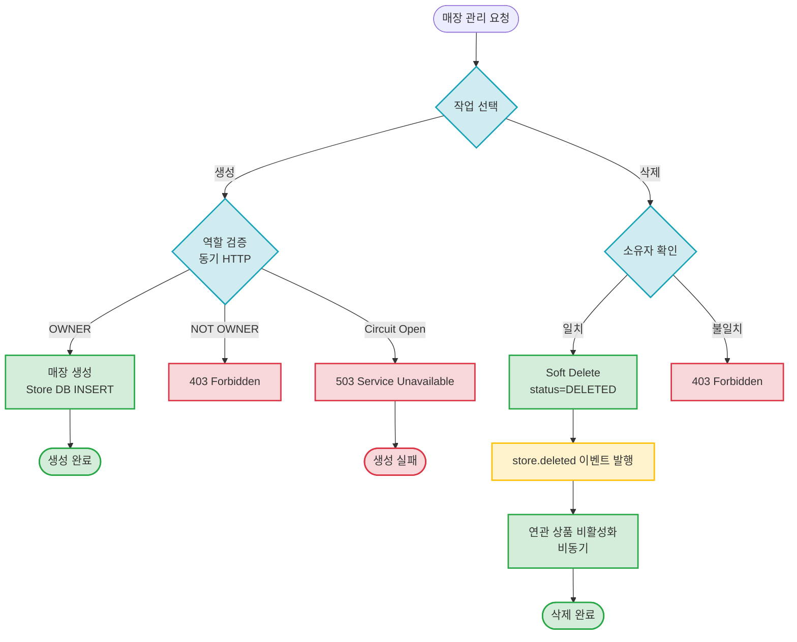

# Store Management

매장 생성 및 삭제 관리

## 개요

매장 관리는 두 가지 주요 작업으로 구성됩니다:
- **매장 생성**: OWNER 역할 검증 후 매장 생성 (동기 HTTP)
- **매장 삭제**: Soft Delete 후 연관 상품 비활성화 (비동기)

**특징:**
- ✅ **역할 검증**: Circuit Breaker 패턴으로 User Service 호출
- ✅ **보안 우선**: Eventual Consistency 대신 동기 검증
- ✅ **Cascade Operation**: 매장 삭제 시 연관 상품 자동 비활성화
- ✅ **Soft Delete**: 데이터 복구 가능 (30일 이내)

---

## 시나리오 플로우차트



---

## 케이스별 문서

### 1. 매장 생성 (동기 HTTP)
OWNER 역할을 가진 사용자만 매장을 생성할 수 있습니다.

**문서:** [create-store.md](./create-store.md)

**플로우:**
1. User Service에 역할 검증 요청 (동기 HTTP)
2. OWNER 확인 후 매장 생성
3. 즉시 응답 (~150ms)

**주요 포인트:**
- ✅ Circuit Breaker: User Service 장애 격리
- ✅ 동기 처리: 보안 우선
- ❌ 비동기 불가: Eventual Consistency 위험

**응답 시간:** ~150ms (User API 50ms + Store 생성 100ms)

---

### 2. 매장 삭제 (비동기)
매장 삭제 시 연관된 모든 상품이 자동으로 비활성화됩니다.

**문서:** [delete-store.md](./delete-store.md)

**플로우:**
1. 소유자 확인
2. Soft Delete (status = `DELETED`)
3. `store.deleted` 이벤트 발행
4. Product Service가 연관 상품 비활성화

**주요 포인트:**
- ✅ Soft Delete: 30일 이내 복구 가능
- ✅ Cascade Operation: 상품 자동 비활성화
- ✅ 비동기 처리: 빠른 응답 (~100ms)

**주요 이벤트:**
- `store.deleted` - 매장 삭제

**응답 시간:**
- Store 삭제: ~100ms (동기)
- 연관 상품 처리: 1~5초 (비동기, 상품 수에 따라 변동)

---

## 관련 이벤트 (Avro 스키마)

### 매장 삭제 이벤트
- [`StoreDeleted.avsc`](../../src/main/avro/store/StoreDeleted.avsc)

**Kafka 토픽:** `store.deleted`

**파티션 키:** `storeId`

---

## 상태 전이도

### 매장 생성
```
(없음) → ACTIVE (생성 성공)
```

### 매장 삭제
```
ACTIVE → DELETED (Soft Delete) → PURGED (30일 후 Hard Delete)
```

---

## Circuit Breaker 설정

매장 생성 시 User Service 호출에 Circuit Breaker 적용:

| 설정 | 값 | 설명 |
|------|-----|------|
| Failure Rate | 50% | 실패율 50% 초과 시 Circuit Open |
| Wait Duration | 10초 | Circuit Open 후 대기 시간 |
| Fallback | Store 생성 거부 | 보안 우선 정책 |

**Circuit Open 시:**
- 응답: `503 Service Unavailable`
- 메시지: "User Service 일시 장애"
- 클라이언트: 몇 초 후 재시도

---

## 비즈니스 규칙

### 매장 생성
- ✅ OWNER 역할을 가진 사용자만 가능
- ❌ 일반 사용자(CUSTOMER)는 불가

### 매장 삭제
- ✅ 매장 소유자만 삭제 가능
- ❌ 진행 중인 주문이 있는 경우 삭제 불가 (`409 Conflict`)
- ✅ 삭제 후 30일 이내 복구 가능
- ⏱️ 30일 경과 후: Hard Delete (Scheduled Job)

---

## 연관 상품 처리

매장 삭제 시 Product Service가 다음 작업을 수행합니다:

```sql
UPDATE products
SET status = 'DISCONTINUED',
    is_visible = false,
    updated_at = NOW()
WHERE store_id = ?
```

**예시:**
- 매장 ID: `STORE-001`
- 연관 상품: 150개
- 처리 시간: 1~3초

---

## 모니터링 포인트

### 매장 생성
- User Service 호출 성공률
- Circuit Breaker 상태
- OWNER 검증 실패율
- 생성 API 응답 시간

### 매장 삭제
- `store.deleted` 이벤트 발행 성공률
- 연관 상품 비활성화 처리 시간
- Soft Delete → Hard Delete 처리율

---

## 관련 문서

- [Kafka 이벤트 시퀀스](../../docs/interface/kafka-event-sequence.md) - 전체 시퀀스
- [Kafka 이벤트 명세](../../docs/interface/kafka-event-specifications.md) - 이벤트 상세 명세
- [전체 이벤트 플로우](../README.md) - 기능별 이벤트 플로우 목록
