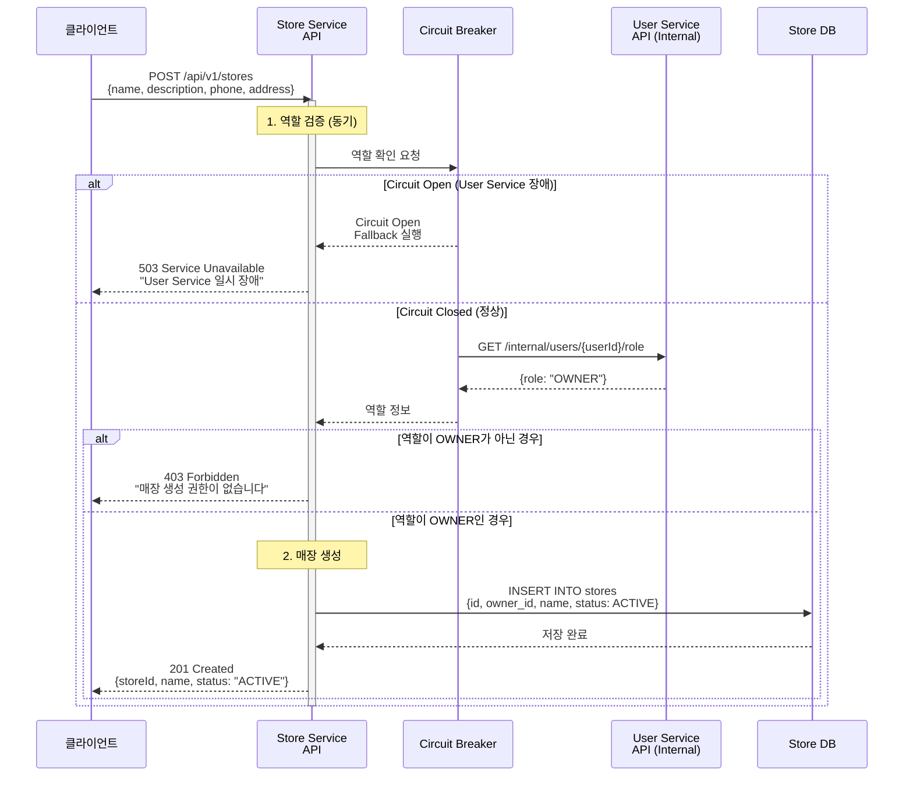
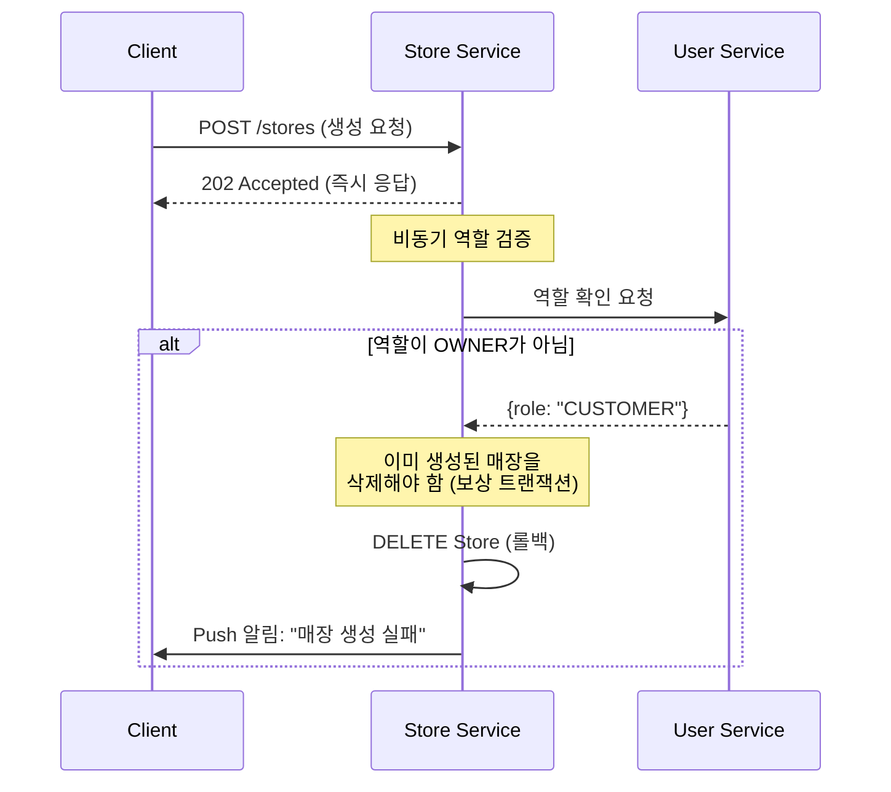
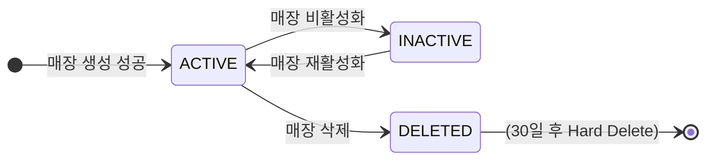

# 매장 생성

OWNER 역할 검증 후 매장 생성 (동기 HTTP)

## 개요

OWNER 역할을 가진 사용자만 매장을 생성할 수 있습니다. 보안상의 이유로 역할 검증은 동기 HTTP 호출로 처리됩니다.

**특징:**
- ✅ **동기 처리**: 보안 우선 (Eventual Consistency 대신)
- ✅ **Circuit Breaker**: User Service 장애 격리
- ✅ **즉시 응답**: ~150ms (User API 50ms + Store 생성 100ms)
- ❌ **비동기 불가**: 역할 검증 없이 생성 불가

---

## 시퀀스 다이어그램



---

## API 명세

### 매장 생성 API

**Endpoint:** `POST /api/v1/stores`

**Headers:**
```
Authorization: Bearer {access_token}
Content-Type: application/json
```

**Request Body:**
```json
{
  "name": "맛있는 치킨집",
  "description": "신선한 국내산 닭만 사용합니다",
  "phone": "02-1234-5678",
  "address": {
    "street": "강남대로 123",
    "city": "서울",
    "state": "강남구",
    "zipCode": "06234",
    "country": "KR"
  },
  "businessHours": {
    "mon-fri": "11:00-22:00",
    "sat-sun": "12:00-21:00"
  },
  "imageUrl": "https://cdn.example.com/stores/store-001.jpg"
}
```

**Response (Success - 201):**
```json
{
  "storeId": "STORE-001",
  "name": "맛있는 치킨집",
  "status": "ACTIVE",
  "ownerId": "USR-001",
  "createdAt": "2024-01-15T10:30:00Z"
}
```

**Response (Error - 403):**
```json
{
  "error": "FORBIDDEN",
  "message": "매장 생성 권한이 없습니다. OWNER 역할이 필요합니다.",
  "code": "STORE_CREATE_FORBIDDEN"
}
```

**Response (Error - 503):**
```json
{
  "error": "SERVICE_UNAVAILABLE",
  "message": "User Service 일시 장애로 역할 검증이 불가능합니다. 잠시 후 다시 시도해주세요.",
  "code": "USER_SERVICE_UNAVAILABLE",
  "retryAfter": 10
}
```

---

## Internal API (User Service)

### 역할 확인 API

**Endpoint:** `GET /internal/users/{userId}/role`

**Response:**
```json
{
  "userId": "USR-001",
  "role": "OWNER",
  "email": "owner@example.com"
}
```

**역할 종류:**
| 역할 | 설명 | 매장 생성 |
|------|------|----------|
| OWNER | 점주 | ✅ 가능 |
| CUSTOMER | 일반 고객 | ❌ 불가 |
| ADMIN | 관리자 | ✅ 가능 |

---

## Circuit Breaker 설정

User Service 호출에 Circuit Breaker를 적용하여 장애를 격리합니다.

### 설정 값

| 설정 | 값 | 설명 |
|------|-----|------|
| Failure Rate Threshold | 50% | 실패율 50% 초과 시 Circuit Open |
| Slow Call Rate Threshold | 80% | 느린 호출 80% 초과 시 Circuit Open |
| Slow Call Duration | 2초 | 2초 초과 시 느린 호출로 간주 |
| Wait Duration in Open | 10초 | Circuit Open 후 대기 시간 |
| Permitted Calls in Half-Open | 5회 | Half-Open 상태에서 허용 호출 수 |
| Sliding Window Size | 10회 | 최근 10회 호출 기준 |

### Kotlin 구현

```kotlin
@Service
class StoreService(
    private val userClient: UserClient,
    private val storeRepository: StoreRepository
) {
    @CircuitBreaker(name = "userService", fallbackMethod = "createStoreFallback")
    fun createStore(request: CreateStoreRequest, userId: String): StoreResponse {
        // 1. 역할 검증
        val userRole = userClient.getUserRole(userId)
        if (userRole.role != Role.OWNER && userRole.role != Role.ADMIN) {
            throw ForbiddenException("매장 생성 권한이 없습니다")
        }

        // 2. 매장 생성
        val store = Store(
            id = generateStoreId(),
            ownerId = userId,
            name = request.name,
            status = StoreStatus.ACTIVE
        )
        storeRepository.save(store)

        return StoreResponse(store)
    }

    fun createStoreFallback(request: CreateStoreRequest, userId: String, ex: Exception): StoreResponse {
        throw ServiceUnavailableException(
            message = "User Service 일시 장애",
            retryAfter = 10
        )
    }
}
```

---

## 왜 동기 처리인가?

### 비동기 처리의 위험성

만약 역할 검증을 비동기로 처리한다면:



**문제점:**
1. 권한 없는 사용자가 일시적으로 매장을 가질 수 있음
2. 보상 트랜잭션 복잡성 증가
3. 보안 취약점 발생 가능

### 동기 처리의 장점

| 항목 | 동기 | 비동기 |
|------|------|--------|
| 보안 | ✅ 즉시 검증 | ❌ 지연된 검증 |
| 복잡성 | ✅ 단순함 | ❌ 보상 트랜잭션 필요 |
| 응답 속도 | ~150ms | ~100ms |
| 장애 격리 | ✅ Circuit Breaker | ❌ 복잡한 롤백 |

---

## 상태 전이



---

## 처리 시간

| 단계 | 소요 시간 | 방식 |
|------|-----------|------|
| 1. 인증 토큰 검증 | ~10ms | 동기 |
| 2. User Service 역할 조회 | ~50ms | 동기 (Internal API) |
| 3. 매장 데이터 저장 | ~80ms | 동기 |
| **전체** | **~150ms** | 동기 |

---

## 시나리오 예시

### 시나리오 1: OWNER 역할 사용자
```
요청자: USR-001 (역할: OWNER)
요청: POST /api/v1/stores
결과: 201 Created, 매장 생성 성공
```

### 시나리오 2: CUSTOMER 역할 사용자
```
요청자: USR-002 (역할: CUSTOMER)
요청: POST /api/v1/stores
결과: 403 Forbidden, "매장 생성 권한이 없습니다"
```

### 시나리오 3: User Service 장애
```
요청자: USR-001 (역할: OWNER)
상황: User Service 응답 없음 (5초 이상)
Circuit: Open 상태
결과: 503 Service Unavailable, "잠시 후 다시 시도해주세요"
```

---

## 에러 코드

| HTTP Status | Error Code | 설명 |
|-------------|------------|------|
| 201 | - | 매장 생성 성공 |
| 400 | INVALID_REQUEST | 요청 데이터 유효성 검증 실패 |
| 401 | UNAUTHORIZED | 인증 토큰 없음 또는 만료 |
| 403 | STORE_CREATE_FORBIDDEN | OWNER 역할이 아님 |
| 409 | DUPLICATE_STORE_NAME | 동일 이름 매장 존재 |
| 503 | USER_SERVICE_UNAVAILABLE | User Service 장애 |

---

## 모니터링 포인트

- 매장 생성 성공률
- User Service 호출 응답 시간
- Circuit Breaker 상태 (CLOSED/OPEN/HALF_OPEN)
- OWNER 검증 실패율
- 매장 생성 API 응답 시간

---

## 알림 정책

### 개발팀 알림
- Circuit Breaker Open: 즉시 Slack 알림
- User Service 응답 시간 > 1초: 경고 알림
- 매장 생성 실패율 > 10%: 긴급 알림

---

## 관련 문서

- [Store Management README](./README.md) - 전체 플로우 개요
- [매장 정보 변경](./update-store-info.md) - 정보 변경 시나리오
- [매장 삭제](./delete-store.md) - 삭제 시나리오
- [Kafka 이벤트 시퀀스](../../docs/interface/kafka-event-sequence.md) - 전체 시퀀스
