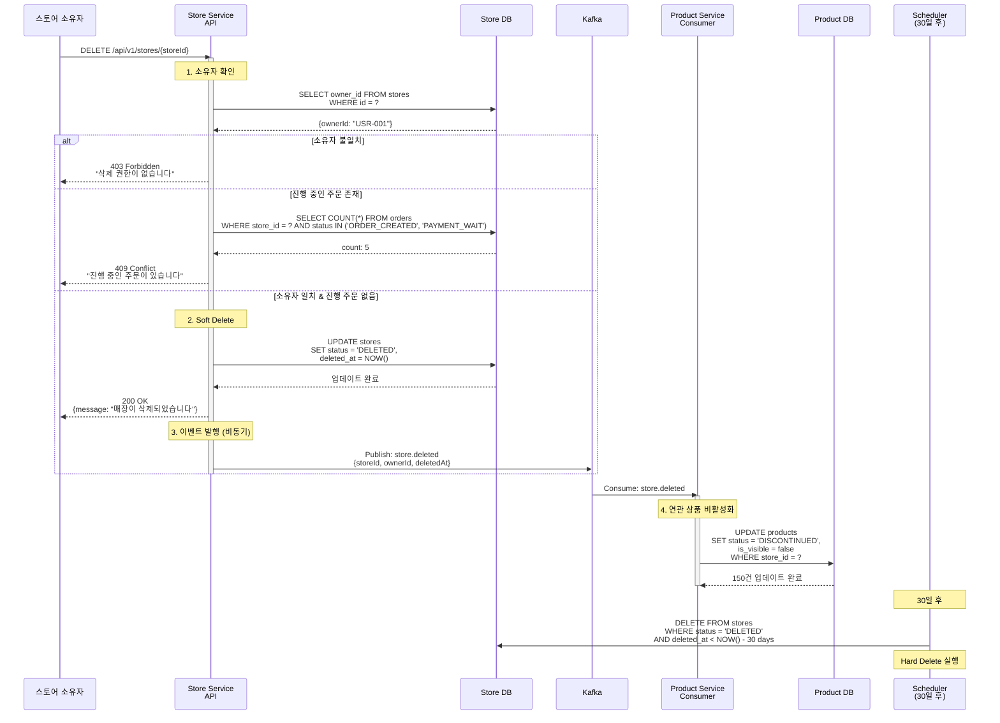
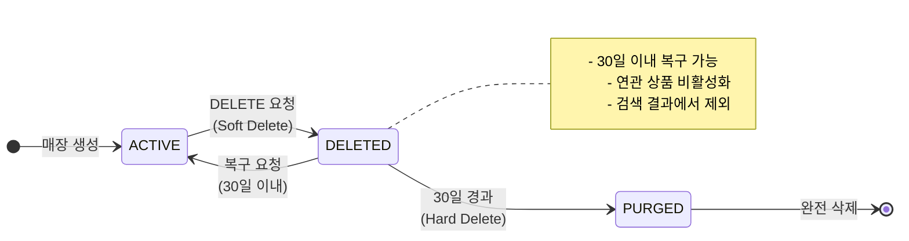

# 매장 삭제

Soft Delete 후 연관 상품 비활성화 (비동기)

## 개요

매장 소유자가 매장을 삭제하면 Soft Delete로 처리되고, 연관된 모든 상품이 비동기로 비활성화됩니다.

**특징:**
- ✅ **Soft Delete**: 30일 이내 복구 가능
- ✅ **Cascade Operation**: 연관 상품 자동 비활성화
- ✅ **비동기 처리**: 빠른 응답 (~100ms)
- ✅ **데이터 보존**: 감사 추적(Audit Trail) 가능

---

## 시퀀스 다이어그램



---

## API 명세

### 매장 삭제 API

**Endpoint:** `DELETE /api/v1/stores/{storeId}`

**Headers:**
```
Authorization: Bearer {access_token}
```

**Response (Success - 200):**
```json
{
  "message": "매장이 삭제되었습니다",
  "storeId": "STORE-001",
  "deletedAt": "2024-01-15T10:30:00Z",
  "recoveryDeadline": "2024-02-14T10:30:00Z"
}
```

**Response (Error - 403):**
```json
{
  "error": "FORBIDDEN",
  "message": "매장 삭제 권한이 없습니다.",
  "code": "STORE_DELETE_FORBIDDEN"
}
```

**Response (Error - 409):**
```json
{
  "error": "CONFLICT",
  "message": "진행 중인 주문이 5건 있습니다. 모든 주문이 완료된 후 삭제해주세요.",
  "code": "STORE_HAS_ACTIVE_ORDERS",
  "activeOrderCount": 5
}
```

---

## 이벤트 상세

### store.deleted

**Avro 스키마:** [`StoreDeleted.avsc`](../../src/main/events/avro/store/StoreDeleted.avsc)

**토픽:** `store.deleted`

**파티션 키:** `storeId`

**페이로드:**
```json
{
  "eventId": "550e8400-e29b-41d4-a716-446655440000",
  "eventTimestamp": 1699876543210,
  "storeId": "STORE-001",
  "ownerId": "USR-001",
  "deletedAt": 1699876543210
}
```

---

## 상태 전이



---

## 연관 상품 처리

### Product Service 처리 로직

```kotlin
@KafkaListener(topics = ["store.deleted"])
fun handleStoreDeleted(event: StoreDeleted) {
    // 멱등성 보장
    if (eventRepository.existsByEventId(event.eventId)) {
        log.info("Event already processed: ${event.eventId}")
        return
    }

    // 연관 상품 비활성화
    val updatedCount = productRepository.deactivateByStoreId(event.storeId)

    // 처리 완료 기록
    eventRepository.save(ProcessedEvent(event.eventId))

    log.info("Deactivated $updatedCount products for store ${event.storeId}")
}
```

### SQL 업데이트

```sql
UPDATE products
SET
    status = 'DISCONTINUED',
    is_visible = false,
    discontinued_reason = 'STORE_DELETED',
    updated_at = NOW()
WHERE store_id = 'STORE-001';
```

**예상 처리 시간:**
- 상품 10개: ~0.5초
- 상품 100개: ~1초
- 상품 1000개: ~5초

---

## Soft Delete vs Hard Delete

### Soft Delete (즉시)

| 항목 | 값 |
|------|-----|
| status | `DELETED` |
| deleted_at | 현재 시각 |
| 데이터 유지 | ✅ |
| 복구 가능 | ✅ (30일 이내) |
| 검색 노출 | ❌ |

### Hard Delete (30일 후)

```kotlin
@Scheduled(cron = "0 0 3 * * *")  // 매일 새벽 3시
fun purgeDeletedStores() {
    val threshold = Instant.now().minus(30, ChronoUnit.DAYS)

    val deletedStores = storeRepository.findByStatusAndDeletedAtBefore(
        status = StoreStatus.DELETED,
        deletedAt = threshold
    )

    deletedStores.forEach { store ->
        // 연관 상품 완전 삭제
        productRepository.deleteByStoreId(store.id)
        // 매장 완전 삭제
        storeRepository.delete(store)
    }

    log.info("Purged ${deletedStores.size} stores")
}
```

---

## 복구 API

### 매장 복구 (30일 이내)

**Endpoint:** `POST /api/v1/stores/{storeId}/recover`

**Response (Success - 200):**
```json
{
  "message": "매장이 복구되었습니다",
  "storeId": "STORE-001",
  "status": "ACTIVE",
  "recoveredAt": "2024-01-20T10:30:00Z"
}
```

**Response (Error - 410):**
```json
{
  "error": "GONE",
  "message": "복구 기간(30일)이 지났습니다. 매장 데이터가 영구 삭제되었습니다.",
  "code": "STORE_PERMANENTLY_DELETED"
}
```

### 복구 시 상품 재활성화

```kotlin
fun recoverStore(storeId: String, userId: String): StoreResponse {
    val store = storeRepository.findById(storeId)
        ?: throw NotFoundException("매장을 찾을 수 없습니다")

    if (store.status != StoreStatus.DELETED) {
        throw BadRequestException("삭제된 매장만 복구할 수 있습니다")
    }

    if (store.ownerId != userId) {
        throw ForbiddenException("복구 권한이 없습니다")
    }

    // 매장 복구
    store.status = StoreStatus.ACTIVE
    store.deletedAt = null
    storeRepository.save(store)

    // 상품 재활성화 이벤트 발행
    kafkaTemplate.send("store.recovered", StoreRecovered(storeId))

    return StoreResponse(store)
}
```

---

## 비즈니스 규칙

### 삭제 전 확인 사항

| 조건 | 확인 내용 | 실패 시 응답 |
|------|----------|-------------|
| 소유자 확인 | 요청자 == 매장 소유자 | 403 Forbidden |
| 진행 중인 주문 | ORDER_CREATED, PAYMENT_WAIT 상태 주문 없음 | 409 Conflict |
| 미정산 금액 | 미정산 금액 0원 (선택) | 409 Conflict |

### 삭제 후 동작

1. **즉시 효과**
   - 매장 검색 결과에서 제외
   - 신규 주문 불가
   - 상품 검색 결과에서 제외

2. **비동기 처리**
   - 연관 상품 비활성화
   - 알림 발송 (소유자에게)

3. **30일 후**
   - Hard Delete (완전 삭제)
   - 복구 불가

---

## 처리 시간

| 단계 | 소요 시간 | 방식 |
|------|-----------|------|
| 1. 소유자 확인 | ~20ms | 동기 |
| 2. 진행 주문 확인 | ~50ms | 동기 |
| 3. Soft Delete | ~30ms | 동기 |
| **API 응답** | **~100ms** | 동기 |
| 4. 이벤트 발행 | ~50ms | 비동기 |
| 5. 상품 비활성화 | 1~5초 | 비동기 |

---

## 시나리오 예시

### 시나리오 1: 정상 삭제
```
요청자: USR-001 (매장 소유자)
매장: STORE-001
연관 상품: 150개
진행 주문: 0건
결과: 200 OK, 매장 삭제, 150개 상품 비활성화
```

### 시나리오 2: 진행 중인 주문 존재
```
요청자: USR-001 (매장 소유자)
매장: STORE-001
진행 주문: 5건 (PAYMENT_WAIT)
결과: 409 Conflict, "진행 중인 주문이 5건 있습니다"
```

### 시나리오 3: 권한 없음
```
요청자: USR-002 (다른 사용자)
매장: STORE-001 (소유자: USR-001)
결과: 403 Forbidden, "삭제 권한이 없습니다"
```

### 시나리오 4: 복구 요청 (30일 이내)
```
요청자: USR-001
매장: STORE-001 (삭제 후 7일 경과)
결과: 200 OK, 매장 복구, 상품 재활성화
```

---

## 알림 메시지

### 소유자 알림
```
제목: 매장이 삭제되었습니다
내용: "맛있는 치킨집" 매장이 삭제되었습니다.
30일 이내에 복구하실 수 있습니다.
복구 기한: 2024년 2월 14일
```

### 고객 알림 (해당 매장 찜 고객)
```
제목: 찜한 매장이 운영을 종료했습니다
내용: "맛있는 치킨집" 매장이 운영을 종료했습니다.
다른 매장을 찾아보세요.
```

---

## 모니터링 포인트

- 매장 삭제 요청 수 (일별)
- 삭제 실패율 (권한 오류, 진행 주문 등)
- 연관 상품 비활성화 처리 시간
- 복구 요청 수
- 30일 후 Hard Delete 처리 수

---

## 관련 문서

- [Store Management README](./README.md) - 전체 플로우 개요
- [매장 생성](./create-store.md) - 생성 시나리오
- [매장 정보 변경](./update-store-info.md) - 정보 변경 시나리오
- [Kafka 이벤트 시퀀스](../../docs/interface/kafka-event-sequence.md) - 전체 시퀀스
