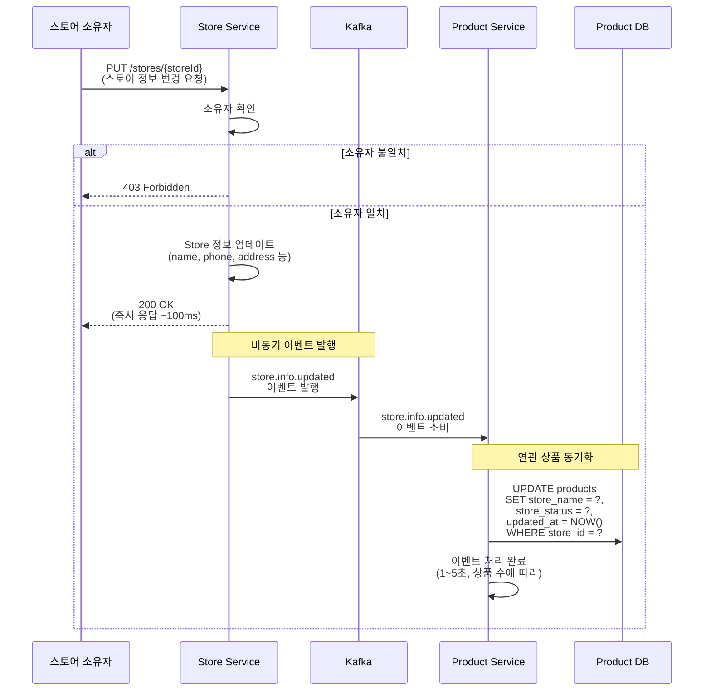

# 매장 정보 변경

스토어 정보 변경 후 연관 상품의 비정규화된 데이터 자동 동기화

## 개요

스토어 소유자가 매장 정보(이름, 설명, 전화번호, 주소 등)를 변경하면, Product Service가 해당 스토어의 모든 상품에 저장된 비정규화된 스토어 정보를 자동으로 업데이트합니다.

**특징:**
- ✅ **Eventual Consistency**: 빠른 응답 후 비동기 처리
- ✅ **검색 성능 최적화**: 상품 검색 시 JOIN 없이 스토어 이름으로 검색
- ✅ **선택적 업데이트**: `updatedFields`로 변경된 필드만 추적
- ✅ **멱등성 보장**: `eventId`로 중복 처리 방지

---

## 시퀀스 다이어그램



---

## 이벤트 상세

### store.info.updated

**Avro 스키마:** [`StoreInfoUpdated.avsc`](../../src/main/avro/store/StoreInfoUpdated.avsc)

**토픽:** `store.info.updated`

**파티션 키:** `storeId`

**예시 페이로드:**
```json
{
  "eventId": "550e8400-e29b-41d4-a716-446655440000",
  "eventTimestamp": 1699876543210,
  "storeId": "STORE-001",
  "storeName": "맛있는 치킨집",
  "storeStatus": "ACTIVE",
  "storeDescription": "신선한 국내산 닭만 사용합니다",
  "storePhone": "02-1234-5678",
  "storeAddress": {
    "street": "강남대로 123",
    "city": "서울",
    "state": "강남구",
    "zipCode": "06234",
    "country": "KR"
  },
  "businessHours": "{\"mon-fri\": \"11:00-22:00\", \"sat-sun\": \"12:00-21:00\"}",
  "storeImageUrl": "https://cdn.example.com/stores/store-001.jpg",
  "updatedFields": ["storeName", "storePhone"],
  "updatedAt": 1699876543210
}
```

---

## Product Service 처리 로직

### 1. 이벤트 수신

```kotlin
@KafkaListener(topics = ["store.info.updated"])
fun handleStoreInfoUpdated(event: StoreInfoUpdated) {
    // 멱등성 보장
    if (eventRepository.existsByEventId(event.eventId)) {
        log.info("Event already processed: ${event.eventId}")
        return
    }

    // 연관 상품 조회
    val products = productRepository.findAllByStoreId(event.storeId)

    // 비정규화 데이터 업데이트
    products.forEach { product ->
        product.updateStoreInfo(
            storeName = event.storeName,
            storeStatus = event.storeStatus
        )
    }

    productRepository.saveAll(products)

    // 처리 완료 기록
    eventRepository.save(ProcessedEvent(event.eventId))

    log.info("Updated ${products.size} products for store ${event.storeId}")
}
```

### 2. 선택적 필드 업데이트 (최적화)

`updatedFields`를 활용하여 변경된 필드만 업데이트할 수도 있습니다:

```kotlin
fun handleStoreInfoUpdated(event: StoreInfoUpdated) {
    val products = productRepository.findAllByStoreId(event.storeId)

    products.forEach { product ->
        event.updatedFields.forEach { field ->
            when (field) {
                "storeName" -> product.storeName = event.storeName
                "storeStatus" -> product.storeStatus = event.storeStatus
                // 필요한 경우 다른 필드도 처리
            }
        }
    }

    productRepository.saveAll(products)
}
```

---

## 데이터베이스 업데이트

### Product 테이블 업데이트

```sql
UPDATE products
SET
    store_name = '맛있는 치킨집',
    store_status = 'ACTIVE',
    updated_at = NOW()
WHERE store_id = 'STORE-001';
```

**예상 처리 시간:**
- 상품 10개: ~0.5초
- 상품 100개: ~1초
- 상품 1000개: ~5초

---

## 비정규화 설계

### 왜 비정규화가 필요한가?

**문제:**
상품 검색 시 스토어 이름으로 필터링하려면 JOIN이 필요합니다:

```sql
-- JOIN 필요 (성능 저하)
SELECT p.*
FROM products p
JOIN stores s ON p.store_id = s.id
WHERE s.name LIKE '%치킨%';
```

**해결:**
Product 테이블에 `store_name`을 비정규화하여 저장:

```sql
-- JOIN 불필요 (성능 향상)
SELECT *
FROM products
WHERE store_name LIKE '%치킨%';
```

### Trade-off

| 장점 | 단점 |
|------|------|
| ✅ 검색 성능 향상 (JOIN 제거) | ❌ 데이터 중복 저장 |
| ✅ 단순한 쿼리 | ❌ Eventual Consistency |
| ✅ 독립적인 서비스 운영 | ❌ 동기화 오버헤드 |

---

## 일관성 보장

### 멱등성

모든 이벤트는 `eventId`를 가지며, Product Service는 처리 완료된 이벤트를 기록합니다:

```kotlin
data class ProcessedEvent(
    val eventId: String,
    val processedAt: Instant = Instant.now()
)
```

### 재시도 정책

| 항목 | 설정 |
|------|------|
| 최대 재시도 횟수 | 3회 |
| 재시도 간격 | 10초, 30초, 60초 (exponential backoff) |
| 실패 처리 | Dead Letter Queue로 이동 |

### 순서 보장

파티션 키를 `storeId`로 설정하여 동일 스토어의 이벤트는 순서대로 처리됩니다.

---

## 모니터링

### 주요 메트릭

- **이벤트 발행 성공률**: Store Service → Kafka
- **이벤트 소비 지연 시간**: Kafka → Product Service
- **상품 업데이트 처리 시간**: Product Service 처리 시간
- **실패율**: 재시도 및 DLQ 비율

### 알림 조건

- 이벤트 소비 지연 > 30초
- 처리 실패율 > 5%
- DLQ 메시지 발생

---

## 장애 시나리오

### 1. Product Service 장애

**상황:** Product Service가 일시적으로 다운

**대응:**
- Kafka에 이벤트가 쌓임 (보관 기간: 7일)
- 서비스 복구 후 자동으로 이벤트 소비 재개
- 파티션 오프셋 관리로 누락 없이 처리

### 2. 데이터베이스 장애

**상황:** Product DB 연결 실패

**대응:**
- 재시도 정책에 따라 3회 재시도
- 실패 시 Dead Letter Queue로 이동
- 알림 발송 → 수동 처리

### 3. 네트워크 파티션

**상황:** Store Service와 Kafka 간 네트워크 단절

**대응:**
- Kafka Producer 재연결 시도
- 실패 시 로컬 큐에 임시 저장
- 네트워크 복구 후 일괄 전송

---

## 성능 최적화

### 배치 처리

대량의 상품을 가진 스토어의 경우 배치 업데이트:

```kotlin
fun handleStoreInfoUpdated(event: StoreInfoUpdated) {
    val batchSize = 100
    val products = productRepository.findAllByStoreId(event.storeId)

    products.chunked(batchSize).forEach { batch ->
        batch.forEach { product ->
            product.updateStoreInfo(event.storeName, event.storeStatus)
        }
        productRepository.saveAll(batch)
    }
}
```

### 인덱스 최적화

```sql
-- 빠른 조회를 위한 인덱스
CREATE INDEX idx_products_store_id ON products(store_id);
CREATE INDEX idx_products_store_name ON products(store_name);
```

---

## 관련 문서

- [매장 생성](./create-store.md)
- [매장 삭제](./delete-store.md)
- [전체 이벤트 플로우](../README.md)
